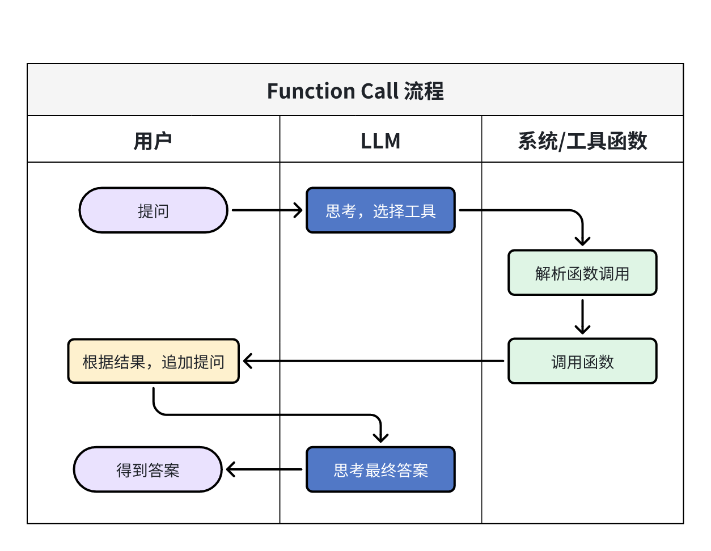

# Function Call 的最小实现

本文整体思路是抄的[从零开始：深入构建 Agent 的 Function Call 实现](https://blog.csdn.net/m0_37733448/article/details/147855072)，只是针对ollama 的调用做了些补充。
整体工作流程如下：  


## 准备工作

定义LLM 客户端及工具函数（集合）

```python{10,19}
import json
from ollama import Client
client = Client(host="http://localhost:11434")

def send_messages(msgs):
    """
    客户端向LLM 发送消息，并获取响应
    - 相比与generate 和completion，chat 可以传入对话历史，实现多轮对话
    """
    resp = client.chat(model="qwen3.5:35b", messages=msgs)
    # 后面将本轮对话产生的结果追加到新的消息体里面
    return resp.message.content

def get_weather(city: str):
    """工具函数：模拟天气查询"""
    return f"{city}，晴天"

# 工具的集合
tools = {"get_weather": get_weather}
```

### 系统提示词

系统提示词规定了`chat` 的功能和整体对话的流程：

```python{2-5,7-13,17-26,28-30}
system_prompt = """
你在运行一个`思考`->`工具调用`->`响应`的过程。每次之运行一个步骤。下面是具体步骤的定义：
1. `思考`：你要仔细思考用户的问题
2. `工具调用`：选择可以调用的工具函数，并根据工具的函数签名生成所需的参数
3. `响应`：根据工具调用产生的结果，回答用户的问题

现有以下工具（python 函数形式）可用：
1. 查询城市天气
    - 函数名 get_weather
    - 参数：
        - city: str 城市名
    - 返回值:
        - str

以下是一个完整的过程示例：

## 第一轮对话
user: 天津的天气怎么样？
thought: 思考应该调用工具查询天津的天气
assistan(以json 字符串的形式返回function_call，不要有多余的解释和符号，只返回最简洁的形式，如下面所示):
{
    "function_name": "get_weather",
    "function_parameters":{
        city: "天津"
    }
}

## 第二轮对话
user：调用function_call 的结果是"天津，晴天"
assistant: 天津的天气晴朗
"""
```

:::details 在LLM 收到这句话后，会返回如下的内容（点击展开）

```markdown
您好！我已经理解了您描述的工作流程：

**我的工作流程：**

1. **思考** - 仔细分析用户问题
2. **工具调用** - 根据需求选择合适的工具并生成参数
3. **响应** - 基于工具返回的结果回答用户

**可用工具：**

- `get_weather(city)` - 查询指定城市的天气

---

**我已经准备好为您服务了！** 请告诉我您需要什么帮助，例如：

- 查询某个城市的天气
- 其他需要我使用工具的问题

请您提出问题，我将按照思考→调用工具→响应的流程为您处理。
```

:::

## 运行实例

### 第一轮对话

第一轮对话主要是为了获得工具函数以及对应的参数：

```python
messages = [
    {"role": "system", "content": system_prompt},
    {"role": "user", "content": "上海今天天气如何"},
]
resp = send_messages(messages)

print(resp)
```

:::details 下面是第一轮对话的响应（点击展开）

```json
{
  "function_name": "get_weather",
  "function_parameters": {
    "city": "上海"
  }
}
```

:::

### 调用工具

```python{3,5-9}
if resp:
    # 将LLM 返回结果追加到chat 多轮对话记录
    messages.append({"role": "assistant", "content": resp})
    fc = json.loads(resp)  # 解析json，这里容易出异常
    resp = tools[
        fc["function_name"]  # 提取工具名
    ](
        **fc["function_parameters"]  # 解析参数，字典解包用**，列表解包用*
    )
    # 上海，晴天
else:
    print("失败了~")
```

### 第二轮对话

`resp` 此时变成了函数调用的结果

```python
if resp:
    messages.append(
        {"role": "user", "content": f'调用function_call 的结果是"{resp}"'}
    )
    resp = send_messages(messages)
    print("resp")
    # 今天上海的天气晴朗。
```

:::details 最终chat 多轮对话的内容如下（点击展开）

```python
messages=[
    {'role': 'system', 'content': '\n你在运行一个`思考`->`工具调用`->`响应`的过程。每次之运行一个步骤。下面是具体步骤的定义：\n1. `思考`：你要仔细思考用户的问题\n2. `工具调用`：选择可以调用的工具函数，并根据工具的函数签名生成所需的参数\n3. `响应`：根据工具调用产生的结果，回答用户的问题\n\n现有以下工具（python 函数形式）可用：\n1. 查询城市天气\n    - 函数名 get_weather\n    - 参数：\n        - city: str 城市名\n    - 返回值:\n        - str\n\n以下是一个完整的过程示例：\n\n## 第一轮对话\nuser: 天津的天气怎么样？\nthought: 思考应该调用工具查询天津的天气\nassistan(以json 字符串的形式返回function_call，不要有多余的解释和符号，只返回最简洁的形式，如下面所示):\n{\n    "function_name": "get_weather",\n    "function_parameters":{\n        city: "天津"\n    }\n}\n\n## 第二轮对话\nuser：调用function_call 的结果是"天津，晴天"\nassistant: 天津的天气晴朗\n'},
    {'role': 'user', 'content': '上海今天天气如何'},
    {'role': 'assistant', 'content': '{\n    "function_name": "get_weather",\n    "function_parameters": {\n        "city": "上海"\n    }\n}'},
    {'role': 'user', 'content': '调用function_call 的结果是"上海，晴天"'},
    {'role': 'assistant', 'content': '上海今天的天气是晴天。'}
]
```

:::

当前能够模拟`function call` 的基本流程，但是缺点就是**LLM输出结果不稳定**，还需参考其他项目进行完善。不过有了`function call`，就有了`MCP/Skills` 的基础，还是蛮有意思的。

## 参考资料

1. [从零开始：深入构建 Agent 的 Function Call 实现](https://blog.csdn.net/m0_37733448/article/details/147855072)
2. [深入解析Function Calling、MCP和Skills的本质差异与最佳实践](https://zhuanlan.zhihu.com/p/1992172117328950705)
