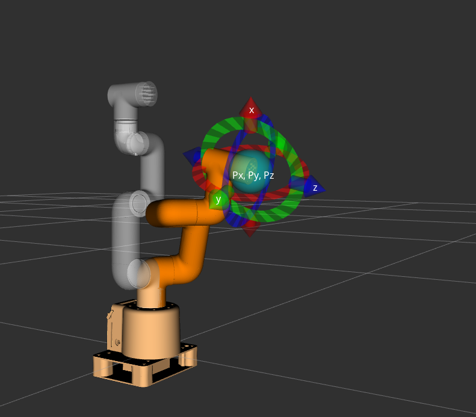
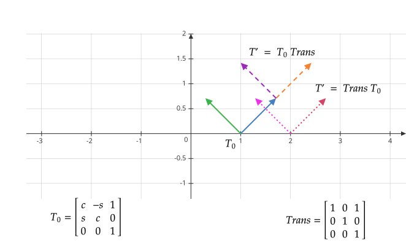
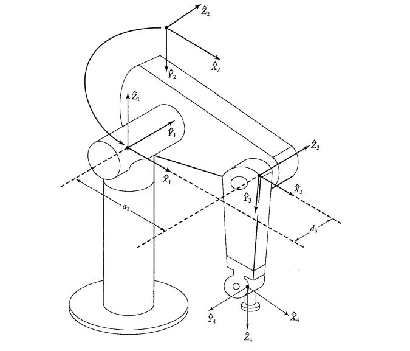
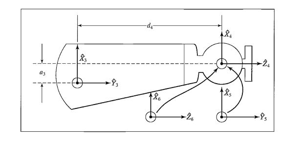
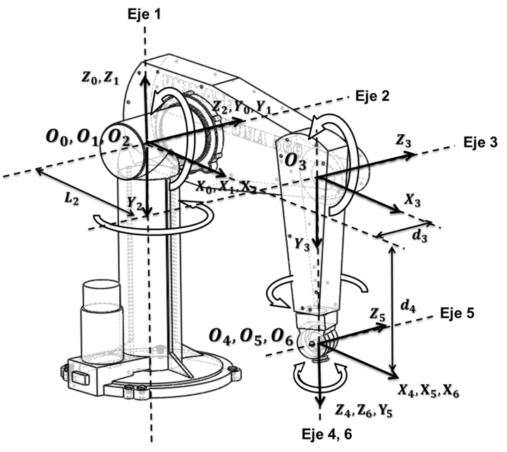

---
title: 机械臂笔记（一）D-H 参数表建立
date: 2026-01-15 08:57:39  
description: D-H 参数表、改进D-H 参数表的构建方法
tags:
    - python
    - 矩阵  
    - 机器人
next: 
    text: 机械臂笔记（二）运动学正逆过程
    link: '../robot-arm-2/'
---  

一般我们采用矩阵来表示机械臂**末端的位置和姿态信息**，其中位置信息可以用一个三维向量表示：  
$$
\vec{P} = \begin{bmatrix} x & y & z\end{bmatrix}^T = \begin{bmatrix} x \\ y \\ z\end{bmatrix} \tag{1}
$$  

初始姿态（朝向）信息可以用一个**单位正交矩阵**表示：  

$$
T_0 = \begin{bmatrix} 1 & 0 & 0 \\ 0 & 1& 0 \\ 0 & 0 & 1 \end{bmatrix} \tag{2}
$$

其中$(2)$式中的每一列表示机械臂末端的$x,y,z$轴朝向。整合$(1)(2)$ 可以得到一个齐次矩阵
$$
T = \begin{bmatrix} T_0 & P \\ 0 & 1 \end{bmatrix} = 
\begin{bmatrix} 
    1 & 0 & 0 & x \\ 
    0 & 1 & 0 & y \\ 
    0 & 0 & 1 & z \\
    0 & 0 & 0 & 1
\end{bmatrix} 
\tag{3}
$$

可以通过下图myCobot 280 机械臂为例，对比理解$(3)$式。  

## 齐次变换  
通过齐次变换可以通过一次齐次矩阵乘法完成坐标系间的旋转、平移变换。变换矩阵也是齐次矩阵，形式上和$(3)$式一样，只是代表的物理意义不太一样。  

### 平移变换  
如果需要将向量$\vec{P}$ 分别沿世界坐标系的$x,y,z$ 轴平移$x_0,y_0,z_0$，则可以左乘下面矩阵：
$$
T = 
\begin{bmatrix} 
    1 & 0 & 0 & x_0 \\ 
    0 & 1 & 0 & y_0 \\ 
    0 & 0 & 1 & z_0 \\ 
    0 & 0 & 0 & 1
\end{bmatrix} 
\tag{4}
$$

### 旋转变换  
将一个三维向量左乘一个旋转矩阵，即可实现旋转操作，有以下三种基本的旋转操作（分别绕$x,y,z$ 轴旋转）：
$$
\begin{array}{l} 
    R_x(\theta) = \begin{bmatrix} 
        1 & 0 & 0 & 0 \\ 
        0 & \cos(\theta) & -\sin(\theta) & 0 \\ 
        0 & \sin(\theta) & \cos(\theta)  & 0 \\
        0 & 0 & 0 & 1
    \end{bmatrix} \\
    R_y(\theta) = \begin{bmatrix} 
        \cos(\theta) & 0 & \sin(\theta) & 0 \\ 
        0 & 1 & 0 & 0 \\ 
        -\sin(\theta) & 0 & \cos(\theta)  & 0 \\
        0 & 0 & 0 & 1
    \end{bmatrix} \\
    R_z(\theta) = \begin{bmatrix} 
        \cos(\theta) & -\sin(\theta) & 0 & 0 \\ 
        \sin(\theta) & \cos(\theta) & 0 & 0 \\ 
        0 & 0 & 1  & 0 \\
        0 & 0 & 0 & 1
    \end{bmatrix} 
\end{array}
\tag{5}
$$

空间中的旋转可以通过上边两两组合得到，机械臂中一般组合$R_z, R_x$。

### 齐次变换（左乘）
整合$(4)(5)$两式，则可得到齐次变换矩阵（以绕$x$ 轴旋转后再平移为例）：
$$
T = 
\begin{bmatrix} 
    1 & 0 & 0 & x_0 \\ 
    0 & cos(\theta) & -sin(\theta)  & 0 \\ 
    0 & sin(\theta) & cos(\theta) & 0 \\ 
    0 & 0 & 0 & 1 
\end{bmatrix} = 
\begin{bmatrix} 
    R & \vec{P} \\ 
    0 &1 
\end{bmatrix}
\tag{6}
$$

### 齐次变换（右乘）  
假设初始位姿矩阵和变换矩阵如下所示：  
$$
\begin{array}{l}
T_0 = \begin{bmatrix} c_0 & -s_0 & x_0 \\ s_0 & c_0 & y_0 \\ 0 & 0 & 1 \end{bmatrix} \\
T = \begin{bmatrix} c_1 & -s_1 & x_1 \\ s_1 & c_1 & y_1 \\ 0 & 0 & 1 \end{bmatrix} 
\end{array}
\tag{7}
$$  

分别计算$T_0T,\,TT_0$：  
$$
\begin{array}{l}
T_0\,T
=
\begin{bmatrix}
c_0c_1 - s_0s_1
& -(c_0s_1 + s_0c_1)
& x_0 + c_0x_1 - s_0y_1\\
s_0c_1 + c_0s_1
& c_0c_1 - s_0s_1
& y_0 + s_0x_1 + c_0y_1\\
0 & 0 & 1
\end{bmatrix}\\

T\,T_0
=
\begin{bmatrix} 
c_1c_0 - s_1s_0
& -(c_1s_0 + s_1c_0)
& c_1x_0 - s_1y_0 + x_1\\
s_1c_0 + c_1s_0
& c_1c_0 - s_1s_0
& s_1x_0 + c_1y_0 + y_1\\
0 & 0 & 1
\end{bmatrix}
\end{array} 
\tag{8}
$$

单位正交矩阵左乘的值等于右乘的值，所以齐次变换后的姿态矩阵看不出来区别。但是位置向量的区别比较明显。  
- **齐次变换矩阵左乘**：表示变换是相对世界坐标系原点的变换，旋转基于世界坐标系原点，先旋转再平移，平移都是沿世界坐标轴方向；    
    - 把物体在世界坐标系下旋转$90\degree$，$T' = R_z(90\degree)\,T$；
- **齐次变换矩阵右乘**：表示变换是相对前一个坐标系，旋转轴基于一个坐标系的原点，先旋转再平移，平移是沿前一个坐标系的坐标轴方向，就像是多个关节依次“粘在”前一个关节上  
    - 夹爪坐标系下向前走$1cm$，$T' = T\,Trans_x(1)$

下图是一个例子的展示（$x_0=x_1=1,y_0=y_0=0, \theta_0=\frac{\pi}{4}, \theta_1=0$）说明：  
    

上文提到，机械臂末端的位姿信息也是用齐次矩阵表示的。如果机械臂中有多个关节，假如直到每个关节相对于前一个关节的齐次变换矩阵，依次相乘就能计算出末端相对于起始位置的坐标信息。  

## D-H 参数表的建立  
关节坐标系间的变换无非是平移和旋转，通常选择$z,x$ 轴为基准轴，然也可以用$z, y$ 轴，但不常见。  

### 建表步骤  
1. 确定每个关节的$z$ 轴，尽量不要改变$z$ 轴方向：
    - 转动关节$z$ 轴沿转动轴方向；
    - 平动关节$z$ 轴沿伸缩方向；

2. 确定每个关节的$x$ 轴，尽量不要改变$x$ 轴方向：
    - 选择当前关节与上一个关节$z$ 轴的公垂线方向；
    - 如果当前关节与上一个关节平行，则选择两个关节连线的方向；

3. 确定（关节）坐标系原点，一般选在关节轴（的几何中心）上：
    - 选择当前关节与上一个关节$z$ 轴相交，则选择交点；
    - 选择当前关节与上一个关节$z$ 轴平行，常选择上一轴的投影或连杆长度起点，以保证 DH 参数唯一性；
    - 当前关节与上一个关节 $z$ 轴异位（既不平行也不相交）。选择公垂线与当前轴的交点作为坐标系原点。

### 标准D-H 参数表中旋转平移操作的顺序  

$$
^{i-1}_i\boldsymbol{T}=\boldsymbol{Rot}_{z_i-1}(\theta_i)\boldsymbol{Trans}_{z_i-1}(d_i)\boldsymbol{Trans}_{x_i}(a_i) \boldsymbol{Rot}_{x_i}(\alpha_i)\tag{9}
$$
1. 先按$z_{i-1}$ 轴（起始坐标系）旋转$\theta_i$，使得$x_i, x_{i-1}$轴指向一致；  
2. 再沿$z_{i-1}$ 轴（起始坐标系）平移$d_i$，使得$x_i, x_{i-1}$轴重合；  
3. 再沿新的$x_{i-1}$ 轴（目标坐标系）平移$a_i$，使得两个坐标系原点重合；  
4. 最后新的$x_{i-1}$ 轴（目标坐标系）旋转$\alpha_i$，使得两个坐标系完全一致；

### 改进D-H 参数表中旋转平移操作的顺序

$$
^{i-1}_i\boldsymbol{T}=\boldsymbol{Rot}_{x_i-1}(\theta_i)\boldsymbol{Trans}_{x_i-1}(d_i)\boldsymbol{Trans}_{z_i}(a_i) \boldsymbol{Rot}_{z_i}(\alpha_i)\tag{10}
$$
改进D-H 与标准D-H 算法相比，差异点主要在旋转平移的操作顺序，并且$x$轴的选择是参考当前关节与下一个关节：
1. 先按$x_{i-1}$ 轴（起始坐标系）旋转$\alpha_i$，使得$z_i, z_{i-1}$轴指向一致；  
2. 再沿$x_{i-1}$ 轴（起始坐标系）平移$a_i$，使得$z_i, z_{i-1}$轴重合；  
3. 再按新的$z_{i-1}$ 轴（目标坐标系）旋转$\theta_i$，使得两个坐标系原点重合；  
4. 最后沿新的$z_{i-1}$ 轴（目标坐标系）平移$d_i$，使得两个坐标系完全一致。  

## 示例：PUMA 560 改进D-H 参数表
  
需要注意的是第三节机械臂的转动轴不是平行的，存在位移$a_3$：
  

### 1. 确定z 轴及方向  

### 2. 根据z 轴方向确定x 轴方向  
x 轴的指向尽量保持不变，z 轴也是，这样得到的参数表会比较简洁。

### 3. 填写参数表  

当前坐标系$i-1$|下一个关节$i$|$\boldsymbol{R}_x/\alpha_i$|$d_x/a_i$|$\boldsymbol{R}_z/\theta_i$|$d_z/d_i$  
:---:|:---:|---:|---:|---:|---:
$0$|$1$|$0$|$0$|$\theta_1$|$0$
$1$|$2$|$-\frac{\pi}{2}$|$0$|$\theta_2$|$0$
$2$|$3$|$0$|$a_2$|$\theta_3$|$d_3$
$3$|$4$|$-\frac{\pi}{2}$|$a_3$|$\theta_4$|$d_4$
$4$|$5$|$\frac{\pi}{2}$|$0$|$\theta_5$|$0$
$5$|$6$|$-\frac{\pi}{2}$|$0$|$\theta_6$|$0$  

正向过程的矩阵计算过程见[参考资料[5-6]](https://mr-iitkgp.vlabs.ac.in/exp/forward-kinematics/theory.html)。需要注意的是，**这样建立的参数表的世界坐标系原点位于第1,2 轴的交点**。

## 参考资料  
1. [机械臂 运动学 D-H经典方法和改进D-H方法参数表建立](https://www.bilibili.com/video/BV1Pk4y1N71b)  
2. [从零手搓人形机械臂之运动学板块（一）](https://www.bilibili.com/video/BV1dp1wB5Ex5)  
3. [详解PUMA 560机械臂的改进D-H参数和标准D-H参数表示](https://zhuanlan.zhihu.com/p/392320782)
4. [在线机械臂（改进）D-H 参数表可视化](https://intelligentsystemslab.org.ntnu.no/course/DH/index.html)  
5. [Forward Kinematics of PUMA 560](https://mr-iitkgp.vlabs.ac.in/exp/forward-kinematics/theory.html)
6. [详解PUMA 560机械臂的改进D-H参数和标准D-H参数表示](https://zhuanlan.zhihu.com/p/392320782)