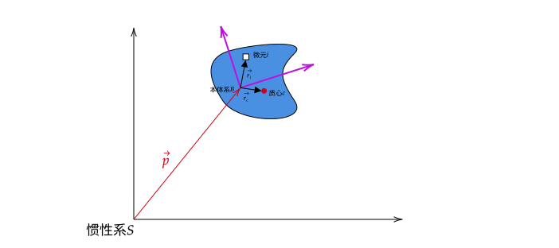

---
title: 机械臂笔记（六）机械臂的动力学模型（牛顿-欧拉方程）
date: 2026-01-20 09:09:05  
description: 基于牛顿-欧拉方程的机器人动力学模型
tags:
    - python
    - 矩阵  
    - 机器人
    - 力学

prev: 
    text: 机械臂笔记（五）机械臂的动力学模型（欧拉-拉格朗日方程）
    link: '../robot-arm-5/'
next: 
    text: 机械臂笔记（七）机械臂动力学参数辨识
    link: '../robot-arm-7/'
---  

通过欧拉-拉格朗日方程在步骤上可以方便地对机器人进行动力学建模，但是最后得到的公式会比较复杂，难以计算。最终工程上还是会用牛顿-欧拉法对机器人进行动力学建模，更利于控制算法的设计。  

> **一般来说，我们（忽略地球的自转和公转等）选择机械臂底座的中心作为世界坐标系（惯性系）；如果底座也在动，我们需要选择地面上的一个固定点作为坐标系的原点。**  
> *这个坐标系不加速、不转动，或者相对真正的宇宙惯性系只做匀速直线运动*

## 推导过程  

  

我们假设上图蓝色的物体是一个刚体，我们选择刚体上的某一点，在此点上定义了一个与该刚体固连的坐标系B，即本体系。假设该刚体是均匀的，是由许多微元组成。最终，我们希望得到外力与刚体相对惯性系的速度与加速度的关系式。  

### 符号定义  
比较容易搞混的概念就是不同坐标系下的变换，所以符号相对于哪个坐标系非常重要。  

符号|表示坐标系|说明  
---|---|---  
$T$|$S$|代表刚体的动能，必须相对于惯性系，不然坐标系选择会影响数值  
$P_b$|$B$|刚体相对于惯性系的动量，用本体系的坐标表示    
$\Pi_b$|$B$|刚体相对于惯性系的角动量，用本体系的坐标表示    
$U_b$|$B$|刚体相对于惯性系的速度，用本体系的坐标表示    
$\Omega_b$|$B$|刚体相对于惯性系的角速度，用本体系的坐标表示    
$U_s$|$S$|刚体相对于惯性系的速度，**用惯性系的坐标表示**  
$\Omega_s$|$S$|刚体相对于惯性系的角速度，**用惯性系的坐标表示**    
$V_{i_b}$|$B$|刚体微元$i$ 相对于惯性系的速度，用本体系的坐标表示    
$\vec{p_b}$|$B$|向量$p$ 在本体系下的表示      
$\vec{p_s}$|$S$|向量$p$ **在惯性系下的表示**     
$\vec{r_{c_b}}$|$B$|向量$r_c$ 在本体系下的表示      
$\vec{r_{i_b}}$|$B$|向量$r_i$ 在本体系下的表示       
$m$|-|表示刚体的质量  
$I_b$|-|刚体的惯量矩阵，相对于本体系    
$F_{ext_b}$|B|刚体所受的合外力，在本体系下的表示  
$M_{ext_b}$|B|刚体所受的合外力矩，在本体系下的表示  

其中有一些定义公式，可能对以后的推导有帮助：  
- 质心  
$$
r_{c_b} = \frac{1}{m}\int{r_{i_b}dm}  
\tag{0.1}
$$  

- 标准向量恒等式（对称的）  
$$
\begin{array}{lll}
(a \times b)\cdot(a \times b) & = & a^T(||b||^2I-bbT)a \\
& = & b^T(||a||^2I-aaT)b  
\end{array}
\tag{0.2}
$$
- 惯量矩阵  
$$
I_b = \int{(||r_{i_b}||I - r_{i_b}r^T_{i_b})}dm
\tag{0.3}
$$  

- 对于任意向量$a$，其在惯性系与本体系之间的导数关系为[欧拉动力学方程](https://zh.wikipedia.org/zh-hans/%E6%AC%A7%E6%8B%89%E6%96%B9%E7%A8%8B_(%E5%88%9A%E4%BD%93%E8%BF%90%E5%8A%A8))所示：  
$$
(\frac{da}{dt})_s = (\frac{da}{dt})_b + \Omega_b \times a 
\tag{0.4}
$$  
- 向量微分  
$$
\frac{d}{dt}(a\times b) = a'\times b+ a\times b'  
\tag{0.5}
$$


### 计算刚体动能  
刚体的动能等于所有微元的动能之和：  
$$
T = \int{ \frac{1}{2} V^2_{i_b}} dm  
\tag{1}
$$
由于刚体上任意微元的运动都可以分解为参考本体系的平动和转动，因此微元的速度可以表示为线速度和转动诱导速度之和：  
$$
V_{i_b} = U_b + \Omega_b \times r_{i_b}
\tag{2}
$$
联立式$(0.1),(0.2),(0.3),(1),(2)$，可得：  
$$
\begin{array}{lll}
T & = & \int {\frac{1}{2} V^2_{i_b}} dm  \\ 
& = & \int {\frac{1}{2} (U_b + \Omega_b \times r_{i_b})\cdot (U_b + \Omega_b \times r_{i_b})} dm \\
& = & \int {\frac{1}{2} U^2_b }dm + 
    \int {U_b\cdot(\Omega_b \times r_{i_b})} dm + 
    \int {\frac{1}{2} (\Omega_b \times r_{i_b}) \cdot (\Omega_b \times r_{i_b})}  dm \\
& = & \frac{1}{2}mU^T_b U_b +U_b\cdot\Omega_b\times\int{r_{i_b}}dm + \frac{1}{2}\Omega^T_b[\int{(||r_{i_b}||^2I-r_{i_b}r^T_{i_b}}) dm]\Omega_b  \\
& = & \frac{1}{2}mU^T_b U_b  + mU_b\cdot\Omega_b\times r_{c_b} + \frac{1}{2}\Omega^T_bI_b\Omega_b
\end{array}
\tag{3}
$$  
### 计算刚体动量  
动能对速度求导，即可得到动量：  
$$
\begin{array}{lll}
P_b & = & \frac{\partial T}{\partial U_b} \\
& = & mU_b+m\Omega_b\times r_{c_b} 
\end{array}
\tag{4}
$$
动能对角速度求导，即可得到角动量： 
$$
\begin{array}{lll}
\Pi_b & = & \frac{\partial T}{\partial \Omega_b} \\
& = & mr_{c_b} \times U_b + I_b\Omega_b 
\end{array}
\tag{5}
$$

### 计算动能/动量与合外力的关系  
在惯性系下，角动量与力矩的关系如下：  
$$
\frac{d}{dt}\Pi_s = M_s  
\tag{6}
$$

但是到本体系里面，结合式$(0.4)$，它与合外力矩的关系是：  
$$
\begin{array}{lll}
\frac{d}{dt}\Pi_s & = & \frac{d}{dt}\Pi_b +\Omega_b\times\Pi_b  \\ 
&\Downarrow& \\
\frac{d}{dt}\Pi_b & = & \frac{d}{dt}\Pi_s  - \Omega_b\times\Pi_b\\ 
&\Downarrow& _{(复杂的恒等变换) }\\  
M_{ext_b} & = & M_{ext_b} - U_b\times P_b
\end{array}
\tag{7}
$$

在惯性系下，结合$(4)$ 式，对动量和角动量对时间求导：
$$
\begin{array}{lll}
F_{ext_b} & = & \frac{d^sP_b}{dt} \\
& = & m\frac{d^sU_b}{dt} + \frac{d^s\Omega_b\times r_{c_b}}{dt} \\
& = & mU'_b+m\Omega_b\times U_b + m\Omega'_b\times r_{c_b} + m\Omega_b\times(\Omega_b\times r_{c_b})
\end{array}
\tag{8}
$$
同样，对于公式$(7)$ 有：
$$
\begin{array}{lll}
M_{ext_b} & = & \frac{d^s\Pi_b}{dt} + U_b \times P_b\\
& = & m\frac{d^s(r_{c_b} \times Ub)}{dt} + \frac{d^sI_b\Omega_b}{dt} + mU_b\times (\Omega_b\times r_{c_b}) \\
& = & m(r_{c_b}\times U'_b +\Omega_b\times(r_{c_b}\times U_b))+I_b\Omega'_b + \Omega_b \times(I_b\Omega_b) + mU_b\times (\Omega_b\times r_{c_b})  \\
& = & mr_{c_b}\times U'_b + I_b\Omega'_b + \Omega_b\times(I_b\Omega_b) + mr_{c_b}\times(\Omega_b\times U_b)
\end{array}
\tag{9}
$$

整理后得到矩阵的形式：  
$$
\begin{bmatrix}
    F_{ext_b} \\
    M_{ext_b}
\end{bmatrix} = 
\begin{bmatrix}
    mI_{3 \times 3} & -m\vec{r_{c_b}} \\
    m\vec{r_{c_b}} & I_b
\end{bmatrix}
\begin{bmatrix}
    U'_b \\
    \Omega'_b
\end{bmatrix} + 
\begin{bmatrix}
    m\Omega_b\times U_b + m\Omega_b\times (\Omega_b\times r_{c_b}) \\
    mr_{c_b}\times(\Omega_b \times U_b)+ \Omega_b\times(I_b\Omega_b)
\end{bmatrix}
\tag{10}
$$  
简写成如下形式： 
$$
F_{ext_j} = M_jV'_j+\beta_j  
\tag{11}
$$
其中：  
- $j$ 表示第j 个连杆；
- $V_j = \begin{bmatrix}U_j \\ \Omega_j\end{bmatrix}$ 表示连杆j 相对于惯性系的速度和角速度组成的六维向量，在本体系下表示。  
- $^jH_{j+1}$ 表示一个六维变换矩阵，可以将j+1 系下的力变化到j 系下  
- $F_{ext_j}$ 表示连杆收到的外力，外力矩在j 系下的表示。  

## 建模示例--平面2R 机械臂  

如果不想看上面公式，可以简单捋一下，下面的步骤。  

### 机构与参数定义
- 关节变量：$\vec{q}=\begin{bmatrix}q_1 \\ q_2\end{bmatrix}$，对应的角速度$\vec{q}'$，角加速度$\vec{q}''$  
- 连杆参数： 
    - 长度： $l_1, l_2$  
    - 质心到前一关节的距离： $r_1, r_2$  
    - 质量： $m_1, m_2$  
    - 转动惯量：$I_1, I_2$
- 重力： $\vec{g} = \begin{bmatrix} 0 \\ -g \\ 0 \end{bmatrix}$  
- 旋转矩阵：$R_i = R_z(q_i)=\begin{bmatrix} cosq_i & -sinq_i & 0 \\ sinq_i & cosq_i & 0 \\ 0& 0 & 1 \end{bmatrix}$，表示坐标系i 相对于坐标系i−1 的方向  
- 矩阵$R^T_i = R^{-1}_i$，表示把一个在i−1 系下表达的向量，转换为在 i 系下的表达  


### 正向递推（速度与加速度）   
因为底座（惯性系）固定在地面，有：  
$$
\begin{array}{lllll}
&& \vec{\omega}_0 & = & \begin{bmatrix} 0 \\ 0 \\ 0\end{bmatrix}  \\
&&\vec{\alpha}_0 & = & \begin{bmatrix} 0 \\ 0 \\ 0\end{bmatrix}  \\
\vec{a}_0 & = & -\vec{g} &=& \begin{bmatrix} 0 \\ g \\ 0\end{bmatrix} 
\end{array}
\tag{12}
$$

因为每个质点都会受到向下的重力加速度$\vec{g}$，如果另惯性系有一个向上的虚拟加速度$-\vec{g}$，那么在后悔递推中各连杆的质心加速度哦都会自动包含重力效应。  

对于连杆i 的角速度和角加速度有：  
$$
\begin{array}{lll}
\vec{\omega}_i & = & R^T_i\vec{\omega}_{i-1} + q'_i\vec{z} \\
\vec{\alpha}_i & = & R^T_i\vec{\alpha}_{i-1} + q''_i\vec{z}
\end{array}
\tag{13}
$$
其中$\vec{z} = [0,0,1]^T$ 表示$z$ 轴的单位向量。$q'_i\vec{z}$可以把标量转化为角速度（角加速度）的向量。  

关节原点的加速度：  
$$
\vec{a}_i = R^T_i(
    \underbrace{\vec{a}_{i-1}}_{平移继承项(前杆带动)} +
    \underbrace{\vec{\alpha}_{i-1}\times\vec{p}_{i-1,i}}_{切向加速度（前杆旋转加速）}+
    \underbrace{\vec{\omega}_{i-1}\times(\vec{\omega}_{i-1}\times\vec{p}_{i-1,i})}_{向心加速度（前杆匀速旋转）}
)
\tag{14}
$$
其中： 
$$
\vec{P}_{0,1} = [0,0,0]^T  \\
\vec{P}_{2,1} = [l_1,0,0]^T 
\tag{15}
$$
很自然可以联想到这是关节到上一关节的拓扑参数。  

> 这里可以看到一个关键点：$R^T_i$   

连杆的质心加速度：  
$$
\vec{a_c}_{i} = \underbrace{\vec{a}_i}_{关节点加速度} +
\underbrace{\vec{\alpha}_i\times\vec{r}_i}_{切向加速度} + 
\underbrace{\vec{\omega}_i\times(\vec{\omega}_i\times\vec{r}_i)}_{向心加速度}
\tag{16}
$$

其中$\vec{r}_i = [r_i, 0,0]^T$，表示质心相对于本体坐标系的位置。  


### 反向递推（力与力矩）  
假设末端无外力，则从末端到基座的力与力矩为：  
$$
\vec{f}_3 = [0,0,0]^T \\
\vec{n}_3 = [0,0,0]^T
\tag{17}
$$  
本关节惯性力与惯性矩：  
$$
\vec{F}_i = m_i\vec{a}_i \\
\vec{N}_i = I_i\vec{\alpha}_i +\vec{\omega}\times(I_i\vec{\omega}_i) 
\tag{18}
$$
递推到关节：  
$$
\vec{f}_i = R_{i+1}\vec{f}_{i+1} + \vec{F}_i \\
\vec{n}_i = \underbrace{\vec{N}_i}_{\text{外力矩}} + 
\underbrace{R_{i+1}\vec{n}_{i+1}}_{\text{后杆传来的力矩}} + 
\underbrace{\vec{r}_i \times \vec{F}_i}_{\text{惯性力力矩}} + 
\underbrace{\vec{p}_{i,i+1} \times (R_{i+1}\vec{f}_{i+1})}_{\text{后杆传力产生的力矩}}
\tag{19}
$$

### 关节驱动力矩
对于转动关节：  
$$
\tau_i = \vec{n}_i\cdot\vec{z}
\tag{20}
$$
整理后可以得到标准形式：  
$$
\boldsymbol{\tau} = \underbrace{\mathbf{M}(\mathbf{q})\ddot{\mathbf{q}}}_{\text{惯性项}} + 
\underbrace{\mathbf{C}(\mathbf{q}, \dot{\mathbf{q}})\dot{\mathbf{q}}}_{\text{科氏力和离心力项}} + 
\underbrace{\mathbf{G}(\mathbf{q})}_{\text{重力项}}
$$


### 显示结果  
为简化表示令$c_i=cosq_i,s_i=sinq_i$:  
#### 惯性矩阵  
$$
\begin{array}{lllll}
&& M_{11} & = & I_1 + I_2+m_1r^2_1+m_2(l^2_1+r^2_2+2l_1r_2c_2) \\
M_{12} &=&M_{21} & = & I_2+m_2(r^2_2+l_1r_2c_2)  \\
&& M_{22} &=&I_2+m_2r^2_2
\end{array}
$$

#### 科氏/离心项  

$$
\begin{array}{lll}
C_1 & = & -m_2l_1r_2s_2(2q'_1q'_2+q'^2_2) \\
C_2&=&m_2l_1r_2s_2q'^2_1
\end{array}
$$

#### 重力项  
$$
\begin{array}{lll}
G_1 & = & (m_1r_1+m_2l_1)gcos(q_1)+m_2r_2gcos(q_1+q_2) \\
G_2&=&m_2r_2gcos(q_1+q_2)
\end{array}
$$


### 注意的点  
上面步骤只适用于旋转关节，如果想添加平动环节（旋转矩阵是单位矩阵），还需要作出如下改动：  

#### 加速度递推  
$$
\boldsymbol{\omega}_i = \underbrace{R_i^T \boldsymbol{\omega}_{i-1}}_{\text{继承的角速度}} + \underbrace{\begin{cases} 
\dot{q}_i \mathbf{z}, & \text{R 关节} \\ 
0, & \text{P 关节} 
\end{cases}}_{\text{本关节贡献}}
$$

#### 角加速度递推  
$$
\boldsymbol{\alpha}_i = \underbrace{R_i^T \boldsymbol{\alpha}_{i-1}}_{\text{继承的角加速度}} + \underbrace{\begin{cases} 
\ddot{q}_i \mathbf{z}, & \text{R 关节} \\ 
0, & \text{P 关节} 
\end{cases}}_{\text{本关节贡献}}
$$
#### 线速度递推  
$$
\mathbf{a}_i = R_i^T \Bigg( \underbrace{\mathbf{a}_{i-1}}_{\text{平移继承}} + \underbrace{\boldsymbol{\alpha}_{i-1} \times \mathbf{p}_{i-1,i}}_{\text{切向加速度}} + \underbrace{\boldsymbol{\omega}_{i-1} \times (\boldsymbol{\omega}_{i-1} \times \mathbf{p}_{i-1,i})}_{\text{向心加速度}} \Bigg) + \underbrace{\begin{cases} 
0, & \text{R 关节} \\ 
\ddot{q}_i \mathbf{z} + 2 \boldsymbol{\omega}_i \times (\dot{q}_i \mathbf{z}), & \text{P 关节} 
\end{cases}}_{\text{本关节贡献}}
$$


## 总结  
根据上面的建模步骤，可以看到，即使公式推导过程难以理解，但是实际建模却非常有规律，如果用编程实现的话可以看到函数是可以递归调用的。  
运动学和动力学可以通过以下方式进行有机的结合：  
```
期望末端轨迹 x_d(t)
        ↓  逆运动学 / 雅可比
期望关节轨迹 q_d(t), ẋ_d(t), q̈_d(t)
        ↓  反馈控制律
误差 e = q_d - q
        ↓
期望关节加速度 q̈_cmd
        ↓  逆动力学（前馈）
期望力矩 τ_cmd
        ↓
电机驱动器 → 实际机器人 → 传感器反馈
```
感谢ChatGPT/Gemini/Calude!

::: details 算是一点疑惑或者抱怨
本人虽学习过一段经典控制理论，但是还没毕业基本都还给老师了。作为一个程序员，是否要耗费大量精力去了解和学习理论推导过程？  
- 学：会陷入无尽的公式推导，数学基础薄弱；  
- 不学：没有一个可靠的输入，去网上也很难找到一个容易扩展的工具或案例  
是我的方向错了吧

AI 回复说：  
> 如果你真把牛顿–欧拉、拉格朗日、完整控制理论全补完，你得到的能力，90% 在真实项目里用不上。
> 而你现在最缺的，其实是：  
>   一个可跑通的控制框架  
>   一套自证正确的测试方法  
>   一种不会把你拖进数学深渊的学习节奏  
:::


## 参考资料  
1. [机器人动力学建模之牛顿欧拉法推导](https://blog.csdn.net/handsome_for_kill/article/details/97132460)  
2. [关于地转偏向力（科氏力）](https://zhuanlan.zhihu.com/p/95837180)。在旋转的坐标系中，物体脱手后相对于惯性系是匀速直线运动，但是相对于旋转系则是曲线运动，像是被某个力改变了运动轨迹一般。  