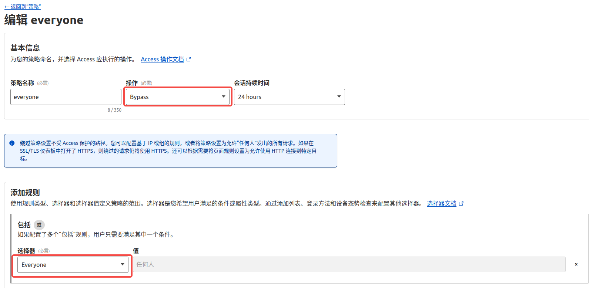
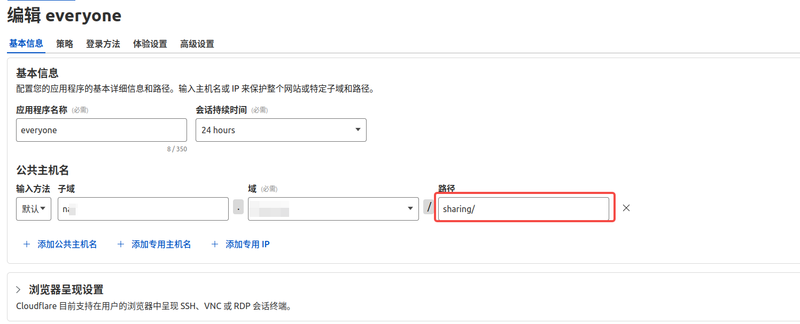
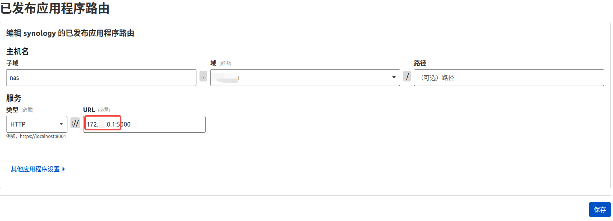
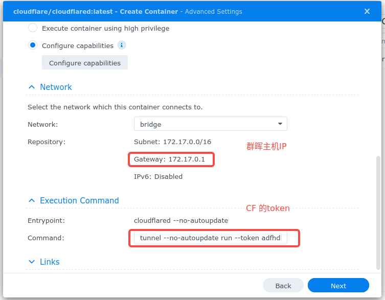

# Cloudflare Tunnel 配置与SSH 代理

去年写过一篇群晖配置cf tunnel 的笔记，但是后来发现它不仅可以用来做网站代理，还能做web ssh以及远程开发。于是重新整理下之前的笔记（对于用户和权限/WARP客户端的理解还不是很深，但是已经够用了）  

## Cloudflare 配置  

### 创建隧道  
1. 登录`Cloudfare Dashboard`，进入`Zero Trust` 选择免费计划。在`Networks-Tunnels（连接器/隧道）` 中创建所需cloudflared 类型的隧道。  
2. 设置隧道名  
3. 安装连接器（有指导教程）
4. 设置应用程序路由（设置对外的url，代理的服务类型和内网端口）

### 创建访问策略  
在`访问控制-策略` 中可以设置允许特定邮箱后缀访问。一般需要（绑定cloudfalre 域名的）邮箱接收验证码。如果需要使用其他的认证方式，如 GitHub，可以在 `Cloudflare 控制台 > Zero Trust > Settings > Authentication > Login Methods` 中添加，其中有对应的帮助文档参考。  

### 部分路径绕过安全设置  
可以通过新增一个子路径（应用），将其测略设置为`bypass`，这样对于某些不需要验证的url 就可以直接访问了。  
**策略设置**  
  
**应用设置**  
  

### 创建自托管应用  
1. 在 `Cloudflare 控制台 > Zero Trust > Access > Applications` 选择 `Add an application` 创建新的应用；应用类型为`自托管(Self-hosted)`  
2. 指定应用名称，并为应用公共主机名（同隧道）；`session` 的过期时间可以按需配置；
3. （ssh 应用）将 `浏览器呈现设置（Browser rendering）` 的类型改为 `SSH`；然后选择保存，这样就配置好web SSH 应用了
4. 需要配置访问策略，只允许特定的邮箱后缀（一般不能是管理员邮箱）登录；
5. 配置登录方法等高级设置  

完成后即可在浏览器访问了。  

## SSH 远程开发  
1. 在客户端安装`cloudflared`，也就是创建隧道时需要安装的程序；  
2. 配置客户端的`~/.ssh/config` 文件  

```txt
Host terminal.mydomain.com
    HostName terminal.mydomain.com
    ProxyCommand /usr/local/bin/cloudflared access ssh --hostname %h
    # 目前已知不支持下面特性
    ForwardAgent yes
    ForwardX11 yes
    ForwardX11Trusted yes
```
这样通过VSCode 或者Zed 远程开发就行了

## 群晖Docker设置
1. 在`Networks-Tunnels` 中创建docker 类型的隧道。保存给出的安装命令中`tunnel --no-autoupdate run --token ...` 字符串备用。
2. 设置`Public Hostname`，给定域名和服务。但是服务端口用`https/5001` 会有问题（需要跳过tls 验证），所以用`http/5000` 的组合更好一些。URL 中的IP 可以设置为docker 宿主机IP：`172.0.0.1`
  

### 群晖安装docker 镜像
在在国内的群晖几乎自动下载docker 镜像，可以通过以下命令保存`.tar` 压缩包，然后再手动导入到群晖的`Container Management`。  
```shell
$ docker pull --platform linux/amd64 cloudfare/cloudfared:latest  

$ docker save -o cfd.tar cloudfare/cloudfared:latest  

$ # 如果是sudo 运行的，还需要修改文件权限才能上传使用  
$ # sudo chmode 777 cfd.tar  
```

如果要导入其他镜像，还可以通过以下命令： 

```bash
# 拉取指定架构的镜像
docker pull --platform linux/amd64 【镜像名称】

# 导出镜像为 tar 文件
docker save -o package.tar 【镜像名称】
```

### 启动docker 镜像  
将上面保存的`tunnel --no-autoupdate run --token ...` 粘贴至`command/命令` 文本框中，其他配置保持默认。




## 参考资料  
1. [使用 Cloudflare Tunnels 通过 Web SSH 访问服务器](https://blog.hellowood.dev/posts/cloudflare-tunnels-web-ssh-server-access/)
2. [Docker 镜像源下线，Image 越来越难以拉取？试试下载后离线转移到线上环境](https://utgd.net/article/20798)  
3. [通过群晖的 QuickConnect 访问第三方应用](https://null.studio/2020/02/16/access-thirdparty-web-via-synology-quickconnect/)  
4. [群晖7.1 docker搭建cloudflared，使用Cloudflare Tunnel内网穿透，公网访问内网服务](https://www.thsink.com/notes/1665/)
