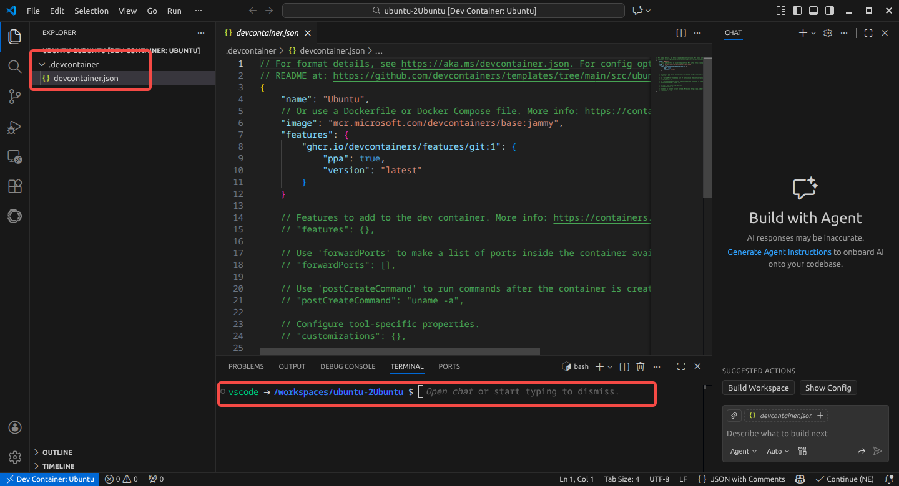

---
title: Docker 基本操作  
date: 2026-01-14 13:12:39  
description: 一些docker 的基础操作，包括离线部署、DevContainer 等内容。  
tags: 
    - 容器技术  
    - ROS
next: 
    text: Wechat QRCode 二维码扫描
    link: '../wechat-qrcode/'
---  

在软件开发完成，进入实际部署的时候，可能会遇到各种环境不兼容的问题，优势也许要将代码的运行环境与其他项目隔离，这时就需要用到容器技术，可以在不同平台上快速构建相同的开发/运行环境。  
Docker 是最流行的一个容器引擎，除此之外还有Podman。因为VSCode 使用docker 作为`DevContainer` 的实现，所以本文将以`DevContainer + ROS2` 为示例，记录相关操作。  

## Docker Community Edition

下面是Docker CE 的安装步骤，因为本人使用的是LMDE，因此需要安装Debian 的教程[通过脚本安装](https://docs.docker.com/engine/install/debian/#install-using-the-convenience-script)：

```bash{5,6}
# 1. 移除现有的安装
sudo apt remove $(dpkg --get-selections docker.io docker-compose docker-doc podman-docker containerd runc | cut -f1)

# 2. 通过脚本安装Docker  
curl -fsSL https://get.docker.com -o get-docker.sh
sudo sh ./get-docker.sh
```

在Debian 环境下，安装docker 之后，还需要将用户添加到`docker` 用户组，否则每次执行`docker` 命令时，需要使用`sudo` 权限。  
```bash
# 添加用户到docker 组
sudo usermod -aG docker your_account
```

### 基本指令  
以下是docker 的一些常用指令，足够满足一般使用场景：  

#### 镜像管理  
```bash{4-5}
docker images # 列出所有docker 镜像，包含ID 和名字  
docker rmi IMAGE_ID/IMAGE_NAME  # 移除镜像  

# 加载离线镜像（断网环境下比较好用）
docer load -i image.tar  
```

#### 容器管理  
```bash{4-11}
docker ps -a  # 列出全部容器，去掉-a 标识则仅列出在运行容器  
docker rm ID/NAME  # 移除容器（需要先停止）

# 通过镜像创建容器并运行
docker run -it --entrypoint /bin/bash  \  # 指定入口
    --name ocr_docker_0_4              \  # 指定容器名
    -v ~/ocr_docker:/home/ocr_docker   \  # 挂载卷
    -w /home/ocr_docker                \  # 指定当前工作区  
    -p 80:8889                         \  # 端口映射
    ocr-docker:0.4                     \  # 镜像名
    -c "python3 main.py"                  # 执行命令

docker start/stop/restart ID/NAME  # 启动/重启/停止容器
```
通过`docker start` 启动容器时，无需像`docker run` 一样传入各种参数，因为容器已经记住了所需的参数。  

#### 保存变更
```bash
# 保存变更到新镜像（不影响原镜像） # // [!code focus] 
docker commit container_ID image_name  # // [!code focus] 

# 导出镜像到tar 文件 # // [!code focus] 
docker save image_name -o filename.tar  # // [!code focus] 

# 加载离线镜像
docer load -i image.tar  
```

### Dockerfile  
Dockerfile 是一个文本文件，包含了构建 Docker 镜像的所有指令。主要包含以下内容：  
```dockerfile
# 指定基础镜像，用于后续的指令构建。
FROM ros:humble 	

# 获取构建参数，可以通过docker build 传入
ARG USERNAME=USERNAME

# 在构建过程中在镜像中执行命令。
RUN apt-get update && apt-get upgrade -y

# 在容器内部设置环境变量。
ENV SHELL /bin/bash

# 指定后续指令的用户上下文
USER $USERNAME

# 指定容器创建时的默认命令。（可以被覆盖）
CMD	["/bin/bash"]
```


通过当前目录下的`Dockerfile` 构建镜像：  
```bash
docker build -t image_name:version .
```

### Docker Compose  
`Docker Compose` 可以通过一个配置文件定义、启动和管理一组相互关联的容器服务。上面创建容器的命令可以写作`compose.yaml`：  
:::code-group
```yaml [compose.yaml]
# Docker Compose 配置文件
services:  
    ocr: # 定义一个名为 "ocr" 的服务
        image: ocr-docker:0.4  # 指定使用的 Docker 镜像名称和版本标签        
        container_name: ocr_docker_0_4  # 设置容器的自定义名称，方便识别和管理              
        volumes:  # 数据卷映射配置
            - ~/ocr_docker:/home/ocr_docker                
        working_dir: /home/ocr_docker  # 设置容器的工作目录            
        ports:  # 端口映射配置
            - "80:8889"                    
        restart: unless-stopped  # 容器退出后自动重启

        # 无需交互模式
        # 使用 command 指定启动命令（推荐）
        command: python3 main.py

        # 如果需要交互模式则启用下面三行
        # entrypoint: /bin/bash
        # stdin_open: true
        # tty: true
```
:::

相关命令如下，Docker Compose 会在当前工作目录查找配置文件，因而无需显式传值：  
```bash  
docker compose up  # 启动服务，前台运行。设置`-d` 设置后台运行
docker compose start/restart/stop  
docker compose down # 停止并删除容器。设置`-v` 会同时删除数据卷
docker compose ps
```
也可以在不同目录启动多个 Docker Compose 项目，它们互不干扰。

## Dev Container  
DevContainer 是一种Docker 容器，VSCode 可以直连进行开发工作，非常方便。**DevContainer 会自己处理构建镜像、启动容器的工作**。    

### 标准环境建立  
如果是自己新建项目，一步步进行开发工作，可以从头建立自己的DevContainer 容器，过程如下：  

> 1. 安装打开VSCode，点击左下角远程连接的按钮；
> 2. 选择`New Dev Container`；
> 3. 选择预定义模板，以`Ubuntu` 为例；
> 4. 选择额外选项（可选）：
>     - 版本号：`jammy`
>     - 特性：
>         - `Git`：保持默认配置
> 5. 完成（等待一段时间拉取镜像）。

得到项目结构如下图所示：  


其中，配置文件`.devcontainer/devcontainer.json` 内容如下：  
:::code-group
```json [.devcontainer/devcontainer.json]
{
	"name": "Ubuntu",
	// 镜像可以用链接，也可以用Dockerfile 等
    // More info: https://containers.dev/guide/dockerfile
	"image": "mcr.microsoft.com/devcontainers/base:jammy",
	"features": {  // 启用git 特性
		"ghcr.io/devcontainers/features/git:1": {
			"ppa": true,
			"version": "latest"
		}
	}
    // ... 
}
```
:::

### 一般环境发布  
如果要发布DevContainer 的配置，让用户可以直接使用，则需要编写更加复杂的配置文件。以ROS2 的项目文件为例，其文件结构如下：  
```
ros_ws
├── .devcontainer           # devcontainer 配置相关
│   ├── devcontainer.json
│   └── Dockerfile          # 容器配置相关
├── src                     # 项目代码
    ├── package1
    └── package2
```

:::code-group
```json [.devcontainer/devcontainer.json]
{
    "name": "ROS 2 Development Container",  // 开发容器的名称，显示用
    "privileged": true,                     // 以 --privileged 模式运行容器，可以访问宿主即设备、网络等
    "remoteUser": "doumiao2",               // VS Code 连接容器后使用的默认用户，一般与当前用户相同，这样不会出现权限问题
    "build": {  // 构建相关
        "dockerfile": "Dockerfile",  // Dockerfile 的路径
        "args": {
            "USERNAME": "doumiao2"   // Dockerfile 会读取当前属性值`ARG USERNAME`
        }
    },
    "workspaceFolder": "/home/ros_ws",  // 工作区文件夹（宿主机）
    // 挂载工作区文件夹到容器（指定目录）
    "workspaceMount": "source=${localWorkspaceFolder},target=/home/ros_ws,type=bind",
    // VSCode 定制属性
    "customizations": {
        "vscode": {
            "extensions":[ // 自动安装下面插件
                "ms-vscode.cpptools",
                "ms-vscode.cpptools-themes",
                "twxs.cmake",
                "donjayamanne.python-extension-pack",
                "eamodio.gitlens",
                "ms-iot.vscode-ros"
            ]
        }
    },
    "containerEnv": {  // 容器环境
        "DISPLAY": "unix:0",  // X11 GUI 转发
        "ROS_LOCALHOST_ONLY": "1",  // DDS 通信仅限于本机
        "ROS_DOMAIN_ID": "42"       // DDS 域隔离
    },
    // 运行参数，传递给docker run 的参数
    "runArgs": [
        "--net=host",   // 容器与宿主共享网络命名空间
        "--pid=host",   // 共享进程命名空间
        "--ipc=host",   // 共享 IPC（Gazebo、FastDDS 更稳定）
        "-e", "DISPLAY=${env:DISPLAY}"  // 从宿主机继承 DISPLAY 值，用于X11 转发
    ],
    "mounts": [ // 额外的挂载
       // X11 套接字，GUI 程序显示到宿主
       "source=/tmp/.X11-unix,target=/tmp/.X11-unix,type=bind,consistency=cached",
       // GPU / 显卡直通，RViz、Gazebo、OpenGL 加速
       "source=/dev/dri,target=/dev/dri,type=bind,consistency=cached"
    ],
    // 容器首次创建完成后执行的命令：更新依赖数据库、安装依赖、修复挂载目录权限问题
    "postCreateCommand": "sudo rosdep update && sudo rosdep install --from-paths src --ignore-src -y && sudo chown -R $(whoami) /home/ros_ws/"
}
```

```dockerfile [.devcontainer/Dockerfile]
# 继承镜像ros:humble
FROM ros:humble  
# 获取构建参数：用户名、用户ID、用户组ID
ARG USERNAME=USERNAME
ARG USER_UID=1000
ARG USER_GID=$USER_UID

# 如果用户存在则删除
RUN if id -u $USER_UID ; then userdel `id -un $USER_UID` ; fi

# 创建用户
RUN groupadd --gid $USER_GID $USERNAME \
    && useradd --uid $USER_UID --gid $USER_GID -m $USERNAME \
    # 安装sudo 并授权
    && apt-get update \
    && apt-get install -y sudo \
    && echo $USERNAME ALL=\(root\) NOPASSWD:ALL > /etc/sudoers.d/$USERNAME \
    && chmod 0440 /etc/sudoers.d/$USERNAME
# 更新系统
RUN apt-get update && apt-get upgrade -y
# 安装python 依赖
RUN apt-get install -y python3-pip
# 设置默认shell
ENV SHELL /bin/bash

# 默认用户切换
USER $USERNAME
# 默认启动命令
CMD ["/bin/bash"]
```
:::

如果配置文件有更新，则需`Ctrl+Shift+P`，选择`Dev Container: Rebuild` 一下。至于移除，则参考移除Docker 容器/镜像即可。  


## 参考资料  
1. [Install Docker Engine | Docker Docs](https://docs.docker.com/engine/install/)  
2. [Dockerfule | 菜鸟教程](https://www.runoob.com/docker/docker-dockerfile.html)  
3. [Dev Container：也许是一种比虚拟机更方便的虚拟开发环境 |  dianhsuのblog](https://www.dianhsu.com/2023/06/07/devcontainer/)
4. [Setup ROS 2 with VSCode and Docker [community-contributed] | docs.ros.org](https://docs.ros.org/en/humble/How-To-Guides/Setup-ROS-2-with-VSCode-and-Docker-Container.html)