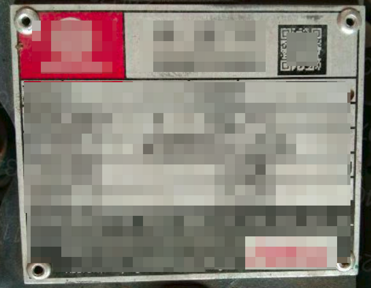
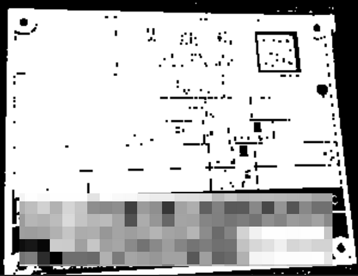
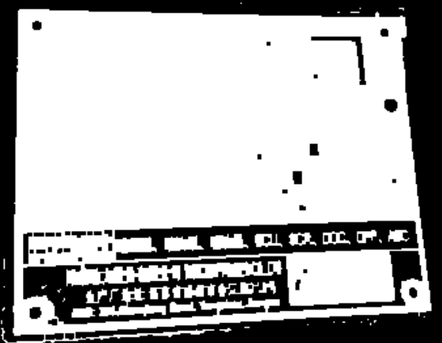
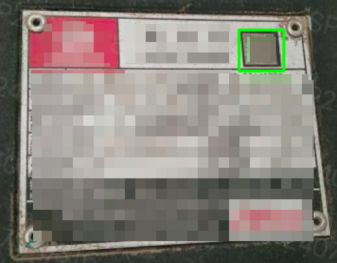
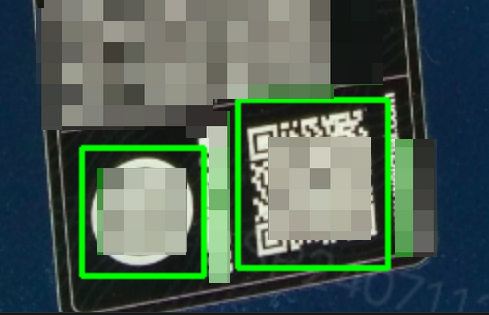

---
title: Wechat QRCode 二维码扫描
date: 2026-01-28 08:37:31  
description: 六年前的模块，依然好使
tags:
    - python
    - 神经网络  
    - 机器视觉

prev: 
    text: Docker 基本操作  
    link: '../docker-basic'
next: 
    text: Todo
    link: '.'
---  

# Wechat QRCode 二维码扫描

做OCR 识别时，发现物体标签上有二维码信息，用手机微信是可以扫描出来，但是用`pyzbar` 却无法识别。搜索后发现这篇文章[微信AI设计了一种超分辨率技术，让扫二维码更方便](https://mp.weixin.qq.com/s/ZEthIoGsIm1KsHheWUviZg)，进一步搜索后发现`opencv` 中已经集成了该功能。真的是踏破铁鞋无觅处，得来全不费工夫。  

理论知识不多赘述，核心的思路是：  
1. 通过超分辨率模型使得原本模糊的二维码变得清晰可识别  
2. 通过模型蒸馏，大幅缩小模型体积并提高效率  

虽然大模型的准确率高，但是消耗资源多，在边缘计算设备中，蒸馏后的小模型反而更有优势。  

## 安装使用  

有时系统会有`python-opencv` 库，但是因为版本原因可能没有`WechatQRCode` 模块，这时候需要手动更新库：  

```bash
# 先卸载opencv 相关库
pip3 uninstall -y opencv-python opencv-contrib-python opencv-python-headless opencv-contrib-python-headless

# 重新安装最新的 opencv-contrib-python
pip3 install opencv-contrib-python
```

安装后还需要[下载模型和权重文件](https://github.com/WeChatCV/opencv_3rdparty)，是基于`CAFFE`框架的，可以通过一些工具转化为torch 或者tf 格式。不过对于一般使用来说不影响。  

使用方法如下：  
```python{3-7,10}
import cv2

detector = cv2.wechat_qrcode.WeChatQRCode(
    "detect.prototxt",
    "detect.caffemodel", 
    "sr.prototxt", 
    "sr.caffemodel")

img = cv2.imread("123.png")
res, points = detector.detectAndDecode(img)
print(res, points)

# 得到结果如下（假设包含两个二维码）：
# (
#     '二维码1 包含的文本', 
#     '二维码1 包含的文本'
# ) 
# (
#     array([[232.75479 ,  88.500145],
#        [227.90897 ,  19.418858],
#        [296.88034 ,  21.399696],
#        [301.46844 ,  89.96361 ]], dtype=float32), 
#     array([[318.8573 , 805.2406 ],
#        [313.44568, 742.3865 ],
#        [372.53503, 732.10156],
#        [377.7074 , 794.7845 ]], dtype=float32)
# )
```

经过测试，灰度处理后的图像能容易识别出来二维码信息：  
```python{7,11-12}
import cv2
import numpy as np

img = cv2.imread("多个二维码.jpg", cv2.IMREAD_GRAYSCALE)

# 计算图像平均亮度
mean_brightness = np.mean(img)

# 如果平均亮度小于128（偏暗，说明是黑色背景），则进行反色
if mean_brightness < 128:
    img = cv2.bitwise_not(img)
    print("检测到黑色背景，已进行反色处理")
else:
    print("检测到白色背景，保持原样")

# 保存结果图片
# cv2.imwrite("output.png", img)

res, points = detector.detectAndDecode(img)
print(res, points)
```

## 特殊情况处理  

并不是所有图片中的二维码都可以直接被识别，如下图中二维码区域相对较小，有时就无法识别到二维码信息。



这是需要先通过opencv 形态学运算找到可能存在二维码的区域。**在OpenCV 的底层逻辑中，它会将（黑色）像素值为`0` 的区域视为背景，将所有像素值大于`0`（通常是二值化后的`255`）的区域视为前景目标。形态学操作的目标是前景色。**  

```python{11-14,16-17,21}
import cv2
import numpy as np

img = cv2.imread('qrcode-label.png')  # 读取图片
gray = cv2.cvtColor(img, cv2.COLOR_BGR2GRAY)  # 转化为灰度图片
_, thresh = cv2.threshold(gray, 100, 255, cv2.THRESH_BINARY) # 图片二值化


kernels_to_try = [(2,2), (3,3)]  # 卷积核，用于把白色区域扩大，黏合成一块
for k in kernels_to_try:
    # 创建卷积核，这里用的MORPH_RECT 矩形
    kernel = cv2.getStructuringElement(cv2.MORPH_RECT, k)
    # 形态学闭运算，先膨胀后腐蚀，可以将白色区域连接起来
    closed = cv2.morphologyEx(thresh, cv2.MORPH_CLOSE, kernel)

    # 白色连通域提取
    num_labels, labels, stats, centroids = cv2.connectedComponentsWithStats(closed)

    for i in range(1, num_labels):
        # 对于每个连通区域进行判断
        x, y, w, h, area = stats[i]
        
        # 计算特征指标
        aspect_ratio = float(w) / h
        rect_area = w * h
        extent = float(area) / rect_area  # 填充率：连通域面积占外接矩形面积的比例

        # 4. 筛选条件：
        # - 面积不能太小 24x24 像素
        # - 长宽比接近 1 (正方形)
        # - 填充率高 (说明是个实心的矩形块)
        if area > 600 and 0.8 < aspect_ratio < 1.2 and extent > 0.7:
            # 标记可疑区域
            cv2.rectangle(img, (x-5, y-5), (x + w+5, y + h+5), (0, 255, 0), 2)
            print(f"检测到潜在区域: [x:{x}, y:{y}, w:{w}, h:{h}], 置信填充率: {extent:.2f}")
        cv2.imwrite(f'prep-closed_{i}.png', closed)

cv2.imwrite('prep.png', img)
```

下面是不同卷积核闭运算后得到的结果：  

2x2 卷积核效果如下：    


3x3 卷积核效果如下（不合格）：    


最终标记出所有可能的位置：  


对于筛选出来的多个可能存在的区域，可以进行合并重叠区域之后，再进行识别。


然后对于有些二维码是与标准二维码是反色的，还需要进一步进行反色处理。  

## 参考资料 
1. [微信AI设计了一种超分辨率技术，让扫二维码更方便](https://mp.weixin.qq.com/s/ZEthIoGsIm1KsHheWUviZg)  
2. [微信二维码引擎OpenCV开源！3行代码让你拥有微信扫码能力](https://mp.weixin.qq.com/s/AknsKNqVmvr8aohV25_ZcQ)  
3. [Python OpenCV 形态学应用—图像开运算与闭运算](https://juejin.cn/post/7205222965281374269)