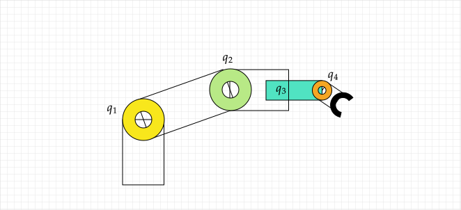
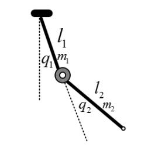

---
title: 机械臂笔记（五）机械臂的动力学模型（欧拉-拉格朗日方程）
date: 2026-01-16 09:05:35  
description: 基于欧拉-拉格朗日方程的机器人动力学模型
tags:
    - python
    - 矩阵  
    - 机器人
    - 力学

prev: 
    text: 机械臂笔记（四）通过雅可比矩阵实现逆运动学运算
    link: '../robot-arm-4/'
next: 
    text: 机械臂笔记（六）机械臂的动力学模型（牛顿-欧拉方程）
    link: '../robot-arm-6/'
--- 

# 机械臂笔记（五）机械臂的动力学模型（欧拉-拉格朗日方程）

通过机器人的（逆）运动学可以将机械臂运动到给定的位姿，但是仅适合轻载、低速、无接触的工况，因为无法判断力矩是否合理、是否会激发振动、是否与系统惯量匹配。而通过引入动力学，则可以让机械臂按照需要的加速度运动，实现运动地稳、准、快、省、柔。  

## 一维欧拉-拉格朗日方程推导  
假设有以下粒子，受管道约束只能上下移动，并且约束力满足虚功原理。  

根据牛顿第二定律，该质点的运动方程为：  
$$my'' = f - mg \tag{1}$$
将$(1)$式右边先对时间求导、再对速度$y'$ 求偏导，可得：  
$$
my'' = \frac{d}{dt}(my') 
= \frac{d}{dt}\frac{\partial}{\partial y'}(\frac{1}{2}my'^2) 
= \frac{d}{dt}\frac{\partial K}{\partial y'}
\tag{2}
$$
其中$K=\frac{1}{2}my'^2$ 表示质点的动能，接下来表示质点的重力势能：  
$$
mg = \frac{\partial}{\partial y}(mgy) = \frac{\partial P}{\partial y}  
\tag{3}
$$
其中$P=mgy$ 表示质点的重力势能。  
之后我们定义拉格朗日算子$L$，表示动能与势能之差：  
$$
L = K - P = \frac{1}{2}my'^2 - mgy  \tag{4}
$$

并且有：  
$$
\begin{array}{l}
    \frac{\partial L}{\partial y'} = \frac{\partial K}{\partial y'} \\
    \frac{\partial L}{\partial y} = -\frac{\partial P}{\partial y} 
\end{array}
\tag{5}
$$

联立式$(1,2,3)$，初始的质点运动学方程可以化为：  
$$
\frac{d}{dt}\frac{\partial K}{\partial y'} = f - \frac{\partial P}{\partial y}  
\tag{6}
$$
联立式$(5，6)$，进一步得到：
$$
\frac{d}{dt}\frac{\partial L}{\partial y'} - \frac{\partial L}{\partial y} = f  
\tag{7}
$$ 
方程$(7)$ 被称为欧拉-拉格朗日方程。推广到$n$ 个自由度的系统，可得：  
$$
\frac{d}{dt}\frac{\partial L}{\partial q'_k}-\frac{\partial L}{\partial q_k} = \tau_k  
\tag{8}
$$
上面方程中：  
1. $q_k$ 表示第$k$ 个广义坐标，在机器人中可以表示转角或直线位移  
2. $L$ 表示拉格朗日量，包含动能和势能  
3. $\frac{\partial L}{\partial q'_k}$ 表示与$q_k$ 对应的广义动量  
4. $\frac{d}{dt}\frac{\partial L}{\partial q'_k}$ 表示惯性项，对加速度的反抗  
5. $\frac{\partial L}{\partial q_k}$ 表示保守力项，构型变化对能量的影响  
6. $\tau_k$ 表示第$k$ 个广义力（矩）  

由虚功原理：  
$$
\delta W = \sum_{k}\tau_k \delta q_k  
\tag{9}
$$

将其对应机械臂的各个关节旧容易理解一些了：  

## 高维推广  
在高维情况下，我们通过一组广义坐标来表示系统的动能和势能。  

### 动能表示  
刚体的动能是平移动能和旋转动能之和：  
$$
K = \frac{1}{2}mv^Tv + \frac{1}{2}\omega^TZ\omega  
\tag{10}
$$

其中$Z$ 表示物体的惯性张量，是一个$3\times 3$ 的矩阵。$Z=RIR^T$，$R$ 是附体坐标系（随刚体运动）与惯性坐标系（世界坐标系）之间的姿态变换。$I$ 是附体坐标系中的惯性张量，仅取决于物体的形状和质量分布，与物体的运动无关。  

:::details 展开$I$ 的计算  

$$
I = \begin{bmatrix}
    I_{xx} & I_{xy} & I_{xz} \\ 
    I_{yx} & I_{yy} & I_{yz} \\ 
    I_{zx} & I_{zy} & I_{zz} 
\end{bmatrix}
$$

其中，各元素的计算如下：  
$$
\begin{array}{l}
I_{xx} = \int\int\int(y^2+z^2)\rho(x,y,z)dxdydz \\
I_{yy} = \int\int\int(x^2+z^2)\rho(x,y,z)dxdydz \\
I_{zz} = \int\int\int(x^2+y^2)\rho(x,y,z)dxdydz \\
I_{xy} = I_{yx} = -\int\int\int(xy)\rho(x,y,z)dxdydz \\
I_{xz} = I_{zx} = -\int\int\int(xz)\rho(x,y,z)dxdydz \\
I_{yz} = I_{zy} = -\int\int\int(yz)\rho(x,y,z)dxdydz 
\end{array}
$$
:::

连杆上任意一点的线速度和角速度可以通过雅可比矩阵和关节速度表示：  
$$

\begin{array}{l}
v_i = J_{v_i}(q)q'  \\
\omega_i = J_{\omega_i}(q)q'
\end{array}
\tag{11}
$$
$J_{*_i}(q)$ 表示第$i$ 个连杆的线（角）速度雅可比矩阵，依赖于构型$q$。映射是线性的。  

则某一关机的动能可以表示为如下（$m_i$）是常数：  
$$
\begin{array}{lll}
K_i & = &\frac{1}{2}m_iv_i^Tv_i+\frac{1}{2}\omega_i^TR_i(q)I_iR_i^T(q)\omega_i \\
& = & \frac{1}{2}\left[m_i q'^TJ_{v_i}^T(q) \, J_{v_i}(q)q' +  
    q'^TJ_{\omega_i}^T(q)R_i(q)I_iR_i^T(q)J_{\omega_i}(q)q'
\right] \\
& = & \frac{1}{2}q'^T\left[
    m_iJ_{v_i}^T(q)J_{v_i}(q) + J_{\omega_i}^T(q)R_i(q)I_iR_i^T(q)J_{\omega_i}(q)
\right]q'
\end{array}
\tag{12}
$$
于是，机械臂的总动能可以表示为：  
$$
\begin{array}{lll}
K_{total} & = & \sum_{i=1}^nK_i \\
& = &  \frac{1}{2}q'^T \sum_{i=1}^n \left[m_iJ_{v_i}^T(q)J_{v_i}(q) + J_{\omega_i}^T(q)R_i(q)I_iR_i^T(q)J_{\omega_i}(q)\right]q'
\end{array}
\tag{13}
$$  
可以用$D(q)$ 表示机器人的惯性矩阵：  
$$
D(q) = \sum_{i=1}^n \left[m_iJ_{v_i}^T(q)J_{v_i}(q) + J_{\omega_i}^T(q)R_i(q)I_iR_i^T(q)J_{\omega_i}(q)\right]  
\tag{14}
$$  
则式$(13)$可以化简为如下形式：  
$$
K_{total} = \frac{1}{2}q'^TD(q)q' \tag{15}
$$

机器人惯性矩阵$D(q)$ 具有以下特点：  
1. **只与机械臂/机器人的构型有关**  
2. **对称且正定**  
3. **动能总是非负的**  

### 势能表示  
假设物体质量集中在质心，计算第$i$个连杆的势能：  
$$
P_i = m_i\vec{g}^T\vec{r}_{c_i} \tag{16}
$$  
其中：  
- $\vec{g}$ 表示重力加速度向量，$\vec{g} = \begin{bmatrix} 0 \\ 0 \\ -g \end{bmatrix}$
- $\vec{r}_{c_i}$ 表示第$i$ 个连杆质心在惯性（世界）坐标系中的位置向量。$\vec{r}_{c_i} = \begin{bmatrix} x_i \\ y_i \\ z_i \end{bmatrix}$  

则系统的总势能为：  
$$
P_{total} = \sum_{i=1}^nP_i = \sum_{i=1}^nm_i\vec{g}^T\vec{r}_{c_i}  
\tag{17}
$$
在$m,g$ 是常数的情况下，机器人势能只与$\vec{r}_{c_i}$ 有关。  

### 运动方程  
由式$(15)$，系统的动能是关于广义速度（坐标微分）的二次函数： 
$$
K_{total} = \frac{1}{2}q'^TD(q)q' = \frac{1}{2}\sum_{ij}^nd_{ij}(q)q_i'q_j'
\tag{18}
$$
$d_{ij}(q)$ 是矩阵$D(q)$的第$(i,j)$个元素。  
结合势能方程$(17)$ 可以得到欧拉-拉格朗日算子： 
$$
L = K_{total} - P_{total} = \frac{1}{2}\sum_{ij}^nd_{ij}(q)q_i'q_j' - P(q)
\tag{19}
$$
第$k$ 个关节的欧拉-拉格朗日方程为：  
$$
\frac{d}{dt}\frac{\partial L}{\partial q_k'} - \frac{\partial L}{\partial q_k} = \tau_k
\tag{20}
$$

其中： 
$$
\begin{array}{lll}
\frac{\partial L}{\partial q'_k} & = & \sum_{j}^n d_{kj}q'_j  \\
\frac{d}{dt}\frac{\partial L}{\partial q'_k} & = & \sum_{j}^n d_{kj}q''_j  + \sum_{j}^n\frac{d}{dt}d_{kj}q'_j \\  
& = & \sum_{j}^n d_{kj}q''_j  + \sum_{ij}^n\frac{\partial d_{kj}}{\partial q_i}q'_iq'_j \\ 
\frac{\partial L}{\partial q_k} & = & \frac{1}{2}\sum_{ij}^n\frac{\partial d_{ij}}{\partial q_k}q'_iq'_j - \frac{\partial P}{\partial q_k}
\end{array}
\tag{21}
$$
因此，对于每一个$k=1,2,...,n$，欧拉-拉格朗日方程可以写为：  
$$
\begin{array}{l}
\sum_{j}^n d_{kj}q''_j  + \sum_{ij}^n\frac{\partial d_{kj}}{\partial q_i}q'_iq'_j - \frac{1}{2}\sum_{ij}^n\frac{\partial d_{ij}}{\partial q_k}q'_iq'_j + \frac{\partial P}{\partial q_k}  \\
= \sum_{j}^n d_{kj}q''_j  + \sum_{ij}^n\left[(\frac{\partial d_{kj}}{\partial q_i} - \frac{1}{2}\frac{\partial d_{ij}}{\partial q_k}) q'_iq'_j \right]+ \frac{\partial P}{\partial q_k}   \\
= \sum_{j}^n d_{kj}q''_j  + \sum_{ij}^n\left[\frac{1}{2}(\frac{\partial d_{kj}}{\partial q_i} + \frac{\partial d_{kj}}{\partial q_i} - \frac{\partial d_{ij}}{\partial q_k})q'_iq'_j \right] + \frac{\partial P}{\partial q_k} \\  
= \tau_k
\end{array}
\tag{22}
$$

定义`Christoffel symbol`：
$$
c_{ijk} = c_{jik} = \frac{1}{2}(\frac{\partial d_{kj}}{\partial q_i} + \frac{\partial d_{kj}}{\partial q_i} - \frac{\partial d_{ij}}{\partial q_k}) 
\tag{23}
$$

定义广义重力：  
$$
g_k = \frac{\partial P}{\partial q_k}  \tag{24}
$$
最终得到欧拉-拉格朗日方程： 
$$
\sum_jd_{kj}(q)q''_j+\sum_{ij}c_{ijk}(q)q'_iq'_j+g_k(q) = \tau_k
\tag{25}
$$

方程可简写为：
$$
M(q)q''+C(q,q')q'+G(q) = \tau
\tag{26}
$$

其中，方程中各项的意义分别是：
- $M(q)$：n×n惯性矩阵
- $C(q,q')$：科氏力和离心力矩阵
- $G(q)$：重力项
- $\tau$：关节力矩向量  

## 实际应用  

### 单摆  
对于长度为$l$、质量为$m$的单摆，角度为$\theta$：
- 动能：$K=\frac{1}{2}ml^2\theta'^2$  
- 势能：$P=-mgl\cos(\theta)$  
- 欧拉-拉格朗日算子：$L=K-P=\frac{1}{2}ml^2\theta'^2+mgl\cos(\theta)$  
应用欧拉-拉格朗日方程得到：
$$
\frac{d}{dt}\frac{\partial L}{\partial \theta'}-\frac{\partial L}{\partial \theta} =  \frac{d}{dt}ml^2\theta'-(-mgl\sin(\theta)) = ml^2\theta''+mgl\sin(\theta)=\tau
\tag{27}
$$
如果所受外力为0 的情况下有：  
$$
 ml^2\theta''+mgl\sin(\theta) = 0
\tag{28}
$$  

两边同时除以$ml^2$，可以得到单摆的非线性运动方程：  
$$
\theta''+\frac{g}{l}\sin(\theta) = 0
\tag{29}
$$  

如果需要$\theta(t)$ 按照某条轨迹走，则根据式$(27)$，需要施加外力：  
$$
\tau(t) = ml^2\theta''(t)+mgl\sin(\theta(t))  
\tag{30}
$$

力$\tau$ 应该以逆时针为正方向。

### 推导平面2关节机械臂动力学模型  
现有2 关节机械臂如下图所示：  

参数|长度|质量|角度  
---|---|---|---
连杆1|$l_1$|$m_1$|$q_1$
连杆2|$l_2$|$m_2$|$q_2$  

首先求连杆质心的位置： 
$$
\begin{array}{l}
r_{c_1} = \begin{bmatrix}
\frac{l_1}{2}\cos(q_1) \\  
\frac{l_1}{2}\sin(q_1) \\
0
\end{bmatrix} \\
r_{c_2} = \begin{bmatrix}
l_1\cos(q_1) + \frac{l_2}{2}\cos(q_1+q_2)\\  
l_1\sin(q_1) + \frac{l_2}{2}\sin(q_1+q_2)\\
0
\end{bmatrix}
\end{array}
\tag{31}
$$

线速度的雅可比矩阵定义：  
$$
v_{c_i} = \frac{d}{dt}r_{c_i} = J_{v_i}(q)q'  \tag{32}
$$

其中，**$r_{c_i}=r_{c_i}(q)$，是一个关于$q$ 的函数，而$q=\begin{bmatrix}q_1\\1_2\end{bmatrix}$，是一组关于时间$t$ 的函数**。  
根据链式法则：  
$$
v_{c_i} = \frac{d}{dt}r_{c_i} = \frac{\partial r_{c_i}}{\partial q}\frac{dq}{dt} = \frac{\partial r_{c_i}}{\partial q}q'
\tag{33}
$$

可得线速度的雅可比矩阵为：  
$$
J_{v_{c_i}}(q) = \frac{\partial r_{c_i}}{\partial q}
\tag{34}
$$

其中雅可比矩阵： 
$$
\begin{array}{l}
J_{v_{c_1}} = \begin{bmatrix}
\frac{\partial r_{c_1}}{\partial q_1} & \frac{\partial r_{c_1}}{\partial q_2} 
\end{bmatrix} = \begin{bmatrix}
-l_{c1}\sin(q_1) & 0 \\
l_{c1}\cos(q_1) & 0 \\
0 & 0
\end{bmatrix} \\
J_{v_{c_2}} = \begin{bmatrix}
\frac{\partial r_{c_2}}{\partial q_2} & \frac{\partial r_{c_2}}{\partial q_2} 
\end{bmatrix} = \begin{bmatrix}
-l_1\sin(q_1)-l_{c2}\sin(q_1+q_2) & -l_{c2}\sin(q_1+q_2) \\
l_1\cos(q_1) + l_{c2}\cos(q_1+q_2) & l_{c2}\cos(q_1+q_2) \\
0&0
\end{bmatrix}
\end{array}
\tag{35}
$$

其线速度对应的动能为：  
$$
\frac{1}{2}m_1v^T_{c_1}v_{c_1}+\frac{1}{2}m_2v^T_{c_2}v_{c_2} = 
\frac{1}{2}q'^T(m_1J^T_{v_{c_1}}J_{v_{c_1}}+m_2J^T_{v_{c_2}}J_{v_{c_2}})q'
\tag{36}
$$

下面考虑转动部分动能：  
$$
\vec{\omega_1} = q'_1\vec{k} \\
\vec{\omega_2} = (q'_1+q'_2)\vec{k}
\tag{37}
$$
其中$\vec{k}=\begin{bmatrix} 0 \\ 0\\1\end{bmatrix}$，表示方向向量。  
因为$\omega_i$与每个关节坐标系的$z$ 轴对齐，所以旋转动能可以简单的表示为：$\frac{1}{2}I_i\omega^2_i$，其中$I_i$ 是转动惯量，它的轴线穿过连杆的质心且平行于$z_i$轴。因此，对于广义坐标系，整个系统的旋转功能为：  
$$
\begin{array}{lll}
K & = & \frac{1}{2}I_1(\vec{\omega'_1})^2+\frac{1}{2}I_2(\vec{\omega'_2})^2 \\
& = & \frac{1}{2}\left\{\vec{\omega'_1}^TI_1\vec{\omega'_1} +  \vec{\omega'_2}^TI_2\vec{\omega'_2}\right\} \\
& = &  \frac{1}{2}\left\{
    (\begin{bmatrix} 1 & 0 \end{bmatrix}q')^TI_1 (\begin{bmatrix} 1 & 0 \end{bmatrix}q')+
     (\begin{bmatrix} 1 & 1 \end{bmatrix}q')^TI_2 (\begin{bmatrix} 1 & 1 \end{bmatrix}q') \\     
\right\} \\
& = &  \frac{1}{2}\left\{
    q'^T\begin{bmatrix} 1 \\ 0 \end{bmatrix}I_1 \begin{bmatrix} 1 & 0 \end{bmatrix}q'+
     q'^T\begin{bmatrix} 1 \\ 1 \end{bmatrix}I_2 \begin{bmatrix} 1 & 1 \end{bmatrix}q' \\
\right\} \\
& = &  \frac{1}{2}q'^T\left\{
    \begin{bmatrix} 1 \\ 0 \end{bmatrix}I_1 \begin{bmatrix} 1 & 0 \end{bmatrix}+
     \begin{bmatrix} 1 \\ 1 \end{bmatrix}I_2 \begin{bmatrix} 1 & 1 \end{bmatrix}\\
\right\}q'  \\
&=& \frac{1}{2}q'^T\left\{ 
    I_1\begin{bmatrix} 1 & 0 \\ 0 & 0 \end{bmatrix} +     
    I_2\begin{bmatrix} 1 & 1 \\ 1 & 1 \end{bmatrix} 
\right\}q' \\
&=& \frac{1}{2}q'^T 
    \begin{bmatrix} I_1+I_2 & I_2 \\ I_2 & I_2 \end{bmatrix}  
    q'
\end{array}
\tag{38}
$$  

结合式$(14),(36),(38)$ 可得，惯性矩阵： 
$$
\begin{array}{lll}
D(q) & = & m_1J^T_{v_{c_1}}J_{v_{c_1}} + m_2J^T_{v_{c_2}}J_{v_{c_2}} + \begin{bmatrix} I_1+I_2 & I_2 \\ I_2 & I_2 \end{bmatrix} \\
& = & \begin{bmatrix} d_{11} & d_{12} \\ d_{21} & d_{22} \end{bmatrix} \\
& = & \begin{bmatrix} \fbox{与$q_1$相关的惯性} & \fbox{$q_1q_2$耦合} \\ \fbox{$q_1q_2$耦合} & \fbox{与$q_2$相关的惯性} \end{bmatrix} 
\end{array}
\tag{39}
$$

结合式$(35),(39)$ 可得： 

$$
\begin{array}{lll}
d_{11} & = & m_1l^2_{c1} + m_2(l^2_1+l^2_{c2}+2l_1l_{c2}\cos(q_2))+I_1+I_2 \\
d_{12}=d_{21} & = & m2(l^2_{c2}+l_1l_{c2}\cos(q_2))+I_2\\
d_{22} & = & m_2l^2_{c2}+I_2
\end{array}
\tag{40}
$$
结合式$(23),(40)$ 可得$c_{ijk}$： 
$$
\begin{array}{lllllll}
c_{111} & = & \frac{1}{2}\frac{\partial d_{11}}{\partial q_1} & = & 0 \\
c_{121} & = & \frac{1}{2}\frac{\partial d_{11}}{\partial q_2} & = & -m_2l_1l_{c2}\sin(q_2) & = & h \\
c_{211} & = & c_{121} & = & h \\
c_{221} & = & \frac{\partial d_{12}}{\partial q_2} - \frac{1}{2}\frac{\partial d_{11}}{\partial q_1} & = & h \\
c_{112} & = & \frac{\partial d_{21}}{\partial q_1} - \frac{1}{2}\frac{\partial d_{11}}{\partial q_2} & = & -h \\
c_{122} & = & \frac{1}{2}\frac{\partial d_{22}}{\partial q_1} & = & 0 \\
c_{212} & = & c_{122} & = & 0 \\
c_{222} & = & \frac{1}{2}\frac{\partial d_{22}}{\partial q_2} & = & 0 
\end{array}
\tag{41}
$$

接下来计算势能，机械臂的势能等于两个连杆的势能之和：  
$$
\begin{array}{lll}
P_1 & = & m_1gl_{c1}\sin(q_1)  \\
P_2 & = & m_2g(l_2\sin(q_1)+l_{c2}\sin(q_1+q_2)) \\
P & = & P_1+P_2 \\
&=& (m_1l_{c1}+m_2l_1)g\sin(q_1) + m_2l_{c2}g\sin(q_1+q_2)
\end{array}
\tag{42}
$$
之前的广义重力$g_k$ 可变为：  
$$
\begin{array}{lll}
    g_1 & = & \frac{\partial P}{\partial q_1}  \\
    & = & (m_1l_{c1}+m_2l_1)g\cos(q_1)+m_2l_{c2}g\cos(q_1+q_2) \\
    g_2 & = &  \frac{\partial P}{\partial q_2} \\
    & = &  m_2l_{c2}g\cos(q_1+q_2)
\end{array}
\tag{42}
$$

结合式$(25),(40),(41),(42)$，最后可以写出系统的动力学方程：  
$$
\begin{array}{rcl}
    d_{11}q''_1 + d_{12}q''_2 +c_{121}q'_1q'_2+c_{211}q'_2q'_1 + c_{221}q'^2_2 + g_1 & = & \tau_1  \\ 
    d_{21}q''_1 + d_{22}q''_2 +c_{112}q'^2_1+ g_2 & = & \tau_2  \\ 
\end{array}
\tag{43}
$$
结合式$(26)$在这种情况下，原方程矩阵$C(q,q')$ 由下式给出：  
$$
C=\begin{bmatrix}
hq'_2 & hq'_2+hq'_1\\
-hq’_1 & 0
\end{bmatrix}
\tag{44}
$$

> 虚功原理的几何意义不过是说约束力$f=mX''-F_a$，与运动轨迹垂直。  

## 参考资料  
1. [从理论力学到机器人动力学（二）：虚功原理与雅可比矩阵](https://blog.csdn.net/weixin_43989965/article/details/120439337)  
2. [基于欧拉-拉格朗日方程的机器人动力学模型 ](http://dev.guyuehome.com/detail?id=1825482657626947585)  
3. [虛功原理及歐拉-拉格朗日方程式 | 数学播客 2021年12月 45卷4期 ](https://www.math.sinica.edu.tw/mathmedia/journals/4680?keywords%5B%5D=Euler)