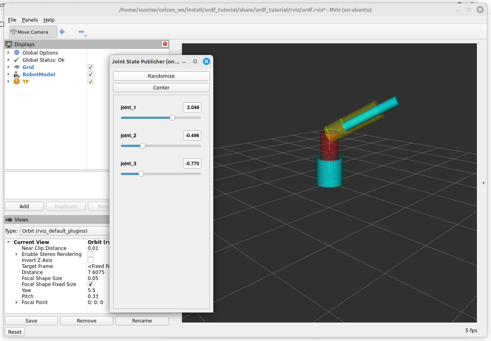

---
title: ROS2笔记（一）URDF 描述文件
date: 2026-02-03 10:15:51  
description: URDF 描述文件
tags:
    - python  
    - ros2

prev: 
    text: ROS2笔记（一）URDF 描述文件
    link: '.'
next: 
    text: Todo
    link: '.'
---  

# ROS2笔记（一）URDF 描述文件

为什么没有先写ROS2 的安装笔记，而是写URDF？因为URDF 文件描述这一块儿并不是那么容易去检索，所以赶紧记下来，怕再想不起来就又拖好久。  

## 文件基本结构  
URDF 文件就是一个特殊的XML 文件，其操作的对象是坐标系，结构大体如下：  
```xml
<?xml version="1.0"?>
<!-- 定义一个叫robot_name 的机器人 -->
<robot name="robot_name">
    <!-- 定义蓝色材料 -->
    <material name="blue">
        <color rgba="0 0 0.8 1"/>
    </material>

    <!-- 定义一个基准link（连杆） -->
    <link name="base_link">
        <visual>
            <!-- 该连杆的几何参数 -->
            <geometry>
                <cylinder length="0.6" radius="0.2"/>
            </geometry>
            <!-- 相对于父坐标的偏移和旋转 -->
            <origin rpy="0 1.57075 0" xyz="0 0 -0.3"/>
            <material name="blue"/>
        </visual>
    </link>

    <!-- 下一个连杆 -->
    <link name="first_link">
    </link>

    <!-- 定义一个关节连接两个连杆（child 一般要跟随parent 动作） -->
    <joint name="base_to_right_leg" type="fixed">
        <parent link="base_link"/>
        <child link="first_link"/>
    </joint>
</robot>
```

### 连杆参数  
一般连杆有以下几个关键参数：  

位置信息`origin`：
- 主要包含该物体相对于父坐标系的平移和旋转

几何特征`geometry` 有下面几种类型：  
- cylinder：圆柱，比较常用  
- box：长方体  
- mesh：任意网格，一般通过`filename` 参数指定`<mesh filename="package://urdf_tutorial/meshes/l_finger_tip.dae" />`  

除几何特征以外，连杆还有一个碰撞检测的属性`collision`：  
```xml
<collision>
  <geometry>...</geometry>
</collision>
```

### 关节参数  
URDF 文件中角度的单位是弧度哦。  
```xml
<!-- 定义关节名和关节类型 -->
<joint name="joint6output_to_joint6" type="revolute">
    <!-- 定义旋转轴（z） -->
    <axis xyz="0 0 1"/>
    <!-- 力矩/角度/速度限制 -->
    <limit effort = "1000.0" lower = "-3.14159" upper = "3.14159" velocity = "0"/>
    <parent link="joint6"/>
    <child link="joint6_flange"/>
    <!-- 关节坐标系定义 -->
    <origin xyz= "0 0.0456 0" rpy = "-1.5708 0 0"/>  
</joint>
```

常用关节类型：  
1. fixed 固定关节 
2. revolute 旋转关节
3. prismatic 平移关节

## 定义一个R-R-P 三关节机械臂 


通过下面代码，可以定义一个如上图的机械臂：  

:::details urdf代码
```xml
<?xml version="1.0"?>
<robot name="myfirst">
  <material name="base">
    <color rgba="0 0.9 0.9 1.0"/>
  </material>

  <link name="base_link">
    <visual>
    <!-- 1. 现将坐标轴沿z 轴平移0.1 -->
    <origin xyz="0.0 0.0 0.3" rpy="0.0 0.0 0.0"/>
    <geometry>
        <!-- 2. 基于坐标轴原点创建一个圆柱体，上下厚各0.3 -->
        <cylinder radius="0.3" length="0.6"/>
    </geometry>
    <!-- 3. 添加材料 -->
    <material name="base" />
    </visual>
  </link>

  <!-- 7. 第一个旋转连杆  -->
  <link name="first_r">
    <visual >
      <origin xyz="0.0 0.0 0.3" rpy="0.0 0.0 0.0"/>
      <geometry>
        <cylinder radius="0.2" length="0.6"/>
      </geometry>
      <material name="">
        <color rgba="1.0 0.0 0.0 .5"/>
      </material>
    </visual>
  </link>

  <link name="second_r">
    <visual >
      <origin xyz="0.0 0.0 0.6" rpy="0.0 0.0 0.0"/>
      <geometry>
        <cylinder radius="0.2" length="1.2"/>
      </geometry>
      <material name="">
        <color rgba="1.0 1.0 0.0 .5"/>
      </material>
    </visual>
  </link>

  <link name="first_p">
    <visual name="">
      <origin xyz="0.0 0.0 0.6" rpy="0.0 0.0 0.0"/>
      <geometry>
        <cylinder radius="0.1" length="1.2"/>
      </geometry>
      <material name="">
        <color rgba="0.0 1.0 1.0 1.0"/>
      </material>
    </visual>
  </link>


  <joint name="joint_1" type="revolute">
    <!-- 4. 定义关节坐标系位置（似乎必须要重合一部分） -->
    <origin xyz="0.0 0.0 0.55"/>
    <!-- 5. 设置旋转轴 -->
    <axis xyz="0.0 0.0 1.0"/>
    <!-- 6. 设置边界条件 -->
    <limit lower="0" upper="3.14" effort="100.0" velocity="0.0"/>
    <parent link="base_link"/>
    <child link="first_r"/>    
  </joint>


  <joint name="joint_2" type="revolute">
    <origin xyz="0.0 0.0 0.55" rpy="1.57 0.0 0.0"/>
    <axis xyz="1.0 0.0 0.0"/>
    <limit lower="-1" upper="1" effort="100.0" velocity="0.0"/>
    <parent link="first_r"/>
    <child link="second_r"/>    
  </joint>

  <joint name="joint_3" type="prismatic">
    <origin xyz="0.0 0.0 1.15"/>
    <axis xyz="0.0 0.0 1.0"/>
    <limit lower="-1" upper="0" effort="0.0" velocity="0.0"/>
    <parent link="second_r"/>
    <child link="first_p"/>    
  </joint>
</robot>
```
:::


## 常见问题
1. 关节的`origin` 偏移量要略小与上一个连杆的长度，否则就会渲染不出来  
2. 建模步骤可以参考[ROS筆記 - 機器人模型URDF ](https://fugjo16.blogspot.com/2017/06/ros-urdf.html)，自上而下、不易出错 
3. 实际工作中，也可通过CAD 工具软件，将三维直接导出为URDF 文件  


## 参考资料  
1. [ROS筆記 - 機器人模型URDF ](https://fugjo16.blogspot.com/2017/06/ros-urdf.html)  
2. [ROS2与URDF入门教程-目录](https://www.ncnynl.com/archives/202110/4672.html)  
3. [Building a visual robot model from scratch](https://docs.ros.org/en/foxy/Tutorials/Intermediate/URDF/Building-a-Visual-Robot-Model-with-URDF-from-Scratch.html)  
4. [【从零开始的ROS四轴机械臂控制】（一）- 实际模型制作、Solidworks文件转urdf与rviz仿真](https://blog.csdn.net/qq_37266917/article/details/104651696)