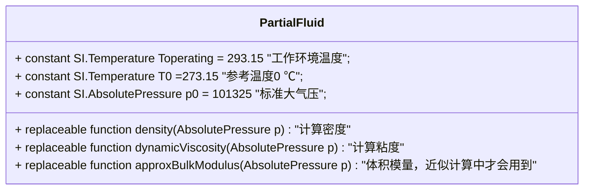

Openhydraulics 中的液压油位于Fluids 包下面，液压油是所有液压组件的基础。在OpenHydraulics 中，预设了两种液压油模型，二者均以`PartialFluid` 为基类。  
<!-- more -->
## PartialFluid  
此类型不能独立使用，类似于一般编程语言中的抽象类：  

## GenericOilSimple  
简单的液压油模型，其中  
- 密度公式：  
$$d = 870 + 5 \times 10^{-7} \times (p-p_0)$$  
- 粘度公式：  
$$\eta = 0.036$$

## GenericOil  
通用液压油，较为精确，其中  
- 密度公式：  
$$\left\{\begin{array}{lll}
    K0_{0} = 8.4 \times 10^9  \\  
    K0_{prime} = 10.9  \\  
    \beta_{K} = 0.0058  \\  
    a_V = 7.7 \times 10^{-4}  \\  
    d_0 = 870  \\  
    K0 = K0_0 \times e^{-\beta_K \times T_{operating}}  \\ 
    d = d0/(1+a_V(T_{operating}-T_0))/
         (1-ln(1+p(1+K0_{prime})/K0)/(1+K0_{prime}))
\end{array} \right.$$  

- 粘度公式：  
$$\left\{\begin{array}{lll}
    A = 9.32 \\  
    B = 3.65 \\  
    \eta = (10^{10^{(A-B*log(T_{operating}))}}-0.7)*density(p)*10^{-6}
\end{array} \right.$$  

## OpenHydraulics.Circuits.Environment  
在仿真时还需要设置工作环境，一般默认环境大气压为一个标准大气压，温度为288.15K。**在每个液压组件模型中，都会包含两个outer 变量：`oil` 和`environment`。**

-----
2022-12-28 山东   