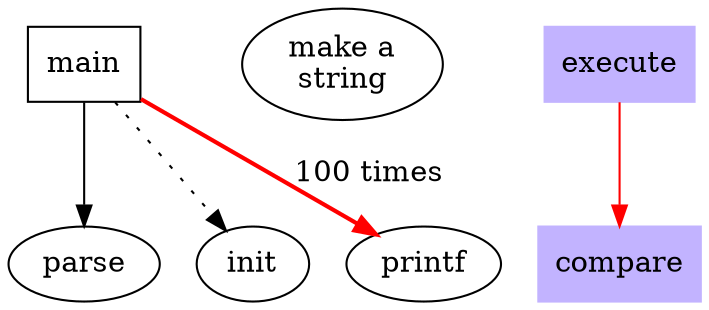
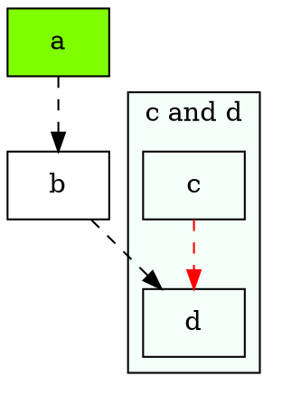
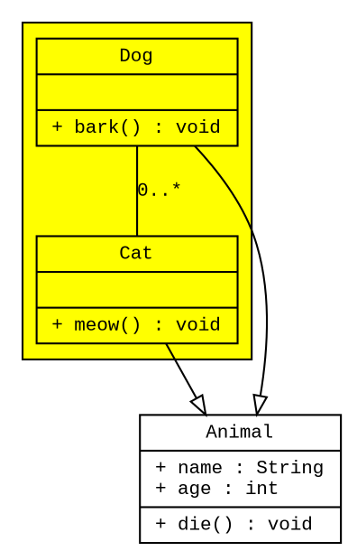
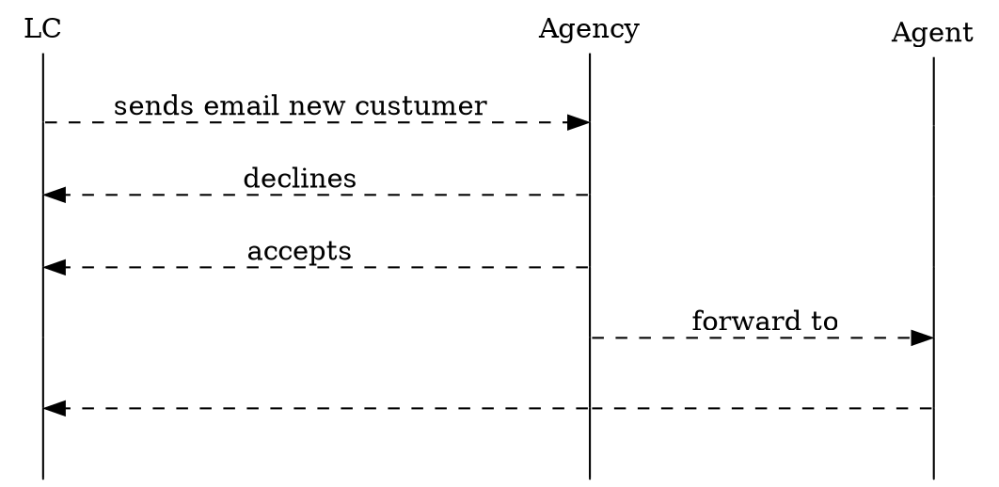

比较有意思的是，Graphviz 直接将[DOT 语法定义](https://www.graphviz.org/doc/info/lang.html) 给贴出来了。可以通过[在线Graphviz 绘图](https://dreampuf.github.io/GraphvizOnline/#) 学习，但是任何工具都是熟能生巧，要经常用才好。     

```antlr4
// [] 内是可选，() 内是必选，| 表示可用选项
graph: [strict] (graph|digraph) [ID] '{' stmt_list '}'
// statement_list 语句列表，以; 分割，最后一行的;可忽略
stmt_list: [stmt[';'] stmt_list]
// 语句可以是以下任何一种类型
stmt: node_stmt  // 节点
    | edge_stmt  // 边
    | attr_stmt  // 属性
    | ID'='ID    // ID
    | subgraph   // 子图
// 属性语句
attr_stmt: (graph|node|edge) attr_list  
// 属性列表，可以由多个[] 块定义
attr_list: '['[a_list]']'[attr_list]
// 每个[] 块又可以包含多个属性，用; 或者, 分割
a_list: ID'='ID [(';'|',')] [a_list]
// 边
edge_stmt: (node_id|subgraph) edgeRHS [attr_list]
// LHS 表示查询赋值语句的左侧；RHS 表示查询赋值语句的右侧
// 以语句 var a=b 为例 
// LHS 将会查询当前作用域内有没有a 的定义  
// 而RHS 将是查询b 的值
// 下面语法则是表示根据节点id 和子图id 和连线操作符进行连线  
edgeRHS: edgeop (node_id|subgraph)[edgeRHS]
// 节点语句，节点的id 和属性列表
node_stmt: node_id [attr_list]
// 节点id  
node_id: ID[port]
// 端口：
port: ':' ID [':' compass_pt]
    | ':' compass_pt
// 子图，可以是匿名的
subgraph: [subgraph [ID]] '{' stmt_list '}'
// 以北-东-南-西的形式定义
compass_pt: (n|ne|e|se|s|sw|w|nw|c|_)
```

## 简单示例  

### 绘制简单有向图/无向图  

```dot  
// 无向图 
graph g_01 {
    main -- a;
}

// 有向图
digraph dg_01 {
    main -> a;  
    a -> main;
}

digraph dg_02 {
    A -> B [dir = both];  // 双向箭头
    B -> C [dir = none];  // 无箭头
    C -> D [dir = back];  // 反向箭头
    D -> A [dir = forward];  // 正向箭头
}

digraph dg_03 {
    node [shape=box];
    c1:n -> d1 [label=n];
    c2:ne -> d2:ne [label=ne];  // 设置port 信息
    c3:e -> d3:ne [label=e];
    c4:se -> d4:n [label=se];
    c5:s -> d5:n [label=s];
    c6:sw -> d6:n [label=sw];
    c7:w -> d7:nw [label=w];
    c8:nw -> d8:nw[label=nw];
}
```



### 节点样式  
`node`、`edge` 的属性定义时，容易与普通节点属性的定义搞混，并且修改两者样式会对接下来的代码产生永久性的影响。  


### 子图绘制  


### 数据结构图  

```dot
digraph st2{
	fontname = "Verdana";
	fontsize = 10;
	rankdir=TB;  // 排列方式：Top-Botoom-Left-Right 
	 
	node [fontname = "Verdana", fontsize = 10, color="skyblue", shape="record"];
	 
	edge [fontname = "Verdana", fontsize = 10, color="crimson", style="solid"];
	 
	st_hash_type [label="{<head>st_hash_type|(*compare)|(*hash)}"];
	st_table_entry [label="{<head>st_table_entry|hash|key|record|<next>next}"];
	st_table [label="{st_table|<type>type|num_bins|num_entries|<bins>bins}"];
	 
	st_table:bins -> st_table_entry:head;
	st_table:type -> st_hash_type:head;
	st_table_entry:next -> st_table_entry:head [style="dashed", color="forestgreen"];
}

// 包含子块 
digraph structs {
    node [shape=record];
    struct1 [label="<f0> left|<f1> mid&#92; dle|<f2> right"];
    struct2 [label="<f0> one|<f1> two"];
    struct3 [label="hello&#92;nworld |{ b |{c|<here> d|e}| f}| g | h"];
    struct1:f1 -> struct2:f0;
    struct1:f2 -> struct3:here;
}

// label 也支持html 语法，更加灵活  
/**
st_table [label=<
	    <table border="0" cellborder="1" cellspacing="0" align="left">
	    <tr>
	    <td>st_table</td>
	    </tr>
	    <tr>
	    <td>num_bins=5</td>
	    </tr>
	    <tr>
	    <td>num_entries=3</td>
	    </tr>
	    <tr>
	    <td port="bins">bins</td>
	    </tr>
	    </table>
	>];
 */
```

`record` 类型的节点，可以通过`label` 属性中的`<port>` 标签设置连接端口。  


### UML 图  


### 时序图  
相当于定义若干个纵向的子图，节点形状为`point` 然后连接彼此间的子节点。  


## 参考资料  
1. [JS--理解编译原理和LHS、RHS](https://juejin.cn/post/7001034851088334862)  
2. [使用graphviz绘图](https://icodeit.org/2015/11/using-graphviz-drawing/)  
3. [在线Graphviz 绘图](https://dreampuf.github.io/GraphvizOnline/#)  
4. [Graphviz Tutorial 1.0 文档](https://graphviztutorial.readthedocs.io/zh-cn/latest/)  
5. [Node Shapes/节点形状](https://graphviz.org/doc/info/shapes.html)