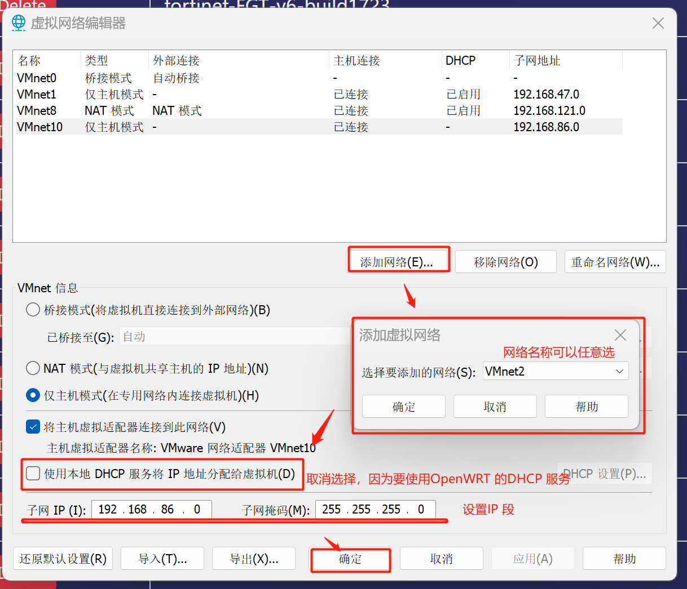
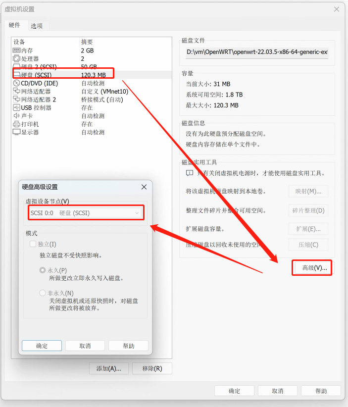
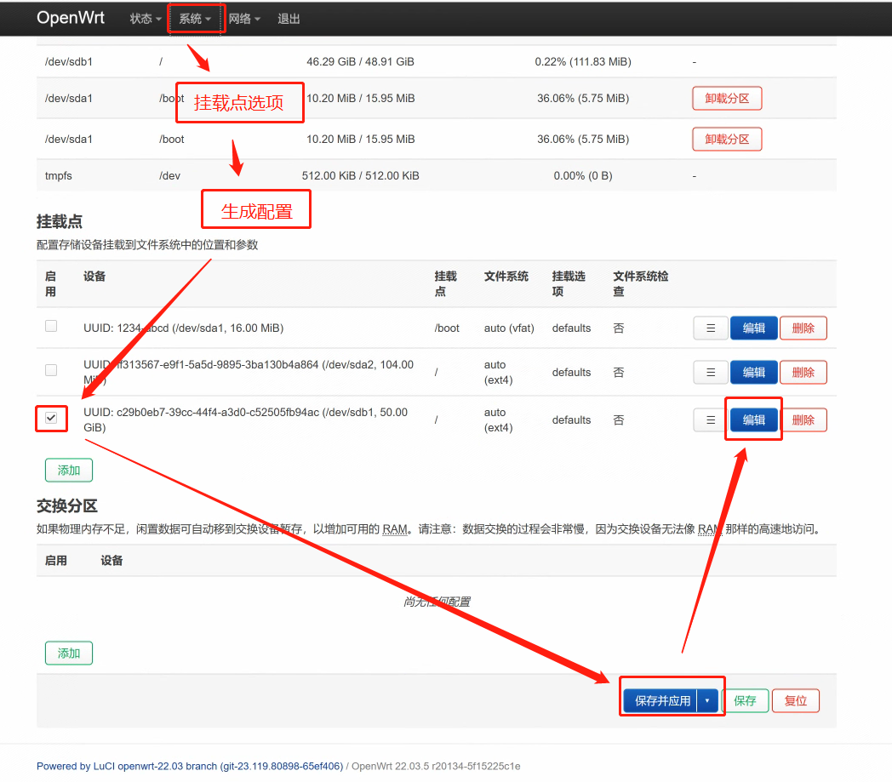
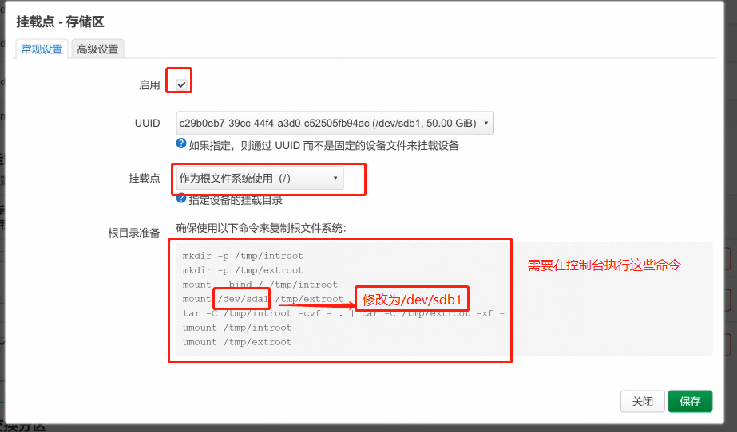
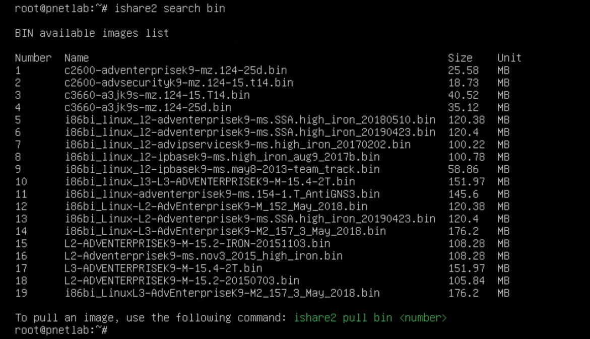

---
title: VM 中配置OpenWRT 透明路由 
date: 2023-09-01
timeLine: true
sidebar: false  
icon: config
category:  
    - 笔记  
    - 运维      
tag:   
    - router  
    - OpenWRT  
    - v2raya
    - vmware  
    - bridge  
---   

> 写这篇笔记的起因是在家里的电脑上安装`Pnetlab` 时，因为GFW 的原因，导致ishare2 无法下载镜像。通过各种`PROXY` 也不能解决问题，只好尝试配置`OpenWRT` 路由并结合`V2rayA` 透明代理来解决。发现能行，所以记录一下实现的过程。将以有为也~  


## 思路  
首先，新建一个OpenWRT 虚拟机，有两个网卡：其中一个桥接到宿主网络，表示`WAN` 口；另外一个接到自己创建的虚拟局域网，表示`LAN` 口。然后在此虚拟机中安装`V2rayA` 服务，配置为透明代理模式。如果能成功启动代理，那么所有接到`LAN` 口的客户端就都能科学上网，而不需做任何设置。  

## 准备OpenWRT 镜像  
可以从官网下载，要求是`版本号/target/x86/64/generic-ext4-combined-efi.img.gz` 即可，如<https://downloads.openwrt.org/releases/22.03.5/targets/x86/64/openwrt-22.03.5-x86-64-generic-ext4-combined-efi.img.gz>。  

下载完成后需要将`.gz` 文件解压，并且将里面的`.img` 文件转换成`VMware` 可以使用的格式。官方推荐的工具是`qemu-img`：  
```bash  
# 要求机器上安装有qemu  
qemu-img convert -f raw -O vmdk {your.img} {fw.vmdk} # fw = firmware 
```  

但是也可以参照[知乎上的教程](https://zhuanlan.zhihu.com/p/642643603) 使用[StarWind V2V Converter](https://www.starwindsoftware.com/tmplink/starwindconverter.exe)。最终会得到一个虚拟磁盘文件，这里面就是`OpenWRT` 的固件系统了，放在虚拟机里面可以直接启动的。  

## VMware 配置  
首先，在`编辑-虚拟网络编辑器-更改设置(C)`，添加一个局域网络。这里用的是`(VMnet10)192.168.86.0/24`，宿主机会自动获得一个IP 地址`192.168.86.1`：    


然后，创建`OpenWRT` 虚拟机，其配置如下：  
- 客户端操作系统选择`Linux --> 其他 Linux 5.x 内核 64 位`  
- 最大磁盘大小`8GB/储存为单个文件`。这个磁盘是用来扩展`OpenWRT` 固件空间的，所以需要修改`虚拟设备节点`不能在`SCSI 0.0`  

完成创建虚拟机后，还需要`编辑虚拟机设置`，添加`fw.vmdk` 以及修改网卡配置，参考[Vmware搭建软路由教程(Openwrt)](https://blog.csdn.net/qq_43316775/article/details/83027053)：  
- 添加现有的`SCSI` 虚拟硬盘`fw.vmdk` 到虚拟设备节点`SCSI 0.0`（硬盘设置--高级）  
- 添加`网络适配器2` 设置为桥接模式（`WAN` 口）  
- 设置`网络适配器` 为特定虚拟网络（自定义--`VMnet10`，`LAN` 口）  
- 网络适配器的顺序不能反了

  

完成之后启动系统便可以进入`OpenWRT`，默认不需要密码直接进入`root` 账户。但是此时还不能通过网页管理，需要在命令行中进行配置。   

## OpenWRT 配置  

首先，`WAN` 口是桥接，可以保持默认自动获取IP，然后修改`LAN` 口地址并重启：  
```shell-session    
root@OpenWrt:~# vi /etc/config/network  

# config interface 'lan'
#         option device 'br-lan'
#         option proto 'static'
#         option ipaddr '192.168.86.254'  # 修改这里就好了
#         option netmask '255.255.255.0'  
#         option ip6assign '60'  

root@OpenWrt:~# reboot    
```  
重启之后我们便能在宿主机中访问`http://192.168.86.254` 管理路由器了。  

之后需要将[镜像源切换到国内](https://www.moewah.com/archives/4054.html)，一边安装软件：  
```shell-session    
root@OpenWrt:~# opkg update
root@OpenWrt:~# opkg install ca-certificates luci-ssl-openssl # 可能会提示失败，忽略就行
root@OpenWrt:~# sed -i 's_downloads.openwrt.org_mirrors.cloud.tencent.com/lede_' /etc/opkg/distfeeds.conf  # 替换为腾讯源  
root@OpenWrt:~# sed -i 's_downloads.openwrt.org_mirrors.ustc.edu.cn/lede_' /etc/opkg/distfeeds.conf  # 替换为中科大源  
root@OpenWrt:~# reboot  
```

### 硬盘扩容  
`OpenWRT` 官方的固件只有120M 的空间，安装几个软件就满了，所以需要将我们之前创建的空白的硬盘挂载到系统中，这里参考[OpenWrt 存储空间扩容的两种方案](https://www.moewah.com/archives/4719.html)中的方案儿。  
首先安装磁盘分区工具：  
```shell-session    
root@OpenWrt:~# opkg update 
root@OpenWrt:~# opkg install cfdisk fdisk e2fsprogs block-mount
```

然后格式化空白的硬盘：  
```shell-session    
root@OpenWrt:~# fdisk -l  # 会显示一个sdb 未被使用的硬盘
root@OpenWrt:~# fdisk /dev/sdb  # 进入fsdisk 命令  
> ...
> Command (m for help): n （输入 n 创建分区）  
> ...
> Select (default p): p （输入 p 创建主分区）
> Partition number (1-4, default 1): （回车键，默认创建一个分区）
> First sector (2048-20971519, default 2048): （回车键）
> Last sector, +/-sectors or +/-size{K,M,G,T,P} (2048-20971519, default 20971519): (回车键) 
> ... 
> Command (m for help): w （输入 w 写入分区表）

root@OpenWrt:~# fdisk -l  # 会显示一个/dev/sdb1 的盘符  
root@OpenWrt:~# mkfs.ext4 /dev/sdb1  # 格式化/dev/sdb1 为ext4   
```  

  
  

命令如下：  
```shell-session    
root@OpenWrt:~# mkdir -p /tmp/introot
root@OpenWrt:~# mkdir -p /tmp/extroot
root@OpenWrt:~# mount --bind / /tmp/introot
root@OpenWrt:~# mount /dev/sdb1 /tmp/extroot # 修改后
root@OpenWrt:~# tar -C /tmp/introot -cvf - . | tar -C /tmp/extroot -xf -
root@OpenWrt:~# umount /tmp/introot
root@OpenWrt:~# umount /tmp/extroot
root@OpenWrt:~# reboot 
```  

### 配置V2rayA  
`OpenWrt 21.02+` 可以直接通过`opkg` 安装`v2raya`。  
```shell-session
root@OpenWrt:~# opkg update
root@OpenWrt:~# opkg install v2raya v2ray-geoip v2raya-geosit  

# 如果在启动代理时提示iptables 的问题，可以依次尝试安装以下包  
root@OpenWrt:~#  opkg install ca-bundle ip-full kmod-nft-tproxy
# 如果还不行的话
root@OpenWrt:~#  opkg install iptables-mod-conntrack-extra iptables-mod-extra iptables-mod-filter iptables-mod-tproxy kmod-ipt-nat6

# 如果不想以服务的形式运行可以直接从命令行启动  
root@OpenWrt:~# v2raya  # 或者 v2raya& 保持在后台云运行  


# 下载配置文件和服务文件  
root@OpenWrt:~# wget https://raw.githubusercontent.com/openwrt/packages/master/net/v2raya/files/v2raya.config -O /etc/config/v2raya
root@OpenWrt:~# wget https://raw.githubusercontent.com/openwrt/packages/master/net/v2raya/files/v2raya.init -O /etc/init.d/v2raya
root@OpenWrt:~# chmod +x /etc/init.d/v2raya  

# 安装并启动服务  
root@OpenWrt:~# uci set v2raya.config.enabled='1'
root@OpenWrt:~# uci commit v2raya
root@OpenWrt:~# /etc/init.d/v2raya enable
root@OpenWrt:~# /etc/init.d/v2raya start  

# 安装完成后就可以通过http://192.168.86.254:2017 访问到v2raya 服务了
```

### 配置透明代理  
可以导入自己购买的小飞机的链接，然后参考[2023最简路由器-透明代理-个人实现：OpenWRT + v2Ray + v2RayA](https://www.youtube.com/watch?v=ixnidCvk0DI)的教程，只需要在`v2raya` 的设置中修改如下选项：    
  
  

当所有的这一切配置好之后，将客户端虚拟机的网卡接入到`VMnet10` 之后便能自动获取到IP 地址，并且不需要做任何配置就能上网了。  


效果如下，需要注意的是，`ping` 命令似乎依然不好使~~~  


## 参考资料  
1. [VMware安装openWRT软路由系统的步骤](https://zhuanlan.zhihu.com/p/642643603)  
2. [Vmware搭建软路由教程(Openwrt)](https://blog.csdn.net/qq_43316775/article/details/83027053)  
3. [OpenWrt 新手配置使用指南](https://www.moewah.com/archives/4054.html)  
4. [OpenWrt 存储空间扩容的两种方案](https://www.moewah.com/archives/4719.html)  
5. [OpenWrt - v2rayA](https://v2raya.org/docs/prologue/installation/openwrt/)  
6. [2023最简路由器-透明代理-个人实现：OpenWRT + v2Ray + v2RayA](https://www.youtube.com/watch?v=ixnidCvk0DI)  

<busuanzi></busuanzi>