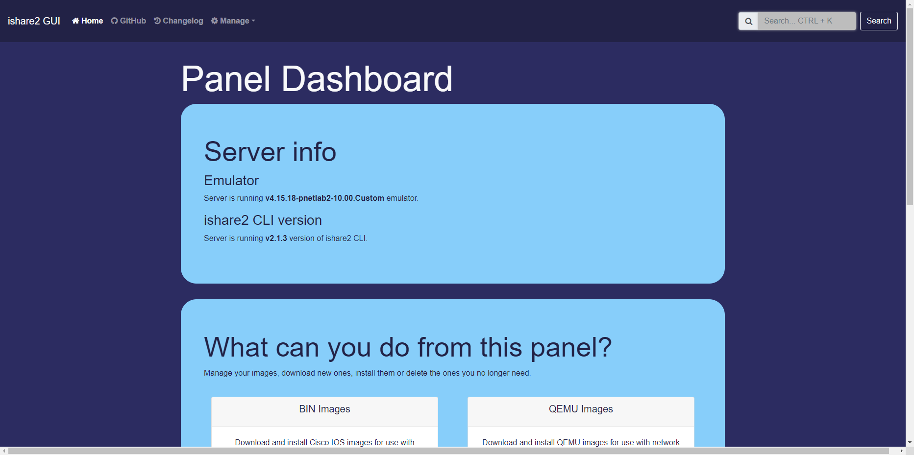

---
title: PNet-Lab 使用笔记 
date: 2023-07-05
timeLine: true
sidebar: false  
icon: config
category:  
    - 笔记  
    - 运维      
tag:   
    - pnet  
    - cisco  
    - switch  
    - router  
    - image  
    - dynamipshe  
    - iol  
    - ssh  
    - scp  
    - vmware  
    - chmod  
    - fortigate
---  

> [PNet-Lab](https://www.pnetlab.com/) 应该是我见过最好用的网工实验室了。它一般运行于VMware 或VBox 之上，也可以[裸机安装](https://www.pnetlab.com/pages/documentation?slug=install-bare-metal)。并且：  
> - 相比于普通的客户端，它具有一个Web 界面，可以多用户同时使用  
> - 相比于EVE，它支持热插拔   
> - 自带了一款镜像管理软件`ishare2`，可以方便地下载很多镜像  

这里仅记录几个使用的坑：  
- 在VMware 中运行虚拟机时，要注意勾选[VT-x 虚拟化支持](https://www.pnetlab.com/pages/documentation?slug=install-PNETlab)。否则基于QEMU 的镜像在启动后会闪退。  
- 如果国内网络不能下载[ishar2](https://github.com/pnetlabrepo/ishare2)。则可以手动将该仓库下的`ishare2` 文件内容复制到`/usr/sbin/ishare2`，然后对照说明设置权限`chmod +x /usr/sbin/ishare2`即可。  
- 官网下载的OVA 虚拟机是`v4.2.10` 版本的。很多镜像包括`ishare2` 不能正确运行。于是可以通过`ishare2 upgrade` 先升级pnet-lab 到最新稳定版，然后在升级`ishare2` 到最新稳定版（当前是`v5.3`）即可。  
- `ishare2 web gui` 需要python 3.7 及以上版本才能运行，如果使用官方的虚拟机还需要升级python 环境，但是一般通过cli 就已经够用了。  
  - 可以[升级Ubuntu 中自带的Python 版本](https://blog.csdn.net/mbdong/article/details/127662406)到`v3.7`，注意切换优先级（似乎解决不了问题，再看吧）  
- 在下载了镜像之后，最好通过网页中的`System --> System Setting --> Fix Permission` 修复一下权限，尤其是下载了Windows 的镜像之后。  

   

## 2023-07-14 更新   
`pnetlab v5` 及以前是基于`ubuntu 18.04` 的，而这个版本的操作系统默认的`python` 版本是`3.6` 的，而`ishare2 webgui` 工具需要`python v3.7+`。所以需要手动安装`ishare2 webgui`，可以下载[虚拟机镜像](https://transfer.sh/VGGNnroo67/Pnet-Lab-v5.3.11.ova)，或者按下面具体步骤安装：  

```shell  
## 在安装完系统后，启用root 账号，并赋予ssh 远程登录的权限
sudo -i 
passwd # input password  
sed -i -e "s/.*PermitRootLogin .*/PermitRootLogin yes/" /etc/ssh/sshd_config 
# allow remote login
service sshd restart  

## 在国内设置系统代理，如果本地局域网中没有代理的话，可以安装v2raya 服务在系统上  
## 参见下一节：  
export http_proxy=http://ip:port 
export https_proxy=http://ip:port 
export all_proxy=http://ip:port    

## 升级Python 包  
apt install python3.7 python3-pip python3-testresources -y
python3.7 -m pip install -U pip setuptools wheel    

## 先安装4.0.20 因为需要借助低版本升级到高版本
echo -e "\ndeb [trusted=yes] http://repo.pnetlab.com ./" >> /etc/apt/sources.list
echo "nameserver 8.8.8.8" > /etc/resolv.conf
apt-get update
apt-get purge netplan.io -y
apt-get install pnetlab -y
# 在ubuntu 20.04 中解决包不兼容、损坏的问题： https://www.cnblogs.com/lvdongjie/p/15787306.html
# apt-get install aptitude  
# aptitude  install pnetlab -y

## 安装ishare2 并通过ishare2 升级到pnetlab 5.3
curl -o /usr/sbin/ishare2 https://raw.githubusercontent.com/pnetlabrepo/ishare2/main/ishare2 > /dev/null 2>&1 && chmod +x /usr/sbin/ishare2 && ishare2  

ishare2 upgrade 选择安装pnetlab 5.3  
# 在安装pnetlab 时会拉取docker 镜像，所需的时间会很长，看起来程序像无响应了，但其实需要耐心等待（千万不要中止）  


reboot # 重启系统，重启后以root 登录，保持各种默认设置  
```  

### 手动安装Ishare2 WebGUI  
这个工具用于提供一个有好的镜像管理接口，还是非常有用的。`ishare2 gui install` 的命令默认会调用`python3.6` 版本太低了。这里我们通过[Github 仓库](https://github.com/ishare2-org/ishare2-web-gui)手动安装：  
```shell
# 切换至root 账户下

## 预备python3.7 虚拟环境（其实venv 似乎也不是必须的）
apt install python3.7-venv
python3.7 -m pip install -U pip 

## 克隆源码
git clone https://github.com/ishare2-org/ishare2-web-gui.git /opt/ishare2/gui/
cd /opt/ishare2/gui/  

## 启用虚拟环境（非必须）
python3 -m venv venv
source venv/bin/activate

## 安装依赖
python3.7 -m pip install -r requirements.txt
python3.7 main.py # 启动服务  
```  
可以保存下面命令到`~/start-gui.sh`：  
```shell  
cd /opt/ishare2/gui/  
python3.7 main.py 
```  
以后就可以通过`~/start-gui.sh` 启动服务了，（但是如果之前安装过`web gui` 服务，再次重启可能会自动启动了就，神奇）  


### V2rayA 代理的安装  
如果本地电脑上已经安装了`v2ray` 则只需启用局域网代理功能即可。如果没有，则可以在`Ubuntu` 上安装`v2raya` 服务，此服务会启动一个web 管理接口。万不得已再用此方法：    
```shell  
## 安装v2ray-core  
# 访问raw.githubusercontent.com 可能需要修改hosts  
curl  https://raw.githubusercontent.com/v2fly/fhs-install-v2ray/master/install-release.sh > install-release.sh
sudo chmod +x install-release.sh
sudo ./install-release.sh

sudo systemctl disable v2ray --now  

## 安装v2raya 服务
wget -qO - https://apt.v2raya.org/key/public-key.asc | sudo tee /etc/apt/trusted.gpg.d/v2raya.asc  

echo "deb https://apt.v2raya.org/ v2raya main" | sudo tee /etc/apt/sources.list.d/v2raya.list
sudo apt update

sudo apt install v2raya

sudo systemctl start v2raya.service
sudo systemctl enable v2raya.service
```