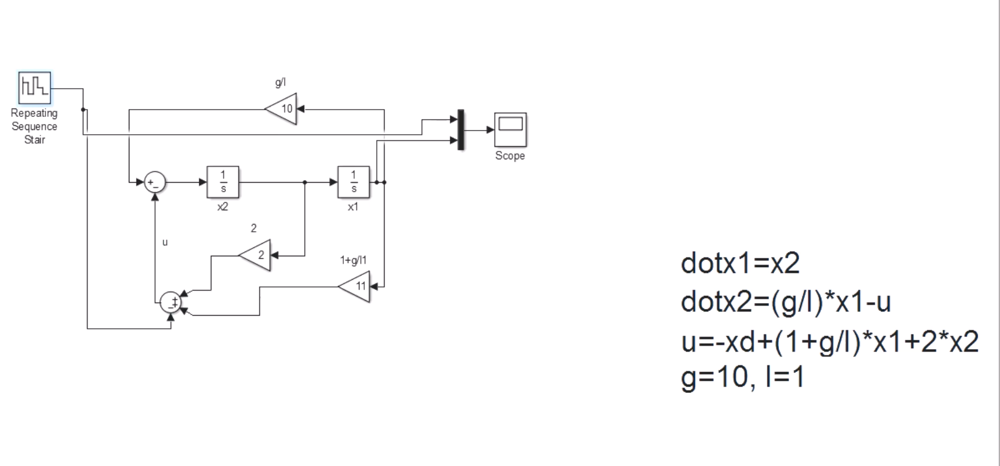
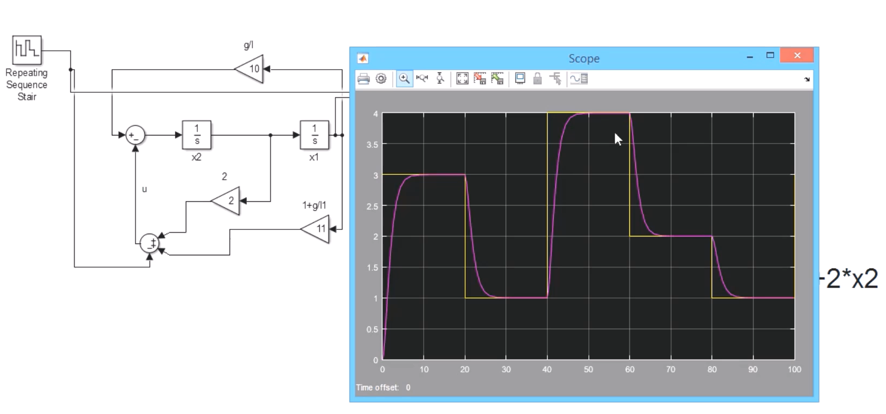

---  
title: 线性控制器设计  
date: 2022-08-25   
timeLine: true
sidebar: false  
icon: superscript
category:  
    - 数学    
tag:   
    - 控制理论    
    - 线性定常系统  
---  
  
> 看[线性控制器设计_Linear Controller Design](https://www.bilibili.com/video/BV1sW411t7Qq)及后续章节的笔记  

对于开环系统$\dot{X} = AX$，矩阵$A$ 的特征值决定了系统的稳定性；当我们引入输入$U$，而$U$ 又是$X$ 的函数时，就变成了闭环控制系统$\dot{X} = AX +BU$。讨论一个基本情况$U=-KX$，则$\dot{X}=AX-BKX = (A-BK)X$，我们把$A-BK$ 称为闭环的状态空间矩阵$A_{cl}$，通过选取不同的$K$ 就可以使得$A_{cl}$ 的特征值在所需范围之内。   

## 一般过程  
以下面系统为例，其状态空间方程为：  
$$\dot{X} = \begin{bmatrix}
    0 & 2 \\
    0 & 3
\end{bmatrix}X + \begin{bmatrix}
    0  \\
    1
\end{bmatrix}U$$  

> 这里要求是要使系统稳定在某一点，并不需要跟随输入。      

首先分析$A$ 矩阵的特征值为$\lambda_1 = 0, \lambda_2 = 3$，系统不稳定。  
然后我们设计$U=-KX=\begin{bmatrix}
    -k_1 & -k_2
\end{bmatrix}X$，得到$A_{cl}= \begin{bmatrix}
    0 & 2 \\
    -k_1 & 3-k_2
\end{bmatrix}$  
然后我们希望闭环系统的特征值$\lambda_1=\lambda_2=-1$，求得$k_1=0.5, k_2 =5$
最后还能求得输入$U=\begin{bmatrix}
    -\frac{1}{2} & -5
\end{bmatrix}\begin{bmatrix}
    x_1  \\
    x_2
\end{bmatrix}$  

### 如何选取$\lambda$  
- $\lambda$ 有虚部会引入震荡  
- $\lambda$ 实部的绝对值决定收敛速度  
- 还要考虑实际中$U$ 给定的范围  
- 最优化控制：有损失函数$J=\int^{\infty}_0 (X^TQX + U^TRU) dt$，根据需要设计不同的$Q,R$ 矩阵，使得$J=J_{min}$ 

> 系统会稳定在哪一点：令$\dot{X} = 0$ 即可得系统的稳定点。  

## LQR 控制器  
`Linear Quadratic Regulater` 是通过引入一个损失函数来确定$A_{cl}$ 的特征值的：  
$$J=\int^{\infty}_0 (X^TQX + U^TRU) dt \tag{1}$$  
假设$Q,R$ 都是对角矩阵，我们可以这样理解损失函数：  
- $X^TQX = q_1x_1^2 + q_2x_2^2 + ... + q_nx_n^2$，表示一种`penalty` 惩罚的概念，可以看作对误差的反应    
- $U^TRU$ 表示输入对系统的影响  
这里我们可以使用`matlab` 的`lqr(sys,Q,R)` 来求解特征值。需要注意的是矩阵$Q,R$ 所对应的状态的物理意义   

## 轨迹跟踪  
> 这里仅记录设计的过程  

以倒立摆的系统为例：  
$$\begin{bmatrix}
    \dot{x_1}  \\
    \dot{x_2}
\end{bmatrix} = \begin{bmatrix}
    0 & 1 \\  
    \frac{g}{L} & 0
\end{bmatrix}\begin{bmatrix}
    x_1  \\
    x_2
\end{bmatrix} + \begin{bmatrix}
    0 \\  
    -1
\end{bmatrix}U \tag{2}$$  
此系统会稳定在$x_1=\dot{x_1}=x_2=\dot{x_2} = 0$，如果我们希望系统稳定在$x_1 = x_{1d}$时应该怎么做呢？  

### 设计误差函数  
我们可以设计误差函数$e=x_{1d} - x_1$，则$\dot{e} = -\dot{x_1}$，可以得到新的系统状态空间方程为：  
$$\begin{bmatrix}
    \dot{e}  \\
    \dot{x_2}
\end{bmatrix} = \begin{bmatrix}
    0 & -1 \\  
    -\frac{g}{L} & 0
\end{bmatrix}\begin{bmatrix}
    e  \\
    x_2
\end{bmatrix} + \begin{bmatrix}
    0 \\  
    -1
\end{bmatrix}U + \begin{bmatrix}
    0 \\
    \frac{g}{L}x_{1d}
\end{bmatrix}$$  
新的系统会稳定在$e=x_{1d}$ 处，因为我们什么也没做，只是从误差的角度观察了系统而已  

### 设计新的稳定点    
我们可以通过调整输入$U$ 来调整系统的平衡点，令：  
$$U= -\begin{bmatrix}
    k_1 & k_2
\end{bmatrix}\begin{bmatrix}
    e \\  
    x_2
\end{bmatrix} + \frac{g}{L}x_{1d}$$  
则新系统的空间状态方程转化为：  
$$\begin{bmatrix}
    \dot{e}  \\
    \dot{x_2}
\end{bmatrix} = \begin{bmatrix}
    0 & -1 \\  
    -\frac{g}{L}+k_1 & k_2
\end{bmatrix}\begin{bmatrix}
    e  \\
    x_2
\end{bmatrix}$$  
平衡点位于$e_f=0,x_{2f}=0$  

### 计算输入    
以$\lambda_1=\lambda_2=-1$ 为例，计算$k_1=1+\frac{g}{L}, k_2=-2$，继而得到：  
$$U=-\begin{bmatrix}
    \frac{g}{L} & -2
\end{bmatrix}\begin{bmatrix}
    e \\  
    x_2
\end{bmatrix} + \frac{g}{L}x_{1d} \tag{3}$$  
将$e=x_{1d}-x_1$ 代入$(3)$ 式，可求得$u= - x_d + (1+\frac{g}{L})x_1 + 2x_2$（这里应该写成矩阵的形式）  

### Simulink 仿真  
仿真结果如下图所示：  
  

可以看到在一定范围内，系统的稳定点会跟随$X_d$ 变化。

-----  

> 强烈建议看一遍视频，因为视频中还包含Matlab 的实践  

<iframe src="//player.bilibili.com/player.html?aid=17564251&bvid=BV1sW411t7Qq&cid=28676293&page=1" scrolling="no" border="0" frameborder="no" framespacing="0" allowfullscreen="true"> </iframe>     

<iframe src="//player.bilibili.com/player.html?aid=17876846&bvid=BV1RW411q7FD&cid=29183940&page=1" scrolling="no" border="0" frameborder="no" framespacing="0" allowfullscreen="true"> </iframe>   

<iframe src="//player.bilibili.com/player.html?aid=20674645&bvid=BV1HW411s7YC&cid=33836064&page=1" scrolling="no" border="0" frameborder="no" framespacing="0" allowfullscreen="true"> </iframe>