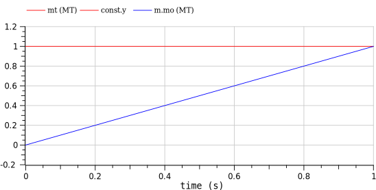

---  
title: 框图组件 block  
date: 2022-08-25   
timeLine: true
sidebar: false  
icon: superscript
category:  
    - 数学    
tag:   
    - OpenModelica  
    - 建模
---  

非因果建模适合物理系统的建模，系统会自动生成守恒模型。而框图则是基于数学运算的因果建模。至于因果模型什么的，现在还理解不了 :(  

## 标准模块  
标准库中的框图（实数）连接器：  
```modelica  
connector RealInput = input Real "'input Real' as connector";
connector RealOutput = output Real "'output Real' as connector";
```  

也可以自定义类型和`connector`：  
```modelica  
within Project.Examples;

type MyType = Real(unit="MT");    // 定义类型，在分文件存储的包里面，每个文件内只能定义一个类型，下同  

///////////////////////////////////////////////
within Project.Examples;

connector MyInput = input MyType;  // 输入信号连接器

///////////////////////////////////////////////
within Project.Examples;

connector MyOutput = output MyType;  // 输出信号连接器  

///////////////////////////////////////////////
within Project.Examples;

model MyModel                  // 定义简单的计算模型
  MyType mt;                   // 内部变量
  MyOutput mo;
  MyInput mi;

equation
  der(mt) = mi;   // 接收输入信号  
  mo = mt;        // 处理并传递到输出信号  
end MyModel;


///////////////////////////////////////////////
within Project.Examples;

model Test  // 测试
  Modelica.Blocks.Sources.Constant const annotation(
    Placement(visible = true, transformation(origin = {-60, 36}, extent = {{-10, -10}, {10, 10}}, rotation = 0)));
  MyModel m;
equation
  connect(m.mi, const.y);
end Test;
```
需要注意的是，因为没有标注图标信息，所以是看不到连线的。但是不妨碍我们得到正确的仿真结果：  


### 单输出模块  
注意模块的定义是`block`，以单输出模块为例：  
```modelica  
partial block SO "Single Output continuous control block"
  extends Modelica.Blocks.Icons.Block;

  RealOutput y "Connector of Real output signal" annotation (Placement(
        transformation(extent={{100,-10},{120,10}}, rotation=0)));
end SO;
```  

### 多输入单输出模块  
可以利用数组的特性，定义任意输入输出的模块：  
```modelica{3-5}  
partial block MISO "Multiple Input Single Output continuous control block"
  extends Modelica.Blocks.Icons.Block;
  parameter Integer nin=1 "Number of inputs";
  RealInput u[nin] "Connector of Real input signals" annotation (Placement(
        transformation(extent={{-140,-20},{-100,20}}, rotation=0)));
  RealOutput y "Connector of Real output signal" annotation (Placement(
        transformation(extent={{100,-10},{120,10}}, rotation=0)));
end MISO;
```

## 混合建模  
非因果模型比较适合物理建模，而原理框图更适合表示信号传递和数学逻辑。二者可以混用！  

-----  

至此，就已经能看懂、甚至开发自己的Modelica 系统了。然而最重要的还是要不断地重复、联系、总结、尝试！  

📅 2022-08-25 Aachen  