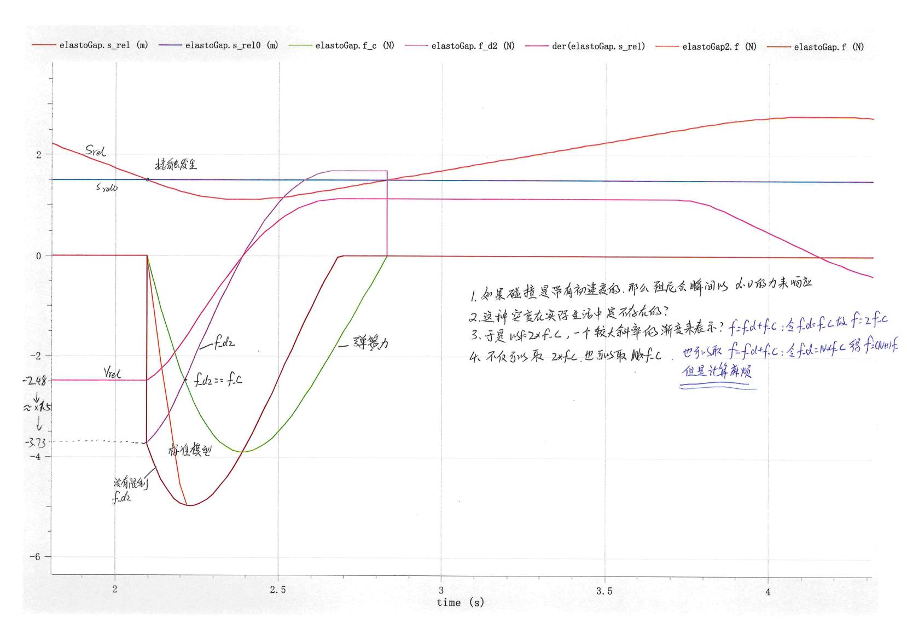

---
title: 常见问题  
date: 2022-08-25   
timeLine: true
sidebar: false  
icon: superscript
category:  
    - 数学    
tag:   
    - OpenModelica  
    - 建模
---  


1. `class` 与`model` 的区别：  
    > 多数情况下 `class` 与`model` 并无严格区别，但现在一般推荐使用`model`：  
    > `class` 只包含类的定义、注解和扩展语句，可以被任何事物继承。多用于定义一些图标信息；  
    > `model` 只能被`model` 继承。    
    > [Difference between Class and Model in OpenModellica](https://www.openmodelica.org/forum/default-topic/3268-difference-between-class-and-model-in-openmodellica) 

2. `inner` 和`outer` 关键字：  
    > `inner` 和`outer` 用来声明和使用全局变量（跨越模块的同一变量），切记**变量名和变量类型都要相同！！！**    
    > `out`：表示该变量将在模型外部被声明；  
    > `inner`：表示该变量将被传递进入所有需要的子组件  
3. `Across/Through Variable` 跨越变量与穿越变量的区别：  
    > - `Across` 跨越变量：需要通过测量**元件两端的差值、下降**而得到的变量。这些变量在拓扑图上任何闭环的回路上的和都为0。KVL 定律。  
    > - `Through` 穿越变量：需要通过**串联在端点之间**才能测量到的变量。这种变量在拓扑图上某一节点（元件）上的总和为0。KCL 定律。 
4. 单位自动转换：可以通过以下形式定义类型    
    ```modelica  
    package Types
        // 需要注意的是，虽然这样可以实现单位转换，但是在给参数赋默认值的时候，还是以原类型给定的。
        type Litre = Modelica.Units.SI.Volume(displayUnit="l",nominal=1e-3);  // 显示单位首字母必须小写
        type Pressure = Modelica.Units.SI.Pressure(displayUnit="mmHg", nominal=133.322387415);
    end Types;
    ```  
5. 关于`ElastoGap` 中，合力$f=f_c+f_d=2*f_c$ 情况之说明。因为力是不能突变的，如果在接触理想的弹簧-阻尼系统时带有初速度。则会造成阻尼力瞬间跳变到一个很大的值（没有加速过程）。这是不可接受的，所以可以人工取一个加速过程，令$f=2*f_c$ 主要是计算也比较简单：  
      

-----  
一个很残酷的现实：学好`Modelica` 的前提是你必须非常了解你的问题！