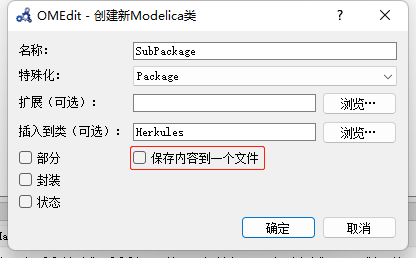

---
title: Package 包  
date: 2022-08-25
timeLine: true
sidebar: false  
icon: superscript
category:  
    - 数学    
tag:   
    - OpenModelica  
    - 建模
---  

以个人经验，任何Modelica 项目最好保存为包的形式，且不应把所有代码保存在同一文件。文件目录大致如下所示：  
```shell-session  
Project               # 包的根节点目录
│  package.mo         # package.mo 内定义Project 包的内容
│  package.order      # 子目录排序信息
│
├─Examples            # 子包名
│      LoadMatFile.mo
│      package.mo
│      package.order
│
└─Resources
        LeakageA.mat  # 资源文件
        LeakageB.mat
        MVerlust.mat
        package.mo
        package.order
```  


## 包的代码结构  
以`Project/Examples/package.mo` 为例，其中定义了属于`Examples` 子包的所有内容代码：  
```modelica
within Project;  // 父级包名，最上层的Project 包定义不需要这一行  

package Examples // 包名    
    type Current = Real(unit="A");  // 可以在包内定义一些类型或者其他常量  
    // 但是不能定义任何变量

end Examples;
```  

## 引用文件  
一般情况下，我们可以通过绝对路径找到各种资源文件。但是如果我们希望自己的包是可移植的，那么就需要将资源文件放在包内，如上面的`Leakage*.mat` 文件，无需额外的声明。在包内的代码中，就可以通过`modelica://package/sub_package/.../*.*` 来访问资源文件了。例如：  
```modelica  
within Project.Examples;

model LoadMatFile
parameter String file = Modelica.Utilities.Files.loadResource("modelica://Project/Resources/LeakageA.mat");
equation

end LoadMatFile;
```  

而`file` 字符串的默认值就是`LeakageA.mat` 的绝对路径。  

## 查找规则  
在Modelica 内使用一个变量或其他符号时，如果没有指定绝对路径，一般会按下面顺序检索：
1. 内建类型；  
2. 从当前（包括其继承的）模块中查找；  
3. 查找`import` 导入定义；  
4. 从父包中查找；  
5. 从更高级的父包中查找，直到：遇到`encapsulate` 关键字；没有更多父包。  


## 导入包  
导入包的语句一般紧跟模型的声明语句：  
```modelica{4-8} 
within ModelicaByExample.PackageExamples;
model NewtonCooling
  "Cooling example importing physical types from the Modelica Standard Library"
  import Modelica.SIunits.Temperature;
  import Modelica.SIunits.Mass;
  import Modelica.SIunits.Area;
  import ConvectionCoefficient = Modelica.SIunits.CoefficientOfHeatTransfer;
  import SpecificHeat = Modelica.SIunits.SpecificHeatCapacity;

  // Parameters
  parameter Temperature T_inf=300.0 "Ambient temperature";
  parameter Temperature T0=280.0 "Initial temperature";
  parameter ConvectionCoefficient h=0.7 "Convective cooling coefficient";
  parameter Area A=1.0 "Surface area";
  parameter Mass m=0.1 "Mass of thermal capacitance";
  parameter SpecificHeat c_p=1.2 "Specific heat";

  // Variables
  Temperature T "Temperature";
initial equation
  T = T0 "Specify initial value for T";
equation
  m*c_p*der(T) = h*A*(T_inf-T) "Newton's law of cooling";
end NewtonCooling;
```

导入包主要有以下三种方式：  
- `import Modelica.SIunits.Temperature;` 后可以直接使用`Temperature`  
- `import DegK = Modelica.SIunits.Temperature; // Kelvin` 导入包为新的名称，避免命名冲突  
- `import Modelica.SIunits.*;` 导入所有定义，不推荐！  


## 参考资料  
1. [包-Modelica by Example](http://modelicabyexample.globalcrown.com.cn/components/packages/)