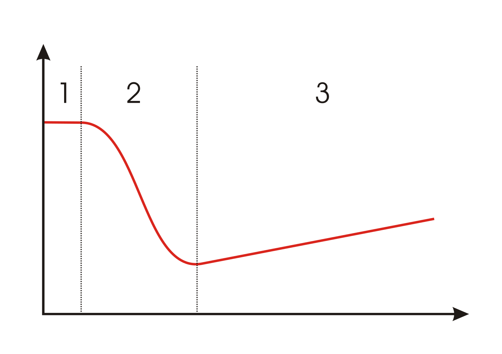
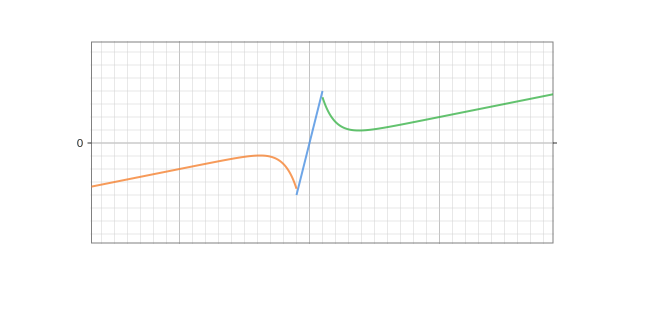

---  
title: 斯特里贝克曲线    
date: 2022-11-24
timeLine: true
sidebar: false  
icon: superscript
category:  
    - 数学    
tag:   
    - 摩擦学  
    - 建模   
---  

> 因为帮同事进行Modelica 建模仿真时看到，感觉挺好玩的  

斯特里贝克曲线(Stribeck Curve) 表示流体润华时摩擦系数$\mu$ 与接触负载$N$、润滑剂粘度$\eta$ 以及流体夹带速率$v$ 之间的非线性关系。一般由下图表示：  
  
其中纵坐标表示摩擦系数$\mu$，横坐标是赫西数$Hersey\, number = \frac{\eta \times v}{N}$，夹带速率也可以看作是接触面的相对运动速率。  

在润滑剂粘度、载荷不变的情况下，摩擦因数随相对速率增大而减小直至稳定。原因是随相对速度的升高，接触面中会逐渐填充油膜，直至两个接触面不在直接接触，但是在考虑润滑剂的粘度随温度升高而降低，所以曲线的尾端会上翘而并不是水平的。这也导致了车辆在涉水时，速度在：  
1. 40km/h 以下时，水会被轮胎排开，轮胎与路面直接接触    
2. 60km/h 时，轮胎与路面之间开始形成水膜  
3. 90km/h 以上时，水膜完全形成，导致车辆像是漂浮在水面上  

## 建模时的要点  

因为物体在静止时，其所受的摩擦力并不能使用该模型来表示，所以一小段非常小的位移来表示物体处于静态摩擦力的范围之内。当位移超出此范围后再去应用斯特里贝克曲线。  
  

在一段时间内，物体可能不断处于启停状态，而位移是速度的积分，所以需要频繁地**重置积分状态**。

## 参考  
1. [斯特里贝克曲线](https://en.wikipedia.org/wiki/Stribeck_curve)，也是上面图片的来源  
2. [MassWithStopAndFriction](https://www.maplesoft.com/documentation_center/online_manuals/modelica/Modelica_Mechanics_Translational_Components.html#Modelica.Mechanics.Translational.Components.MassWithStopAndFriction)  
3. [老王酱油汤第三期#斯特里贝克曲线解读](https://www.bilibili.com/video/BV1uM4y1P7RP)  

-----  
2022-11-24 Aachen  