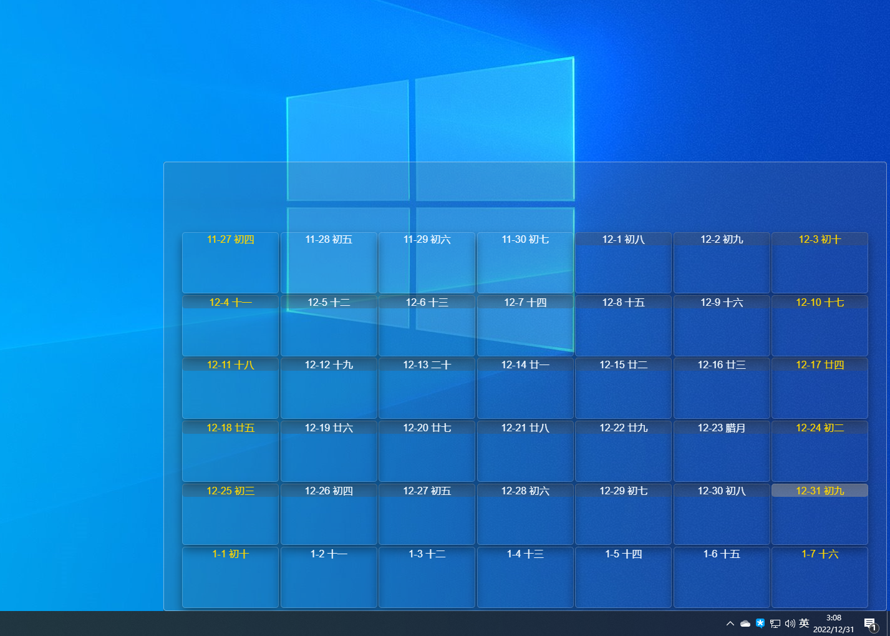

---
title: 简单的壁纸引擎   
date: 2022-12-30    
timeLine: true
sidebar: false  
icon: nodeJS  
category:  
    - 开发  
    - Javascript  
tag:  
    - Win32   
    - NAPI
    - Electron      
    - 壁纸引擎  
---  

这个练手的[项目](https://github.com/12Tall/vite-electron-vue-template/tree/cal)本来是在21年写的，时间久了就荒废了。今年总结时忽然想到之前自己还做过一个建议的壁纸引擎。发现里面有些东西还是值得记录一下的。  

## NAPI 项目结构  

一般我们需要新建一个空白文件夹，如：`user32-napi`，里面包含：  
- `package.json` 用于包含项目信息和入口文件  
- `src/` 文件夹下包含C++ 代码
- `index.js` 入口文件  
- `binding.gyp` C++编译配置项
- 依赖项`bindings` 可以简化`index.js`     

以下是详细代码：  

::: code-tabs  

@tab package.json  
```json
{
  "name": "user32-napi",
  "version": "1.0.0",
  "main": "index.js",
  "repository": "git@github.com:12Tall/user32-napi.git",
  "author": "12tall <fb.ouyang@outlook.com>",
  "license": "MIT",
  "dependencies": {
    "bindings": "^1.5.0"
  }
}
```

@tab index.js  
```js  
// 导出二进制文件user32 中的所有接口  
module.exports = require("bindings")("user32")  
```

@tab binding.gyp  
```gyp  
{
    "targets": [
        {
            "target_name": "user32",  # 此文件会被生成到build/release/ 文件夹下
            "sources": ["./src/user32.cc"]  # 指定C++ 源码文件  
            # 后面还可以跟环境变量、编译器选项、平台选择等配置项，可以参考：  
            # https://zhuanlan.zhihu.com/p/448490760
        }
    ]
}
```  

@tab src/user32.cc  
```cpp  
/** 本节只包含代码结构，具体工作代码见下文 **/
#include <assert.h>
#include <node_api.h>  // 这里最好在IDE 中也指定相关路径，这样的话代码高亮提示更方便
#include <windows.h>
#include <winuser.h>

// 简化NAPI 方法声明的宏
#define DECLARE_NAPI_METHOD(name, func) { name, 0, func, 0, 0, 0, napi_default, 0 }

// NAPI 方法：设置窗口透明
static napi_value setWindowTransparent(napi_env env, napi_callback_info info) {
  napi_status status;
  napi_value res;
  // ...  
  return res;
}

// ...

// 固定模式，可以在内部暴露更多的方法在外面
static napi_value Init(napi_env env, napi_value exports) {
  napi_status status;
  napi_property_descriptor desc[] = {
    // 在该数组中添加更多的方法
    DECLARE_NAPI_METHOD("setWindowTransparent", setWindowTransparent),
  };
  status = napi_define_properties(env, exports, 5, desc);
  assert(status == napi_ok);
  return exports;
}

// 固定模式代码
NAPI_MODULE(NODE_GYP_MODULE_NAME, Init)
```  

:::

## 主要代码逻辑  
在Windows 中，桌面、壁纸、甚至图标都是以窗口的形式渲染的。就壁纸而言，其窗口存在于一个包含有`SHELLDLL_DefView` 窗口的`WorkerW` 窗口。Windows 自带的窗口我们无法操作，但是我们可以新建一个新的窗口将壁纸窗口遮蔽掉。然后在该窗口中，我们就可以设置视频、动画等效果。随心所欲。  
具体可参见：[最近很火的 Wallpaper Engine 的实现原理是怎样的？](https://www.zhihu.com/question/54246843/answer/1053268179)。练手项目中还包含开机启动和一个简单的日历效果，大致如下：  
    


## Win32 编程  
操作Windows 窗口需要调用Win32 API 这里仅列举用到的部分API：

```cpp{25-27,57,95,115-127,132-157}  
static napi_value setWindowTransparent(napi_env env, napi_callback_info info) {
  napi_status status;
  napi_value res;

  size_t argc = 1;
  napi_value argv[1];
  status = napi_get_cb_info(env, info, &argc, argv, NULL, NULL);
  assert(status == napi_ok);
  if (argc < 1) {
    napi_throw_type_error(env, NULL, "FindWoindow takes only 2 parameters");
    return NULL;
  }

  int32_t handle = 0;
  napi_valuetype valType;
  status = napi_typeof(env, argv[0], &valType);
  assert(status == napi_ok);
  if (valType == napi_number) {
    status = napi_get_value_int32(env, argv[0], &handle);
    assert(status == napi_ok);
  }

  // https://blog.csdn.net/u011822516/article/details/41946631
  // 一种实现窗口透明的方式
  bool result = SetWindowLongA((HWND)handle, GWL_EXSTYLE,
                               GetWindowLongA((HWND)handle, GWL_EXSTYLE) |
                                   WS_EX_LAYERED) != 0;

  status = napi_get_boolean(env, result, &res);
  assert(status == napi_ok);
  return res;
}

// NAPI 方法：更新窗口
static napi_value updateWindow(napi_env env, napi_callback_info info) {
  napi_status status;
  napi_value res;

  size_t argc = 1;
  napi_value argv[1];
  status = napi_get_cb_info(env, info, &argc, argv, NULL, NULL);
  assert(status == napi_ok);
  if (argc < 1) {
    napi_throw_type_error(env, NULL, "FindWoindow takes only 2 parameters");
    return NULL;
  }

  int32_t handle = 0;
  napi_valuetype valType;
  status = napi_typeof(env, argv[0], &valType);
  assert(status == napi_ok);
  if (valType == napi_number) {
    status = napi_get_value_int32(env, argv[0], &handle);
    assert(status == napi_ok);
  }

  bool result = UpdateWindow((HWND)handle);

  status = napi_get_boolean(env, result, &res);
  assert(status == napi_ok);

  return res;
}

// 为窗口指定父窗口，用于遮蔽原有的壁纸
static napi_value setParent(napi_env env, napi_callback_info info) {
  napi_status status;
  napi_value res;

  size_t argc = 2;
  napi_value argv[2];
  status = napi_get_cb_info(env, info, &argc, argv, NULL, NULL);
  assert(status == napi_ok);
  if (argc < 2) {
    napi_throw_type_error(env, NULL, "FindWoindow takes only 2 parameters");
    return NULL;
  }

  int32_t child = 0, parent = 0;
  napi_valuetype valType;
  status = napi_typeof(env, argv[0], &valType);
  assert(status == napi_ok);
  if (valType == napi_number) {
    status = napi_get_value_int32(env, argv[0], &child);
    assert(status == napi_ok);
  }

  status = napi_typeof(env, argv[1], &valType);
  assert(status == napi_ok);
  if (valType == napi_number) {
    status = napi_get_value_int32(env, argv[1], &parent);
    assert(status == napi_ok);
  }

  HWND hwnd = SetParent((HWND)child, (HWND)parent);

  if (hwnd == NULL) {
    status = napi_get_null(env, &res);
  } else {
    status = napi_create_int32(env, (int32_t)hwnd, &res);
  }
  assert(status == napi_ok);

  return res;
}

/**
  *  HWND FindWindowExA(
  *  HWND   hWndParent,      // 父窗口，NULL 表示从Desktop 窗口开始查找
  *  HWND   hWndChildAfter,  // 起始子窗口，NULL 表示从第一个子窗口开始
  *  LPCSTR lpszClass,
  *  LPCSTR lpszWindow
  );
  */
BOOL CALLBACK EnumWindowsProc(HWND hwnd, LPARAM lParam) {
  // 1. 查找包含'SHELLDLL_DefView' 子窗口的WorkerW 窗口
  HWND p = FindWindowExA(hwnd, NULL, "SHELLDLL_DefView", NULL);
  HWND* ret = (HWND*)lParam;  // 传入的wallpaper_hwnd 指针

  if (p) {
    // 将指针指向下一个WorkerW
    // 还有一种判断方法，就是下一个WorkerW 的Handle
    // 要比包含`SHELLDLL_DefView`的WorkerW 的Handle 大2
    *ret = FindWindowExA(NULL, hwnd, "WorkerW", NULL);
  }
  return true;
}

/**
 * https://stackoverflow.com/questions/56132584/draw-on-windows-10-wallpaper-in-c
 */
static napi_value getWallpaperWindow(napi_env env, napi_callback_info info) {
  napi_status status;
  napi_value res;
  // 1. 查找最底层的窗口
  HWND progman = FindWindowA("ProgMan", NULL);

  // 2. 向最底层窗口创建两个WorkerW 窗口，如果已存在则什么都不会发生
  // 网络上大部分代码发送的消息参数都是0x00,0x00。但这会造成一旦WorkerW
  // 窗口被不小心销毁，就再也找不到了
  // https://gitlab.com/kelteseth/ScreenPlay/-/blob/master/ScreenPlayWallpaper/src/winwindow.cpp#L387
  // 而相应的，在监视窗口消息时，应使用对应版本的spy++，否则是拦截不到消息的
  // 需要注意的是，在程序异常退出时会有边框遗留在壁纸上
  SendMessageTimeout(progman, 0x052C, 0x0D, 0x01, SMTO_BLOCK, 1000, nullptr);
  // SendMessage(progman, 0x052C, 0x0D, 0x01);

  // 3. 枚举所有窗口，直到发现包含'SHELLDLL_DefView'
  // 子窗口的WorkerW，他下面的WorkerW 就是我们需要的WorkerW
  HWND wallpaper_hwnd = nullptr;
  EnumWindows(EnumWindowsProc,
              (LPARAM)&wallpaper_hwnd  // 被传入回调函数的参数
  );

  status = napi_create_int32(env, (int32_t)wallpaper_hwnd, &res);
  assert(status == napi_ok);
  return res;
}

// string|NULL, string|NULL
static napi_value findWindow(napi_env env, napi_callback_info info) {
  napi_status status;
  napi_value res;

  size_t argc = 2;
  napi_value argv[2];
  status = napi_get_cb_info(env, info, &argc, argv, NULL, NULL);
  assert(status == napi_ok);
  if (argc < 2) {
    napi_throw_type_error(env, NULL, "FindWoindow takes only 2 parameters");
    return NULL;
  }

  size_t len = 0;
  char *className = NULL, *windowName = NULL;
  napi_valuetype valType;
  status = napi_typeof(env, argv[0], &valType);
  assert(status == napi_ok);
  if (valType == napi_string) {
    // 获取字符串长度
    status = napi_get_value_string_utf8(env, argv[0], NULL, 0, &len);
    assert(status == napi_ok);
    className = (char*)calloc(++len, sizeof(char));
    status = napi_get_value_string_utf8(env, argv[0], className, len, &len);
    assert(status == napi_ok);
  }

  status = napi_typeof(env, argv[1], &valType);
  assert(status == napi_ok);
  if (valType == napi_string) {
    status = napi_get_value_string_utf8(env, argv[1], NULL, 0, &len);
    assert(status == napi_ok);
    windowName = (char*)calloc(++len, sizeof(char));
    status = napi_get_value_string_utf8(env, argv[1], windowName, len, &len);
    assert(status == napi_ok);
  }

  HWND hWnd = FindWindowA((LPCSTR)className, (LPCSTR)windowName);
  status = napi_create_int32(env, (int32_t)hWnd, &res);
  assert(status == napi_ok);
  free(className);
  free(windowName);
  return res;
}

static napi_value Init(napi_env env, napi_value exports) {
  napi_status status;
  napi_property_descriptor desc[] = {
      DECLARE_NAPI_METHOD("findWindow", findWindow),
      DECLARE_NAPI_METHOD("getWallpaperWindow", getWallpaperWindow),
      DECLARE_NAPI_METHOD("setParent", setParent),
      DECLARE_NAPI_METHOD("updateWindow", updateWindow),
      DECLARE_NAPI_METHOD("setWindowTransparent", setWindowTransparent),
  };
  status = napi_define_properties(env, exports, 5, desc);
  assert(status == napi_ok);
  return exports;
}

NAPI_MODULE(NODE_GYP_MODULE_NAME, Init)
```  

## 编译过程  
编译过程要在子项目`user32-napi` 中完成，首先要安装配置`node-gyp`：  
```sh  
cd user32-napi  
npm install -g node-gyp  
node-gyp install # 安装头文件和静态库，否则可能会包依赖库损坏    
node-gyp configure # 生成编译配置项  
node-gyp build  # 编译项目    

cd ..  
npm install
```

需要注意的是，在项目打包或者编译时，要注意目标平台的选择，比如在x64 编译下的`.node` 文件是不能被32 位的应用程序调用的。这里附一条编译的指令解析  
```sh  
  vite build  # 构建前端
  # 构建后端，在64 位平台下、或者默认可以省略掉--arch=ia32， 否则有可能会报.node 文件的异常
  electron-packager . vite-electron-vue-template --platform=win32 --arch=ia32 --icon=./app.ico --out=./out --asar --app-version=0.0.1 --overwrite 
```

-----  
2022-12-30 山东  