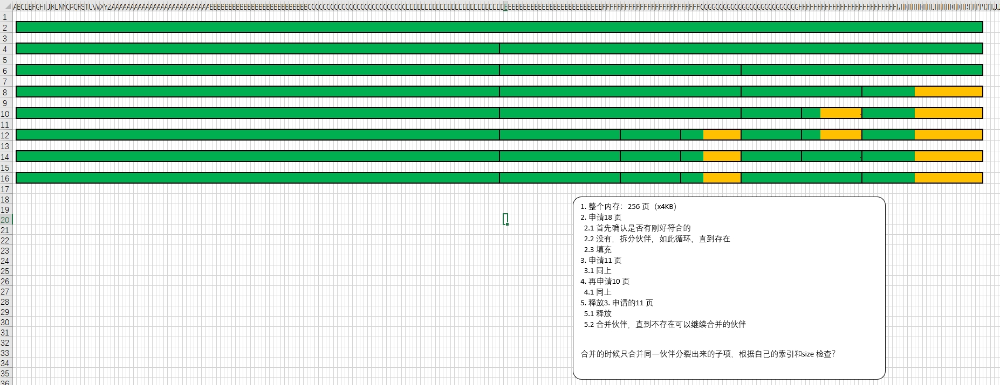

---
title: 简陋的Buddy 算法  
date: 2023-12-11
timeLine: true
sidebar: false  
icon: c
category:  
    - 笔记      
tag:   
    - 操作系统  
    - c/cpp  
    - 内存管理 
---  

> 随着工作的调动，估计以后越来越没有时间来学习了。谨以此篇献给我兴趣的开始。

  

至今尚未入门操作系统，原因就是内存管理始终是一个过不去的坎。且不说有MMU 的芯片，就连没有MMU 的芯片，也很难去想象如何管理内存，使得内存碎片最小化。然而内存碎片总是存在的，不是在分配单元的内部，就是在其外部。我们无法控制内存的分配，只能通过某些算法使得在释放内存时可以主动合并一些小块来形成更大块的可用空间。  

## 伙伴算法   
伙伴算法的精髓在于：  
1. 将内存分为一个或多个`buddy`  
2. 分配内存前，为请求计算最合适的内存空间大小（$2^n$ 指数级）    
3. 在分配时，首先查找最合适的空余`buddy`，如果没有，则拆分相对最合适的`buddy`  

释放内存时：  
1. 释放当前`buddy`  
2. 自己的小伙伴是否是空闲的，如果是，则合并之；否则结束  
3. 如此循环  

似乎默认选择会通过链表或者二叉树来管理伙伴，但是本文采用的是数组加循环的方式管理。最坏的情况就是按最小粒度将所有伙伴遍历一遍。感觉还可以，比链表要容易理解些吧，应该~


## 丐中丐版代码  
第一版的代码重点在于内存分配时的拆分，并没有涉及到如何拆分最小合适的Buddy，以至于运行起来仍然会存在明显的内存碎片。但是其对于理解伙伴算法还是很有帮助的！
```c
#include <stdio.h>
#include <math.h>

#define MEM_SIZE (1024 * 1024)
#define PAGE_SIZE (4 * 1024)

typedef unsigned int uint32_t;

typedef struct Buddy
{
    void *addr;
    uint32_t pages;
} buddy_t;

char mem[MEM_SIZE] = {0};

buddy_t buddies[MEM_SIZE / PAGE_SIZE] = {0};

void buddy_init()
{
    // 1. 初始化，默认只有一个buddy，可用的页数为256
    buddies[0].addr = 0x0000;
    buddies[0].pages = MEM_SIZE / PAGE_SIZE;
}

uint32_t get_buddy_pages(uint32_t pages)
{
    // https://yalexin.gitee.io/2020/08/11/%E5%B0%86int%E7%B1%BB%E5%9E%8B%E6%95%B4%E6%95%B0%E5%90%91%E4%B8%8A%E5%8F%962%E6%AC%A1%E5%B9%82/
    if (pages <= 0 || pages > MEM_SIZE / PAGE_SIZE)
    {
        printf("request is too small or too large\n");
        return 0;
    }
    double p = ceil(log2(pages));
    pages = (uint32_t)pow(2, p);
    return pages;
}

void *buddy_alloc(uint32_t pages)
{
    /**
     * 这里要重写，每次检查buddy 是否可用时可以跳过max(pages, buddy.pages) 个页
     * 然后需要一个临时指针，指向可以容纳下所需空间的最小可用buddy。
     * 循环
     *  遍历buddies，查找空闲buddy  
     *      在用：跳过max(pages, buddy.pages) 个页
     *      空闲：
     *          空间不足，跳过pages 个页
     *          空间刚好够，跳出循环  
     *          空间较大，比较并看结果更新tempBuddy 指针
     *  如果tempBuddy 为空，则没有符合条件的  
     *  拆分tempBudy，之后的代码可以照抄了
     * 此算法最差会循环MEM_SIZE/PAGE_SIZE 次，并且减少了内存碎片的产生，因为会优先使用已经存在的最适合空余buddy
    */
    // 分配内存，pages 页数
    uint32_t buddy_pages = get_buddy_pages(pages);
    uint32_t offset = 0;
    printf("alloc %d pages\n", buddy_pages);
    buddy_t *buddy = buddies;                                     // 第一个buddy
    while ((buddy->addr != 0x0000 || buddy->pages < buddy_pages)) // 如果该buddy 已被分配，或者内存不足
    {
        if (offset >= MEM_SIZE / PAGE_SIZE)
        {
            printf("there is no enough sapce for %d pages\n", buddy->pages);
            return 0x0000;
        }
        if (buddy->addr != 0x0000)
        {
            printf(" %d pages are being used in this buddy\n", buddy->pages);
        }

        if (buddy->pages < buddy_pages)
        {
            printf("only %d pages available in this buddy\n", buddy->pages);
        }

        offset += buddy->pages;
        buddy += buddy->pages;
    }

    while ((buddy->pages / 2 >= buddy_pages))
    {
        printf("find %d pages available, but it is too large than %d\n", buddy->pages, buddy_pages);
        // 拆分过大的空间
        buddy->pages /= 2;
        buddy_t *temp = buddy + buddy->pages;
        temp->pages = buddy->pages;
        printf("split this buddy to %d pages\n", buddy->pages);
    }

    printf("allocate memories from %d\n", offset);
    buddies[offset].addr = &mem[offset * PAGE_SIZE];
    buddies[offset].pages = buddy_pages;
    return buddies[offset].addr;
}

void buddy_free(void *addr)
{
    // 释放内存，合并buddies
    uint32_t offset = ((char *)addr - &mem[0]) / PAGE_SIZE;
    buddy_t *buddy = buddies + offset;
    uint32_t position = offset % buddy->pages;
    buddy->addr = 0x0000;
    printf("position: %d/%d=%d\n", offset, buddy->pages, position);

    if (position == 1)
    {
        buddy -= 1;
        // 位于两个伙伴的右边
        if (buddy->addr == 0x0000)
        {
            buddy->pages *= 2;
        }
    }
    else
    {
        // 位于两个伙伴的左边
        if ((buddy + 1)->addr == 0x0000)
        {
            buddy->pages *= 2;
        }
    }
}

int main(void)
{
    buddy_init();
    void *p = buddy_alloc(127);
    buddy_alloc(8);
    buddy_free(p);
    printf("%d, %p, %p\n", buddies[0].pages, buddies[0].addr, &mem[0 * PAGE_SIZE]);
    buddy_alloc(9);
    printf("%d, %p, %p\n", buddies[128].pages, buddies[128].addr, &mem[128 * PAGE_SIZE]);
    printf("%d, %p, %p\n", buddies[144].pages, buddies[144].addr, &mem[144 * PAGE_SIZE]);
    printf("%d", ((char *)buddies[128].addr - &mem[0]) / PAGE_SIZE);
    return 0;
}
```


## 完整版代码  

完整版代码虽然效果更好，但是不如最初版的易懂。也警告自己不要试图一次就把代码写好。下面附上，仅供参考：  
```c
#include <stdio.h>
#include <math.h>

typedef unsigned int uint32_t; // 4 bytes

typedef struct Buddy
{
    void *addr;    // start address of this buddy in memory block
    uint32_t size; // the size of this buddy
} Buddy_t;

typedef struct Buddy_Allocator
{
    uint32_t memory_size;    // total memory size
    uint32_t page_size;      // size of each page
    uint32_t pages;          // = memory_size / page_size
    void *memory_start_addr; // just treat it as an array
    Buddy_t *buddies;
} Buddy_Allocator_t;

uint32_t calc_Buddy_Size(Buddy_Allocator_t *allocator, uint32_t pages);
void *buddy_Allocate(Buddy_Allocator_t *allocate, uint32_t pages);
void buddy_Free(Buddy_Allocator_t *allocator, void *addr);

#define MAX(x, y) ((x) > (y)) ? (x) : (y)
#define MIN(x, y) ((x) < (y)) ? (x) : (y)

#define MEMORY_SIZE (1024 * 1024)
#define PAGE_SIZE (4 * 1024)
#define PAGES MEMORY_SIZE / PAGE_SIZE
char memories[MEMORY_SIZE] = {0};
int main(void)
{
    // initial function, can not be replaced by macro
    char memory[MEMORY_SIZE] = {0};
    Buddy_t buddies[PAGES] = {{0x0000, 0}};
    buddies[0].size = PAGES;
    Buddy_Allocator_t allocator = {
        MEMORY_SIZE,
        PAGE_SIZE,
        PAGES,
        memory,
        buddies};
    printf("Init Buddy Allocator: %d pages(%d bytes/page) from 0x%p\n\n", allocator.pages,
           allocator.page_size, allocator.memory_start_addr);

    // test code
    void *p = buddy_Allocate(&allocator, 127);
    void *q = buddy_Allocate(&allocator, 8);
    buddy_Free(&allocator, p);
    buddy_Free(&allocator, q);

    p = buddy_Allocate(&allocator, 64);
    q = buddy_Allocate(&allocator, 8);
    q = buddy_Allocate(&allocator, 7);
    buddy_Free(&allocator, p);
    buddy_Free(&allocator, q);
    return 0;
}

/**
 * caculate suitable minimum buddy size from request pages
 */
uint32_t calc_Buddy_Size(Buddy_Allocator_t *allocator, uint32_t pages)
{
    if (pages <= 0 || pages > allocator->pages)
    {
        printf("Failed to caculate the size of buddy, you request too small/large memory");
        return 0;
    }

    double p = ceil(log2(pages));
    uint32_t size = (uint32_t)pow(2, p);
    return size;
}

/**
 * return the matched size than request
 * */
void *buddy_Allocate(Buddy_Allocator_t *allocator, uint32_t pages)
{
    pages = calc_Buddy_Size(allocator, pages); //
    if (pages <= 0)
    {
        return 0x0000;
    };
    printf("Allocate %d pages\n", pages);

    Buddy_t *buddy = allocator->buddies;
    Buddy_t *matched_buddy = allocator->buddies;

    while (buddy - allocator->buddies < allocator->pages)
    {
        if (buddy->addr == 0x0000 && buddy->size >= pages)
        {
            // there is a buddy available
            printf("    There is a buddy[No.%d] available, maybe not the best: %d pages\n", buddy - allocator->buddies, buddy->size);
            if (matched_buddy->size > buddy->size || matched_buddy == allocator->buddies)
            {
                // find the most suitable buddy
                matched_buddy = buddy;
                printf("    There is a more suitable buddy, maybe not the best: %d pages", buddy->size);
            }
        }

        if (buddy->addr != 0x0000)
        { // buddy is used, skip max(buddy.size, pages)
            printf("    %d pages are being used in this buddy\n", buddy->size);
        }

        if (buddy->size < pages)
        {
            printf("    only %d pages available in this buddy, but you request %d pages\n", buddy->size, pages);
        }
        buddy += MAX(buddy->size, pages);
    }

    if (matched_buddy->addr != 0x0000)
    {
        printf("After all checking, there is no buddy available.\n\n");
        return 0x0000;
    }
    printf("After all checking, there is a suitable buddy(No.%d).\n\n", matched_buddy - allocator->buddies);

    while (matched_buddy->size / 2 >= pages)
    {
        // break the bigger buddy, until suitable for request
        printf("  -> find %d pages available, but it is too large than %d\n", matched_buddy->size, pages);
        matched_buddy->size /= 2;
        (matched_buddy + matched_buddy->size)->size = matched_buddy->size; // create a new buddy with the size/2
        printf("  -> break this buddy into 2 buddies with %d pages per buddy\n", matched_buddy->size);
    }

    uint32_t offset = matched_buddy - allocator->buddies;
    printf("Allocate memories from buddies[%d]\n\n", offset);
    allocator->buddies[offset].addr = &memories[offset * PAGE_SIZE];
    allocator->buddies[offset].size = matched_buddy->size;
    return allocator->buddies[offset].addr;
}

void buddy_Free(Buddy_Allocator_t *allocator, void *addr)
{

    // find the index of buddy of current addr
    uint32_t index = ((char *)addr - memories) / allocator->page_size;
    // find current buddy
    Buddy_t *buddy = allocator->buddies + index;
    buddy->addr = 0x0000;
    Buddy_t *temp_buddy = 0x0000;

    uint32_t finished = 0;

    while (buddy->size != allocator->pages)  // free all memories, and stop!
    {
        // the left one? or the right one
        uint32_t high_low = (index / buddy->size) % 2;
        printf("Free buddy at[%d] in %d buddies: %d(1:h;0:l)\n", index, buddy->size, high_low);

        if (high_low == 1)
        {
            temp_buddy = buddy; // temp_buddy point to the higher buddy
            buddy = temp_buddy - temp_buddy->size;
            index -= temp_buddy->size;
        }
        else
        {
            temp_buddy = buddy + buddy->size;
        }
        if (temp_buddy->addr == buddy->addr)
        {
            printf("-> Merge blocks\n");
            buddy->size *= 2;
        }
        else
        {
            printf("Free buddy(ies): done!\n\n\n");
            return;
        }
    }
    printf("There might be sth. wrong when free memories!");
}
```

程序在分配内存时会优先找最小合适的伙伴，如果还是较大，就会拆分。而释放内存时，则会按照规则合并伙伴，直到全部合并完成或者不能继续合并。（要是能有个动画演示下就好了~）  

后面在补充上`sla[uo]b` 算法，在微控制器中应该就足够用了。面对工作调动，忽然有一种英雄迟暮的感觉。希望小姜同学科研、工作都顺利吧。将来安顿到哪，都要尽快团聚啊！   

## 参考资料  
1. [Buddy Memory Allocation Program | Set 1 (Allocation)](https://www.geeksforgeeks.org/buddy-memory-allocation-program-set-1-allocation/)  
2. [Buddy Memory Allocation Program | Set 2 (Deallocation)](https://www.geeksforgeeks.org/buddy-memory-allocation-program-set-2-deallocation/)  
3. [伙伴系统-Buddy System](https://www.cnblogs.com/xkfz007/archive/2012/11/08/2760148.html) 内存回收部分  