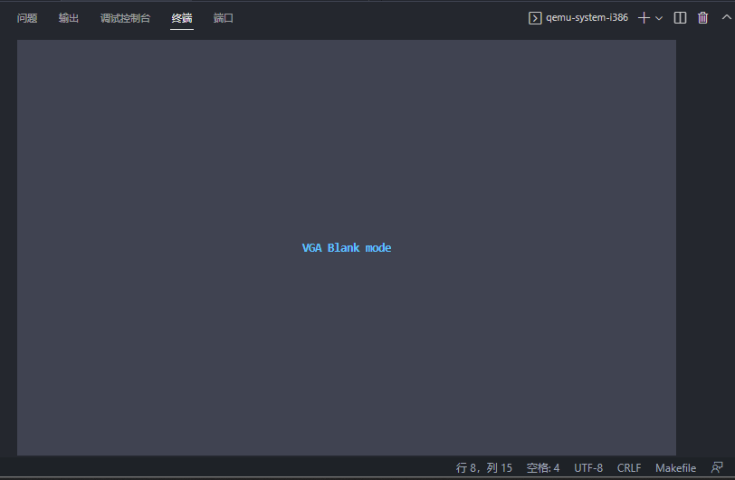
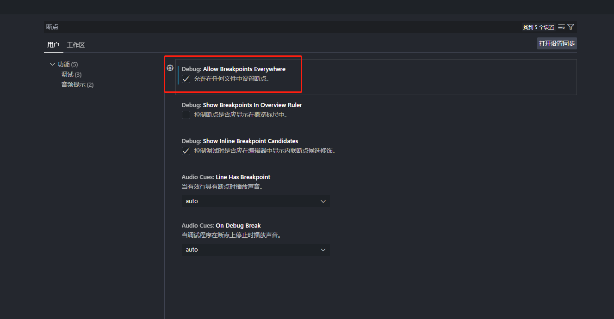

---  
title: x86 操作系统笔记  
date: 2022-08-03
timeLine: true
sidebar: false  
icon: c
category:  
    - 笔记      
tag:   
    - OS  
    - x86  
    - asm  
---  

# x86 操作系统笔记  
学习[用200行代码写一个超小的操作系统](https://www.bilibili.com/video/BV1fB4y1J7LL)的笔记。开发过程最好还是在Linux 下运行，Windows 下虽然有[i686-elf-tools 跨平台编译工具](https://github.com/lordmilko/i686-elf-tools)，但是[虚拟机QEMU](https://www.qemu.org/download/) 和`GDB` 调试工具还是会有版本上的不兼容等问题。**笔记重点在于工具链的配置**，其中的代码和命令是在OpenSUSE 系统中验证的。    

## 命令解析     
为调试方便起见，笔记中的命令只适用于Linux/OpenSUSE 平台，Windows 平台上的指令名称不同，但是作用与步骤是一样的。  

### 编译
因为我们的代码需要在裸机上运行，不能包含任何平台相关的标准库代码，所以在编译时需要指定专门的`flag`。    
```makefile 
CFLAGS = -g -c -O0 -m32 -fno-pie -fno-stack-protector -nostdlib -nostdinc  
# -g    在目标文件中添加调试信息，便于gdb 调试或者objdump 反汇编  
# -c    进行预编译、编译、汇编，但是不进行链接的工作
# -O0   优化等级为0，不优化！
# -m32  生成x86 32位代码
# -fno-pie 禁止生成位置无关的代码，因为代码是运行在裸机上的
# -fno-stack-protector 禁用堆栈保护
# -nostdlib 禁用标准链接库
# -nostdinc 禁用包含标准文件    

all: src/os.c src/os.h src/start.S  # make all 前提需要三个源文件的存在  
    # $(var_name) 获取变量值
	gcc $(CFLAGS) src/start.S  
    # 编译gcc 汇编代码，主要是完成一些C 语言所不能涉及的代码  
	gcc $(CFLAGS) src/os.c 
    # 编译C 代码

    # 链接汇编结果文件
	ld -m elf_i386 -Ttext=0x7c00 start.o os.o -o os.elf  
    # -m 目标平台文件  
    # -Ttext=0x7c00 .text 段的起始位置为0x7c00  
    # -o 输出文件  

	objcopy -O binary os.elf os.bin
    # 文件格式转换  
    # -O 指定文件格式为二进制文件  

	objdump -x -d -S  os.elf > os_dis.txt	  
    # 查看反汇编信息  
	readelf -a  os.elf > os_elf.txt         
    # 查看elf 文件信息  

	dd if=os.bin of=disk.img conv=notrunc  
    # 将二进制文件写入（创建）虚拟磁盘文件 

# 清理编译结果文件和中间文件
clean:
	rm -f *.elf *.o     
```  

### QEMU   
在远程开发的前提下，我们可以以另一种形式看到QEMU 的图形界面，那就是设置`-display` 选项。此选项能将QEMU 的界面转发至终端。  
```sh
qemu-system-i386 -m 128M -s -S  -drive file=./image/disk.img,index=0,media=disk,format=raw -display curses  
# -m 128M 内存  
# -s 打开调试的简写/shorthand for -gdb tcp::1234
# -S 启动后停止，等待调试信息/freeze CPU at startup (use 'c' to start execution)  
# -drive file=./image/disk.img,index=0,media=disk,format=raw 启动镜像  
# -display curses 
```
  

在终端中按`alt+2(1/2/3/...)` 可以切换到`QEMU`的控制台，输入`quit` 可以终止进程。更过[Display 选项](https://web.archive.org/web/20200304204518/https://qemu.weilnetz.de/doc/qemu-doc.html#Display-options)

## 汇编与C 混合编程    
虽然操作系统可以用C/C++ 开发，但是启动引导部分还是要由汇编来完成，这里简单记一下阅读源码时比较重要的知识点：  

### GAS 语法  
GAS 使用`AT&T` 语法，对于习惯了`Intel` 语法的我们来说，有些难记，这里以简短的代码为例：  
```nasm  
; 一下代码粘贴自：https://gitee.com/lishutong-01ketang/diy-x86os/blob/master/diy-200lines-os/b00.04/source/start.S
	#include "os.h"    ; 引入头文件
	
	.global _start     ; 声明_start符号是全局的，在其它代码源文件中可以访问

  	.code16            ; 以下代码将会被编译为16 位机器码，在实模式下运行

 	.text              ; 代码段
_start:
	// 平坦模式，预设各段寄存器起始地址均为0x0000
	mov $0, %ax	       ; 1 立即数前要加%
	mov %ax, %ds       ; 2 寄存器前要加%
	mov %ax, %es       ; 3 指令从左往右依次为：操作 源操作数 目的操作数
	mov %ax, %ss
    ; 栈顶指针为_start 所在的地址，即编译后的0x7c00 
	mov $_start, %esp  ; 4 符号前加$ 表示该符号所在的地址，相当于mov 一个立即数常量	 
                       ; 5 符号前不加$ 表示该符号所在地址的内容
                       ; 可以看出下面两条指令编译出来的机器码是不同的！
    ; mov $_start, %esp 
    ; 7c09:	66 bc 00 7c          	mov    $0x7c00,%sp  
    ; 7c0d:	00 00                	add    %al,(%eax)
	; mov _start, %esp
    ; 7c0f:	66 8b 26             	mov    (%esi),%sp
    ; 7c12:	00                   	.byte 0x0
    ; 7c13:	7c                   	.byte 0x7c  


read_self_all:         ; 利用13 号BIOS 中断读取硬盘，加载剩余的代码
	mov $_start_32, %bx	; 待写入的目标地址
	mov $0x2, %cx		; ch:磁道号，cl起始扇区号
	mov $0x0240, %ax	; ah: 0x42读磁盘命令, al=0x40 64个扇区，多读一些, 32KB
	mov $0x80, %dx		; dh: 磁头号，dl驱动器号0x80(磁盘1)
	int $0x0013
	jc read_self_all	; 读取失败，则重复

	; 进入保护模式，详解看教程
	cli					; 关中断
	lgdt [gdt_desc]		; 6 [label] 操作符表示 相对于DS 的偏移地址，因为这里需要加载的是地址
                        ;   所以不能用$，但是不加任何修饰符也可以使用
	mov $1, %eax
	lmsw %ax			; 设置PE位，进入保护模式
	jmp $KERNEL_CODE_SEG, $_start_32	; 长跳转，段选择子+偏移
                                        ; 进入32位保护模式代码，可以运行32位指令

	// 跳到引导标志, 由bios在上电后检查
	.org 0x1fe			// 引导标志
	.byte 0x55, 0xaa

	; 32 位代码
	.code32
	.text
_start_32:
	; 重新加载数据段寄存器
	mov $KERNEL_DATA_SEG, %ax
	mov %ax, %ds
	mov %ax, %es
	mov %ax, %ss
	mov $_start, %esp
	jmp .

; gdt描述符，由lgdt加载
gdt_desc: .word (256*8) - 1  ; 见规则4、5
	.long gdt_table
```

### C 语言代码  
C 语言中全局的变量、结构、函数都会被编译为类似于`gdt_desc` 的符号，但是宏中定义的常数可以以立即数的形式在汇编语言中调用。  
```c
#include "os.h"

// 类型定义
typedef unsigned char uint8_t;
typedef unsigned short uint16_t;
typedef unsigned int uint32_t;

struct
{
    uint16_t limit_l, base_l, basehl_attr, base_limit;    // 1. 内存地址从左到右递增
} gdt_table[256] __attribute__((aligned(8))) = {          // 2. 在内存中以8 字节对齐，实际编译结果，编译器会创建一个砖妹的数据段来存放
    // 0x00cf9a000000ffff - 从0地址开始，P存在，DPL=0，Type=非系统段，32位代码段（非一致代码段），界限4G，
    [KERNEL_CODE_SEG / 8] = {0xffff, 0x0000, 0x9a00, 0x00cf},
    // 0x00cf93000000ffff - 从0地址开始，P存在，DPL=0，Type=非系统段，数据段，界限4G，可读写
    [KERNEL_DATA_SEG / 8] = {0xffff, 0x0000, 0x9200, 0x00cf},
};
```

## 平坦模型  
x86 芯片是支持分段内存模型的，这样可以让代码不一定在内存上连续，比较灵活。然而，这样的灵活性会导致开发人员疲于管理段寄存器，尤其是引入内存分页的概念之后，并且**其他平台的芯片并不一定会提供分段的机制**。于是我们可以将物理内存只划分为一个很大的段，而在这个很大的段的基础上，再去使用其他的手段去管理内存。这就是最简单的平台模型的概念。  
- 在实模式与保护模式切换过程中，我们采取平坦模式可以让这个过程变得自然且流畅；  
- 因为系统调用很多的地址都应该时固定的，所以采用平坦模型的话也减少了任务切换时段寄存器的管理了。甚至在x64 长模式下还取消了分段寻址的机制（[为什么会有段寄存器的存在？](https://www.yuque.com/lishutong-docs/diyx86os/efpo1i)）。    

### 分页机制  
采用分页机制可以让程序访问到实际上并不存在的物理地址，如果物理内存已经被完全占用，操作系统可以负责将部分未使用的内存页暂存到硬盘上。这样对于我们的用户程序来说，每个进程都可以独享`4GB` 的空间。  
- 恒等映射，对于部分公用的代码和数据，例如系统调用，可以将物理内存与虚拟内存一对一映射。  

## 特权级切换  
x86 提供了`0,1,2,3` 四个特权级，编号越小、特权越高。高特权级的的代码可以执行关中断、调用低特权级的代码和数据；而低特权级的代码只能执行普通的指令、访问低特权级的数据。操作系统一般运行在特权级`0`，用户程序一般运行在特权级`3`。  

### 切换到低特权级  
系统可以通过中断返回指令`iret` 调用低特权级的指令。只需要在`iret` 之前，将低特权级代码的`ss:esp` 和`cs:eip` 等信息压栈就好了。   
> 只有`RPL` 字段的值大于`CPL` 的时候才可以使用`iret`   
```nasm
; 下面模拟中断返回，从而实现从特权级0到特权级3的变化
; 中断发生时，会自动压入原SS, ESP, EFLAGS, CS, EIP到栈中
push $APP_DATA_SEG
push $task0_dpl3_stack + 1024	; 特权级3时的栈，因为栈是向下增长的
push $0			; 中断暂时关掉 0x202						// EFLAGS
push $APP_CODE_SEG				; CPL=3时的选择子
push $task_0_entry					; eip
iret		


task_0_entry:
	; 进入任务0时，需要重设其数据段寄存器为特权级3的
	mov %ss, %ax
	mov %ax, %ds
	mov %ax, %es
	jmp task_0			; 跳转到C 代码的task_0运行
```
[视频教程](https://www.bilibili.com/video/BV1fB4y1J7LL?p=20)。但是这样有一个问题，我们的高特权级代码也映射在了低特权级的任务空间，这样是不安全的吧。  

### 任务切换  
x86 提供了对任务切换的硬件支持`TSS` 寄存器，可以保存任务所需的各种寄存器和描述符的。但实际上我们也可以通过栈操作完成，而不必使用TSS 寄存器。虽然使用寄存器会比较快一些。  
> 例如：Linux 就是使用task_struct 存储任务状态的。详见[Linux进程：Linux切换机制主流程](http://bbs.chinaunix.net/thread-2054471-1-1.html)，虽然不用很多TSS 保存任务信息，但还是得利用这个机制实现任务的切换。  

关于任务切换这一部分，最重要的点应该在于，什么时候保存任务的状态、谁负责保存任务运行的状态。
> 任务状态段(Task State Segment)是保存一个任务重要信息的特殊段。任务状态段描述符用于描述这样的系统段。任务状态段寄存器TR的可见部分含有当前任务的任务状态段描述符的选择子，TR的不可见的高速缓冲寄存器部分含有当前任务状态段的段基地址和段界限等信息。
> TSS在任务切换过程中起着重要作用，通过它实现任务的挂起和恢复。所谓任务切换是指，挂起当前正在执行的任务，恢复或启动另一任务的执行。在任务切换过程中，首先，处理器中各寄存器的当前值被自动保存到TR所指定的TSS中；然后，下一任务的TSS的选择子被装入TR；最后，从TR所指定的TSS中取出各寄存器的值送到处理器的各寄存器中。由此可见，通过在TSS中保存任务现场各寄存器状态的完整映象，实现任务的切换。  
> [《任务状态段》](https://www.cnblogs.com/guanlaiy/archive/2012/10/25/2738355.html)  

如何将`EIP` 压栈？中断机制可以完成！

### 系统调用  
低特权级的代码无法访问高特权级的代码或数据，但是我们又需要时不时用到一些系统调用。这时候就需要用到调用门的概念。调用门主要包含一下信息：  
- 系统服务函数所在代码段的选择子  
- 系统服务函数在代码段选择子中的偏移  
- 系统调用接口传递的参数  
- 段是否存在、以及访问时所需的权限  

当然，如果系统调用时目标段不存在于内存上，则会触发中断，用于将所需代码、数据读取到内存中。  

> 除了调用门之外，也可以通过`INT 0x??` 来触发软中断，继而通过寄存器传参来进行系统调用。  

### 关于LDT  
x86 芯片实现了很多机制，但是在实际应用中并不一定会用到。考虑到代码的可移植性，也可能会通过其他方法和机制来实现相似的功能。特性太多反而加重了开发者的负担。  


## 工具相关  
如果只注重于工具的话，就偏离了学习的目标；但是离开了工具，我们又失去了开发的便利。先熟悉命令，然后再配置工具。  

### VSCode 调试配置   
因为调试任务需要历经编译、加载虚拟机、加载调试器三个大的步骤，编译我们可以用`make` 命令完成，而加载虚拟机会导致进程阻塞，于是我们把它放在一个单独的脚本进行。  
```sh  
# ./script/start_qemu.sh
qemu-system-i386 -m 128M -s -S  -drive file=disk.img,index=0,media=disk,format=raw -display none -daemonize   
# 不能使用shell 中的&，不然可能会启动任务失败 
```  
#### 配置文件  
我们主要通过`tasks.json` 来执行编译、启动虚拟机的任务；`launch.json` 用于启动调试操作：  

<CodeGroup>
<CodeGroupItem title="tasks.json">

```json  
{
    "tasks": [
        {
            "type": "shell",
            "label": "make_all",
            "linux": {
                "command": "make all"  // 编译、链接等一系列操作
            }
        },
        {
            "type": "shell",
            "label": "start_qemu",
            "linux": {
                "command": "bash ${workspaceRoot}/script/start_qemu.sh"
                // 启动qemu 虚拟机
            },
            "options": {
                "cwd": "${workspaceRoot}/image/"
                // 指定start_qemu.sh 的启动目录
            },
        },  
        {
            "type": "shell", 
            "label": "run",
            "dependsOrder": "sequence",
            "dependsOn":[  // 顺序执行以上两条命令
                "make_all",
                "start_qemu"
            ]
        }
    ],
    "version": "2.0.0"
}
```

</CodeGroupItem>
<CodeGroupItem title="launch.json">

```json
{
    "version": "0.2.0",
    "configurations": [
        {
            "name": "GDB Debug",
            "type": "cppdbg",
            "request": "launch",
            "program": "${workspaceRoot}/os.elf",  // 参考的可执行文件，包含调试信息
            "args": [],
            "stopAtEntry": false,
            "cwd": "${workspaceRoot}",
            "environment": [],
            "externalConsole": false,
            "MIMode": "gdb",
            "miDebuggerServerAddress": "127.0.0.1:1234",
            "targetArchitecture": "x86",
            "stopAtConnect": true,
            "linux": {
                "miDebuggerPath": "gdb",
                "preLaunchTask": "start_qemu"     // 预执行的任务
            },
            "setupCommands": [
                {
                    "description": "为 gdb 启用整齐打印",
                    "text": "-enable pretty-printing",
                    "ignoreFailures": true
                },
                {
                    "description": "将反汇编风格设置为 Intel",
                    "text": "-gdb-set disassembly-flavor intel",
                    "ignoreFailures": true
                },
                {
                    "description": "设置体系结构",   // 方便以16位方式进行反汇编
                    "text": "-gdb-set arch i8086",
                    "ignoreFailures": true
                }
            ],
            // gdb连接后的设置
            "postRemoteConnectCommands": [
                {
                    "description": "运行至0x7c00",
                    "text": "-exec-until *0x7c00",
                    "ignoreFailures": false
                },
            ],
        }
    ]
}
```  

因为VSCode 的原因，各种`GDB Command` 不能以原本的形式设置，上面出现了三种形式，复制粘贴就好了：  
| gdb 命令 | vscode 中的形式 |
| -------- | --------------- |
| set      | -gdb-set        |
| enable   | -enable-        |
| until    | -exec-until     |

</CodeGroupItem>
</CodeGroup>


### VSCode 汇编断点的问题  
某些情况下，VSCode 中的`.S` 文件中不能设置断点，这是我们需要在`首选项--设置`中设置在所有文件中启用断点。[详情参考](https://github.com/microsoft/vscode/issues/112288#issuecomment-743456329)  
    

## 参考资料  
- [x86 机器码](http://ref.x86asm.net/coder32.html)  
- [[Feature Request] Execute GDB commands without typing "-exec"](https://github.com/microsoft/vscode-cpptools/issues/106)  
- [GNU Assembler Examples](https://cs.lmu.edu/~ray/notes/gasexamples/)
