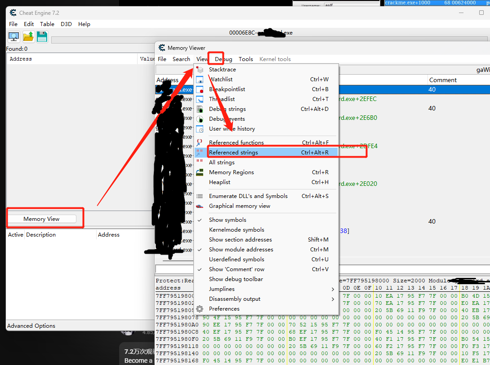
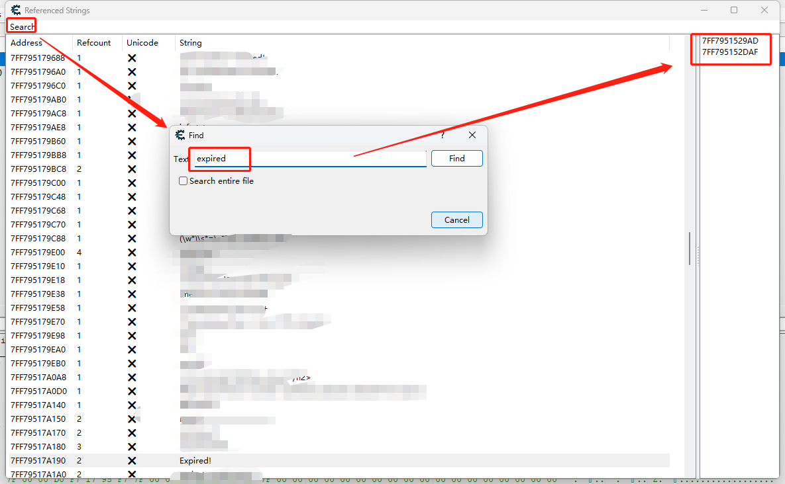
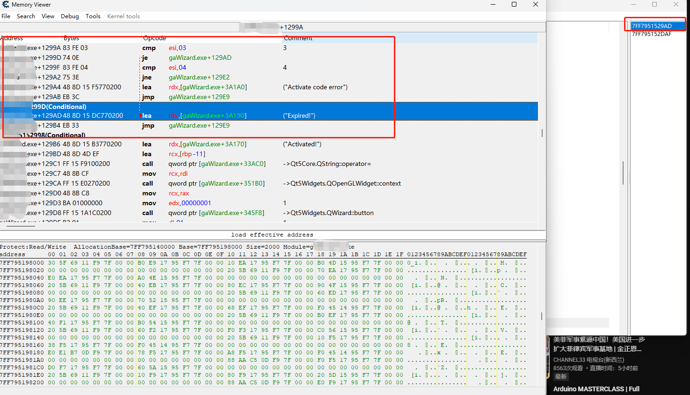
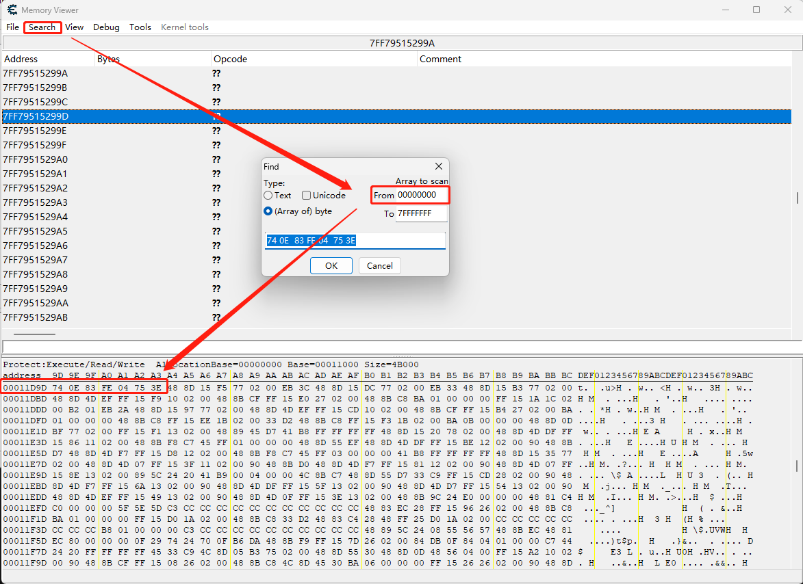

---
title: 通过Cheat Engine 爆破注册码
date: 2023-09-15
timeLine: true
sidebar: false  
icon: c
category:  
    - 笔记      
tag:   
    - Cheat Engine  
    - 爆破    
---    

> 玩《植物大战僵尸》时学过一点点CE，想着是不是可以用来追软件的注册码？谷歌了一下，果然还是有[教程](https://www.youtube.com/watch?v=Emiuht3YSXA)的。而且CE 上手要比OD 简单感觉。  

## 爆破程序  
首先将CE 附加到进程，然后使用错误的激活码激活几次，然后通过CE 在进程内存空间中查找错误提示的字符串，诸如`expired` 等。  
  

然后查找字符串就能找到程序在什么位置会加载此字符串，下图示例中有两处：
  

双击其中任何一个地址，就可以查找到跳转代码：  

找到对应的跳转，按照需要使用右键`汇编`或者`NOP` 掉指令。 
重新输入错误的注册码，选择注册，提示注册成功。  

有些程序不止会在一个位置验证，最好多试几个地方。  

### 修改二进制文件  
重新使用CE 打开`程序.exe` 文件，注意不是附加到进程，然后`Memory View --> View --> Search --> Array of byte`。输入上图中爆破前的字节码，如：  
  
查找到的，就是需要修改的机器码在文件中的偏移位置。这时候通过二进制编辑工具，找到相应的位置，然后将机器码修改为爆破后的数值，另存为新的`exe` 即可。  
比较简单的小软件就可以这么搞定。追注册码还是难了点~  

## 参考资料  
1. [How to Crack and Patch Applications with Cheat Engine (Part 1)](https://www.youtube.com/watch?v=Emiuht3YSXA)  
2. [How to Crack Applications with Cheat Engine (Part 2)](https://www.youtube.com/watch?v=iCLQcBiv-ns)  