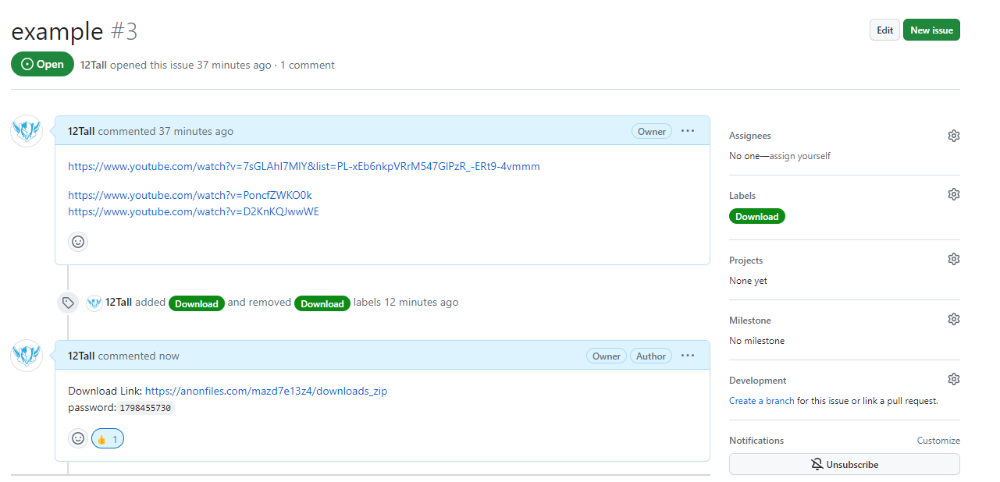

---
title: 通过Github Actions 下载转存Youtube 视频   
date: 2023-07-11
timeLine: true
sidebar: false  
icon: config
category:  
    - 笔记   
tag:   
    - Github Actions  
    - Youtube  
    - Video  
---  

昨天发哥给我看了他的Github 爬虫，能够实现[定时任务](https://github.com/LPTFF/lptff.github.io/blob/e3abb9332ff45493f9b814010efda71bcb3f1db9/.github/workflows/ci.yml#L2-L8)。那么如果我的事件能够由Issues 触发，那么就能根据Issues 内容下载外网的内容并且传送到公有云？试了一下，果然可以！参见项目[12Tall/youtube_dl_actions](https://github.com/12Tall/youtube_dl_actions)    

## 更多想法   
项目中是将`issue.body` 保存为`playlist.txt` 文件，然后直接交给了`youtube-dl` 去下载，但是中间可以加入一些`python` 处理程序，比如根据`url` 解析不同的视频源，然后就能支持更多的视频网站了。  

同样，后端用的是`transfer` 上传到公有云，其实也可以通过一些工具同步到自己的私有空间。  

挺好玩的思路，甚至以后也能白嫖一些仿真计算的资源？但是无论如何，最好让`issues.body` 尽量整洁。  