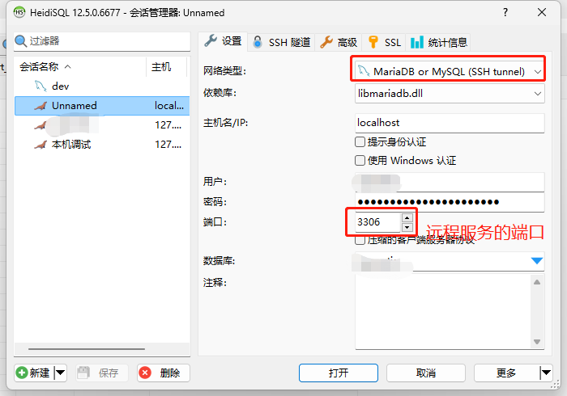
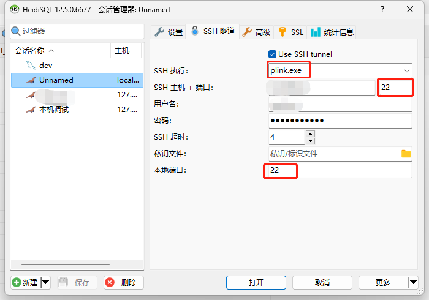

---
title: HeidiSQL 工具     
date: 2023-07-05    
timeLine: true
sidebar: false  
icon: nodeJS  
category:  
    - DataBase       
tag:  
    - ssh  
    - MariaDB  
    - MySQL         
---    

## 通过SSH 连接数据库  
服务器上的数据库不能直连，有时候又需要简单调试一下。可以试试HeidiSQL 的这个功能：  
  
  

不清楚为啥要这样配置，尤其是图二中的[本地端口](https://www.heidisql.com/forum.php?t=24073#p30739)……，但是好用。  