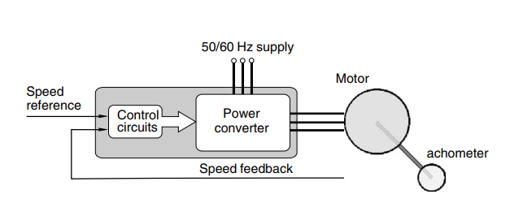
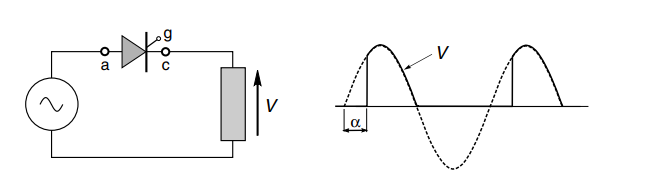

---
title: 电机与驱动读书笔记（驱动电路）  
date: 2023-03-11  
timeLine: true
icon: notebook
category:  
    - 笔记  
tag:  
    - 电机  
    - 控制  
    - 驱动  
    - 整流  
    - 逆变
---   
> 电机的驱动电路是不存储能量的，然而电机在启动时由于反电动势为0，所以会大幅度拉低电源的输出电压，而影响其他设备使用。于是我们需要一个灵活且可靠的驱动电路。  

一般驱动电路由两部分构成：供能部分负责提供电机运行所需的电能，控制部分负责采集电机运行状态数据进而控制功能部分以获得预期的效果。  
   

对于驱动电路来说，最重要的两个特性就是：效率和输出波形的质量。  

## DCDC 变换电路  
开关器件的导通和截止状态都可以近似地认为消耗的功率为0，而开启和关闭的过程中的损耗则不能忽略不计，于是开关器件的动作频率越快，相对的效率就会越低，发热也就越严重。  
> 一般来说，双极型三极管的基极电流要达到集电极电流的5%~10%，才能使三极管到达饱和状态（电阻近似为0）。因为三极管需要电流维持导通状态，所以效率较低。  

- 脉宽调制：PWM，开关闭合的频率一定，但是每次闭合的时间不同，于是输出波形的宽度也不同；  
- 频率调制：PFM，开关闭合的时间一定，但是闭合的频率不同，于是输出波形的密度不同。   

## ACDC 可控整流   
> 晶闸管可以通过门极开启，但是不能主动关断，需要反向的电压才能关断。而对于负载是感性器件的电路来说，刚好可以通过感生电压来关断晶闸管。  

如果仅仅需要从交流变化成直流，那么二极管就够了。但是如果还要控制输出电压的话，就需要用到可以按需要导通的器件，例如晶闸管等。根据开启时间就能调整输出电压。  
  

## 过压保护  
主要是针对电枢绕组属于感性器件，在通电期间会储存能量$W=\frac{LI^2}{2}$，在突然中断供电时，会产生巨大的感生电压$V=L\frac{di}{dt}$，从而可能破坏电子器件。所以一般可以通过并联二极管来实现过压保护。  
