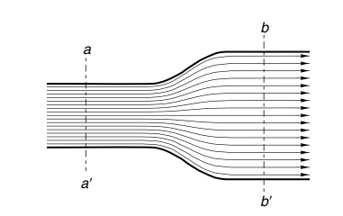

---
title: 电机与驱动读书笔记  
date: 2023-03-03  
timeLine: true
icon: notebook
category:  
    - 笔记  
tag:  
    - 电机  
    - 控制  
---   

> 《Electric Motors and Drives: Fundamentals, Types and Applications. 3rd Edition》的读书笔记。与其他的教材不同，这本书更偏向于工程实践，能让人对电机有更加直观的印象。笔记中的图片如无特殊说明均截自本书。

## 预备知识 

### 右手定则
磁场在电机中扮演举足轻重的角色，了解矢量在右手坐标系中的叉乘，将有助于对磁场、磁通量和安培力的理解与学习。如下图所示，如果矢量$\vec{z}=\vec{x}\times\vec{y}$，那么并拢右手四指指向$\vec{x}$，掌心朝向$\vec{y}$，则拇指竖起便是$\vec{z}$ 的方向。   

通过右手定则，可以快速判断各类矢量的方向，如磁通量、安培力等。  

### 磁通量  
磁通量（magnetic flux）的定义就是磁感线穿过平面S的数量。符号是$\boldsymbol{\Phi}$，单位是韦伯$Wb$。  
在通电螺线管中，磁通量的方向由右手螺旋定则确定，大小与电流$\boldsymbol{I}$和匝数$N$ 之间有如下关系：  
$$\boldsymbol{\Phi} = \frac{N \boldsymbol{I}}{\boldsymbol{R}} \tag{1}$$  
而安匝数则是通电螺线管的磁通势（magnet motive force）:$MMF=N\boldsymbol{A}$

其中，$\boldsymbol{R}$ 表示介质的磁阻，类比于电阻：  
$$\boldsymbol{R} = \frac{l}{\boldsymbol{A}\mu} \tag{2}$$  
**一般来说，空气的磁导率$\mu_{0}=4\pi\times10^{-7} H/m$，远小于铁磁材料的磁导率。故磁感线会优先集中分布在铁磁材料中，而整个回路的磁阻，基本可以近似看作由气隙的长度和面积决定。**  
当然，考虑材料的饱和时需要特殊考虑，但这也是电机设计时需要避免的情况，所以不做考虑。

### 磁通密度  
磁通密度，也叫磁感应强度，表示单位面积上的磁通量，符号是$\boldsymbol{B}$，单位是特斯拉$T$。可以理解为磁感线在介质中的密度。  
$$\boldsymbol{B} = \frac{\boldsymbol{\Phi}}{\boldsymbol{A}} \tag{3}$$  
在均匀（磁导率处处相同）介质中，磁感线是均匀分布的，于是截面积越小的地方，磁通密度越大。如下图中$\boldsymbol{B}_a = 2\boldsymbol{B}_b$  
  

考虑$(1)(2)(3)$式，可以得出，在如下图所示的气隙内，其平均磁通密度：  
$$\boldsymbol{B} = \frac{\mu_0N\boldsymbol{I}}{L_{gap}} \tag{4}$$  

由$(4)$可以看出，磁通密度只与电流、匝数和气隙长度相关。考虑$250$ 匝、$10A$ 的电流，气隙长度为$1mm$，则其平均磁通密度约为$0.63 T$。  

**常见情况是，在电机的励磁中，往往磁通量很小，但是磁通密度却很大，一般电机的气隙中的磁通密度都能达到$1T$ 左右。**  

### 安培力  
在磁场中的通电导线会受到安培力，具体表现为：  
$$\boldsymbol{F} = \boldsymbol{I}\boldsymbol{B}l \tag{5}$$  
这里$l$ 表示有效长度，即导线长度与磁场的垂直分量的长度。

## 电动机    
