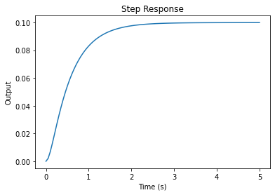
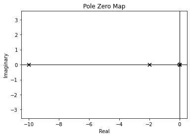
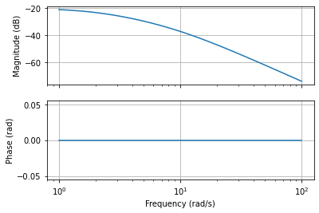
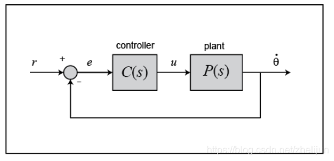
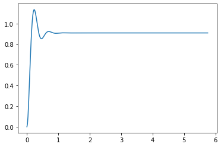
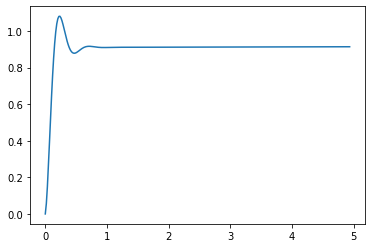
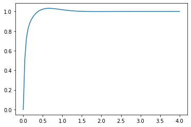
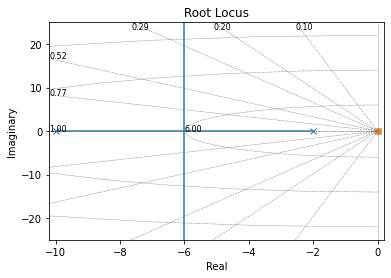
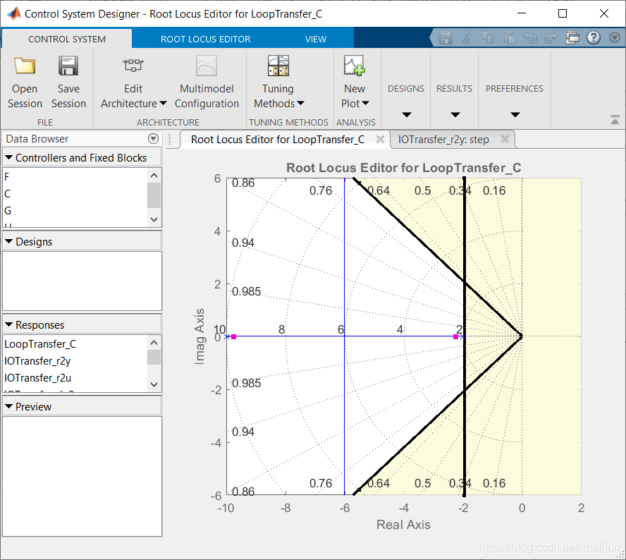

---
title: 电机与驱动读书笔记（直流电机仿真）  
date: 2023-04-17  
timeLine: true
icon: notebook
category:  
    - 笔记  
tag:  
    - 电机  
    - 控制  
    - 仿真  
---   

> 笔记摘自：[《Matlab 仿真——直流电机速度控制系列》](https://www.guyuehome.com/22965)   

电机的参数为：  
- 转子的转动惯量$J$：$0.01kg \cdot m^2$    
- 电机粘性摩擦常数$b$：$0.1N \cdot m \cdot s$  
- 电枢时间常数$K_e$：$0.01V/rad/sec$  
- 机电时间常数$K_t$：$0.01N \cdot m/Amp$  
- 电枢绕组电阻$R$：$1Ohm$  
- 电枢电感$L$：$0.5H$  

设计要求：  
1. 输入电压为$1v$ 时，稳定转速为$0.1rad/sec$  
2. 稳定时间不超过$2s$  
3. 稳态误差小于$1\%$  
4. 超调小于$5\%$


## 系统建模  

一般情况下，电枢的转矩与电流、反电动势与转速的关系如下：  
$$\left\{
    \begin{array}{ll}
        T = k_ti \\
        E = k_e\dot{\theta}
    \end{array}
\right. \tag{1}$$  

而其转矩平衡方程为：$J\ddot{\theta} + b\dot{\theta} = k_ti$  
电枢电压平衡方程为：$V-k_e\dot{\theta} = L\frac{di}{dt} + Ri$  

令$\omega = \dot{\theta}$，写作状态空间表达式，输出为转速$\omega$：  
$$\begin{bmatrix}
    \dot{\theta}  \\  
    \dot{\omega}  \\  
    \dot{i}
\end{bmatrix} = \begin{bmatrix}
    0 & 1 & 0  \\  
    0 & \frac{-b}{J} & \frac{k_t}{J}  \\  
    0 & \frac{-k_e}{L} & \frac{-R}{L}
\end{bmatrix}\begin{bmatrix}
    \theta  \\  
    \omega  \\
    i
\end{bmatrix}+\begin{bmatrix}
    0  \\
    0  \\  
    \frac{1}{L}
\end{bmatrix}V$$  
$$y=\begin{bmatrix}
    0 & 1 & 0
\end{bmatrix}\begin{bmatrix}
    \theta  \\
    \omega  \\  
    i
\end{bmatrix}$$  

### Python  

利用[`python-control`](https://python-control.readthedocs.io/en/0.9.3.post2/index.html) 库中建模，代码如下：  

```python  
import control  
# 电机参数  
J = 0.01;
b = 0.1;
Ke = 0.01;
Kt = 0.01;
R = 1;
L = 0.5;  
# 状态空间方程
A = [[0,1,0],[0, -b/J, Kt/J], [0, -Ke/L, -R/L]]  
B = [[0],[0],[1/L]]  
C = [0,1,0]  
D = [0]
# 形式转换
sys = control.ss2tf(A,B,C,D)
sys
```  

可以得到系统的传递函数为：  
$$\frac{2s}{s^3 + 12s^2 +20.02s} \tag{2}$$  

### 开环响应  
[`python-control`](https://python-control.readthedocs.io/en/0.9.3.post2/index.html) 库中自带了单位阶跃响应的方法：  
```python  
import matplotlib.pyplot as plt
import numpy as np 

t, y = control.step_response(sys, T=5)

plt.plot(t, y)
plt.xlabel('Time (s)')
plt.ylabel('Output')
plt.title('Step Response')
plt.show()  

rise_time = np.interp(0.9*np.max(y), y, t)  
rise_time
```  
  
系统的上升时间为： `1.2612596135236138`    
稳定时间`2.07`？  

### 零极点  
也可以绘制零极点图：  
```python 
# 绘制零极点图
control.pzmap(sys)

# 显示图像
plt.show()
```  
  

可见系统是稳定的，且`-2` 处的极点主导了系统的响应，可以与单极点的系统$new_sys = \frac{0.1}{0.5s+1}$ 进行比较：  
```python  
new_sys = control.tf([0.1],[0.5, 1])  


t, y = control.step_response(new_sys, T=5)
t1, y1 = control.step_response(sys, T=5)

plt.plot(t, y, label="new_sys")
plt.plot(t1, y1, label = "sys")
plt.xlabel('Time (s)')
plt.ylabel('Output')
plt.title('Step Response')
plt.legend()
plt.show()  
```
  
可以比较二者很像。    

### 其他信号响应    
- 单位冲击响应：`t, y = control.impulse_response(sys)`    
- 频率响应：`mag, phase, omega = control.frequency_response(sys, omega)`  

因为频率响应有些特殊，所以这里详细记录一下，感谢`ChatGPT`：  
```python  
# 计算频率响应10 ~ 10^2
omega = np.logspace(0, 2, num=100)
mag, phase, omega = control.frequency_response(sys, omega)

# 绘制幅频特性和相频特性曲线
fig, (ax1, ax2) = plt.subplots(2, 1, sharex=True)
ax1.semilogx(omega, 20 * np.log10(abs(mag)))
ax1.set_ylabel('Magnitude (dB)')
ax1.grid(True)

ax2.semilogx(omega, np.angle(mag))
ax2.set_xlabel('Frequency (rad/s)')
ax2.set_ylabel('Phase (rad)')
ax2.grid(True)

plt.show()
```  


## PID 控制器设计  
首先需要给系统加一个反馈和控制器，新的系统结构如下图所示：  
   

但是在`control` 库中，并不存在`pid` 模块。于是我们可以通过传递函数来构造`pid` 模块：  
$$tf = \frac{K_ps^2 + K_is + K_d}{s} \tag{3}$$    
```python  
# 设计一个PID控制器
Kp = 1
Ki = 0
Kd = 0
ctrl = control.tf([Kd, Kp, Ki], [1, 0])

# 将控制器与系统模型组合成一个闭环系统
sys_with_ctrl = control.feedback(ctrl * sys)
```

### 纯比例控制器   
首先增加比例控制，用于减少稳态误差，比例系数随意设置，暂定为$100$。则新系统的单位阶跃响应如下图所示：  
   

新系统的稳定时间在$0.567s$，超调达到了$14\%$。是不可接受的。    

### PID控制    
于是我们可以重新设计控制器，增加微分和积分环节，当然数值还是随便定义：  
```python  
# 设计一个PID控制器
Kp = 100
Ki = 1
Kd = 1
ctrl = control.tf([Kd, Kp, Ki], [1, 0])

# 将控制器与系统模型组合成一个闭环系统
sys_with_ctrl = control.feedback(ctrl * sys)

# 绘制阶跃响应
t, y = control.step_response(sys_with_ctrl)
plt.plot(t, y)
plt.show()
```  
  

增大$K_i$ 可以使系统快速稳定，增大$K_d$ 可以减少系统超调。这里调试需要一些经验。当$K_p,K_i,K_d=75,200,10$ 的时候，系统的响应如下：  
   
各项参数满足要求。  

## 通过根轨迹设计控制器   
[通过根轨迹法进行控制器设计](https://www.guyuehome.com/23599)是第二种设计控制器的角度，PID 是使用最简单的。而根轨迹是最基本的。利用Python 也可以绘制系统的根轨迹：  
```python   
control.root_locus(sys)  
plt.show()
```  


而我们设计所需要做的就是将时域上的设计需求转化为根轨迹图上的区域，在`Matlab-Control system designer` 里面可以添加设计需求，比如`SeetingTime/稳定时间`、`超调` 等，下图中空白的区域就是可用的根轨迹区域： 
- 竖线是稳定时间的需要  
- 斜线是超调量的需要   
    

但是这样系统的稳态误差不能满足需要，所以还需要添加`Lag 补偿器`:  
$$C(s) = \frac{s+1}{s+0.01}$$   
> `Lag 补偿器`通常由一个比例项和一个延迟项组成。比例项控制输出信号的增量，而延迟项则引入了一个时间延迟，以提高系统的稳定性。但是设计上需要考虑到幅值裕度和相角裕度。  

## 通过频率特性设计控制器   
不同的设计角度适用于不同的需求，[通过频率特性设计控制器](https://www.guyuehome.com/23466)首先要绘制原始系统的波特图：  
```python  
# 定义频率范围和步长
omega = np.logspace(-2, 4, num=1000)

# 绘制波特图
mag, phase, omega = control.bode_plot(sys, omega, dB=True)

# 显示波特图
plt.show()
```  


由上图可见，系统的相角裕度和幅值裕度都是无限大，表明了系统稳定且有最小的超调。但是由于幅值图像对于任何频率都在0 dB下面，那么就带来了问题，那就是该系统难以跟踪没太大误差的参考信号。于是我们需要在保持相角裕度的同时增大系统增益。  

感觉到这里基本上就忘完了，还是得跟着书上仔细再看看。但是系统建模与PID 的部分还是可以的。    


