---  
title: 路径规划算法A*  
date: 2022-06-12  
timeLine: true
sidebar: false  
icon: python
category:  
    - Python      
tag:   
    - python    
    - 算法  
    - A*  
    - 路径规划
---  

> 原本想做一个两点之间生成折线的工具，知道今天才知道自己需要的是路径规划算法。是不是最终和图论有什么关系啊？  

## 广度优先搜索  

Breadth First 算法在树的遍历中也有应用。对于平面（空间）中的两个点，首先从起点开始，下一步遍历其周围的点，以此类推（跳过已经遍历过的点），知道抵达终点或者遍历完全部的点为止。由重点即可反推一条最短的路径。此算法的遍历过程像是水中的涟漪一样扩散。  

## Dijkstra 算法  

如果每一个节点移动的代价不相等（如山地、高速），此算法优先遍历距离起点代价最低的节点。所以需要一个`优先级队列`来存储每个节点距起点的总代价。  

> 如果图形是网格图，且节点之间的代价相同，则Dijkstra 算法退化为广度优先。  

## 最佳优先搜索  

> 然而我们可以预估每个节点到终点的距离，虽然不一定准确，但可以为路径规划提供重要的参考。  

这时我们需要另外一个`优先级队列`，来存储每个节点到终点的预计代价和。在每次遍历时始终选择移动到终点代价最小的那个。就像始终有根绳子连着终点一样，该算法就被称为最佳优先搜索（Best First），但看起来对不同代价分布不均的情况想过不好。  

## A* 算法  
A* 算法相当于结合了Dijkstra 和最佳优先算法，每个节点的优先级被表示为：`f(n) = g(n) + h(n)`。其中：  
- `f(n)` 是节点n 的综合优先级，值越小优先级越高  
- `g(n)` 是节点n 距离起点的总代价  
- `h(n)` 是节点n 距离终点的预计代价，也被称作启发函数  

A* 算法在遍历节点时，会优先选择综合优先级最高的。并且需要两个集合来分别存储已经遍历过的节点和待遍历的节点。  

  

> 可以理解为A* 总是会寻找离终点最近的点，并且选择该点距起点最短（代价最小）的路径

### 启发函数   
> 启发函数会影响A* 的行为，可以根据需要灵活调整    

1. 启发函数为0，则算法退化为Dijkstra 算法  
2. 启发函数始终小于节点n 到终点的代价，则算法一定能找到最短路径，相应地，也需要遍历更多的节点  
3. 启发函数完全等于节点n 到终点的代价，但并不总是存在最理想场景  
4. 启发函数大于节点n 到终点的代价，此时算法速度会变快，但不能保证路径最短  
5. 启发函数远大于节点n 到终点的代价，算法退化为最佳优先搜索  

### 关于启发函数  
> 一般考虑每个节点的代价均为D，计算某一点`(x,y)` 到终点的`(m,n)` 代价，有如下常用方式   

- 曼哈顿距离。图形只允许上下左右四个方向移动，则总代价为`D*(|m-x|+|n-y|)`  
- 对角距离。图形允许沿对角线移动，则总代价为`D*(|m-x|+|n-y|) + (D2 - 2*D)*min(|m-x|, |n-y|)`。其中`D2` 为两个对角节点间的移动代价  
- 欧几里得距离。图形允许向任意方向移动，总代价为`D*sqrt((m-x)^2 + (n-y)^2)`  

### 有用的优化  
- 使用二叉堆来保存open_set  
- 给`g(n)` 增加一定的奖惩参数，来使算法生成的路径更加平滑

## A* 算法的变种  
- ARA  
- D*  
- Field D*
- Block A*  
- 等等  

## 参考  
1. [路径规划之 A* 算法](https://developer.aliyun.com/article/685477)  
2. [A星算法详解](https://blog.csdn.net/hitwhylz/article/details/23089415)  
3. [流程图——正交连线的算法的一种简单实现](https://juejin.cn/post/6844903657087959054)  
4. [A*算法实现流程图折线的思路](https://chuchencheng.com/2020/02/26/A-%E7%AE%97%E6%B3%95%E5%AE%9E%E7%8E%B0%E6%B5%81%E7%A8%8B%E5%9B%BE%E6%8A%98%E7%BA%BF%E7%9A%84%E6%80%9D%E8%B7%AF/)