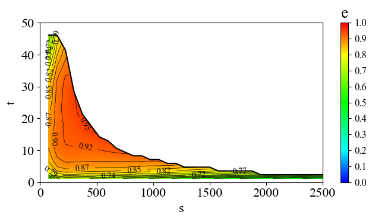

---  
title: Matplotlib 绘制等高线图  
date: 2024-03-03
timeLine: true
sidebar: false  
icon: python
category:  
    - Python      
tag:   
    - pandas  
    - matplotlib
    - contour
---      

> 帮老婆绘制科研中的图像，因为接触绘图工具较少，所以跟ChatGPT 聊了好久才调整出满意的图像。于是记录下源码：  

### 预设参数  
提前设置几个可以手动调整的绘图参数：  

```python  
import numpy as np
input_csv = 'data.csv'  # 输入文件地址  
x_lim = 2500  # 横坐标最大值  
y_lim = 50    # 纵坐标最大值  
label_num = 12 # 显示数据标签条数
z_scale = 0.01 # z 轴数据缩放倍数

contour_levels = np.linspace(0,1.0,40)  # 等高线条数  
contourf_levels = np.linspace(0,1.0,200)  # 等高线渲染密度  
```

### 数据预处理  
读取数据，并获取坐标轴的名字：  

```python
import pandas as pd

raw_data = pd.read_csv(input_csv)
# 获取坐标名
[axis_x, axis_y, axis_z] = raw_data.columns[:3]

# 排除掉x,y 轴为0 的数据
data = raw_data[
    (raw_data[axis_x] != 0) & 
    (raw_data[axis_y] != 0)]

# 获取边缘数据
data_edge = data.groupby(axis_x)[axis_y].max().reset_index()
data_x = data[axis_x] 
data_y = data[axis_y] 
data_z = data[axis_z]*z_scale  
```

### 插值并处理异常数据   
这里遇到了布尔掩码加速异常处理的操作，蛮有意思的：  

```python
from scipy.interpolate import griddata

# 定义要生成等高线图的网格范围
x_grid = np.linspace(min(data_x), max(data_x), 1000)
y_grid = np.linspace(min(data_y), max(data_y), 1000)
x_grid, y_grid = np.meshgrid(x_grid, y_grid)

# 对数据z 进行二维线性插值
z_interp = griddata((data_x, data_y), data_z, (x_grid, y_grid), method='linear')
# 对于上边界进行线性插值
edge_interp = np.interp(x_grid[0], data_edge[axis_x], data_edge[axis_y])

# 处理边界问题，利用布尔掩码
mask = y_grid > edge_interp
# 将符合条件的值设为 NaN
z_interp[mask] = np.nan
```
### 绘制图像  

```python
import matplotlib.pyplot as plt
from matplotlib.colors import LinearSegmentedColormap

plt.rcParams["font.family"] = "Times New Roman"  # 设置字体
plt.rcParams["font.size"] = 16  # 设置字号  

# 定义图像渐变色
colors = [(0, 'blue'),   # 起始颜色
          (0.2, 'cyan'),  # 过渡色1
          (0.5, 'lime'),  # 过渡色2
          (0.8, 'yellow'),  # 过渡色3
          (1, 'red')]   # 结束颜色
cmap = LinearSegmentedColormap.from_list('custom_cmap', colors)

# 调整图像大小
plt.figure(figsize=(7, 4))  

# 绘制填充颜色的等高线图-区域上色
contourf = plt.contourf(x_grid, y_grid, z_interp,cmap=cmap,levels=contourf_levels)
# 添加右侧颜色条  
cbar = plt.colorbar(contourf)  
# 修改颜色条刻度 
ticks=np.linspace(0,1,11)
cbar.set_ticks(ticks)

# 自定义刻度标签
# tick_labels=["{:.3f}".format(t) for t in ticks]
# cbar.set_ticklabels(tick_labels)

# 设置颜色条刻度的样式和标题
cbar.ax.tick_params(labelsize=12)  # 单独设置字号
cbar.ax.set_title(axis_z)

# 绘制等高线
contour=plt.contour(x_grid, y_grid, z_interp, colors='k',levels=contour_levels, linewidths=0.5)
# 添加数据标签
plt.clabel(contour, contour.levels[-label_num:], fontsize=10, fmt='%.2f')  # 由高到低选12条

# 绘制转矩边界曲线
plt.plot(x_grid[0], edge_interp, color='k', label="_")

# 设置 x 和 y 轴的范围
plt.xlim(0, x_lim)
plt.ylim(0, y_lim)

plt.xlabel(axis_x)
plt.ylabel(axis_y)

plt.tight_layout()
plt.show()
```  

得到结果如下：  
