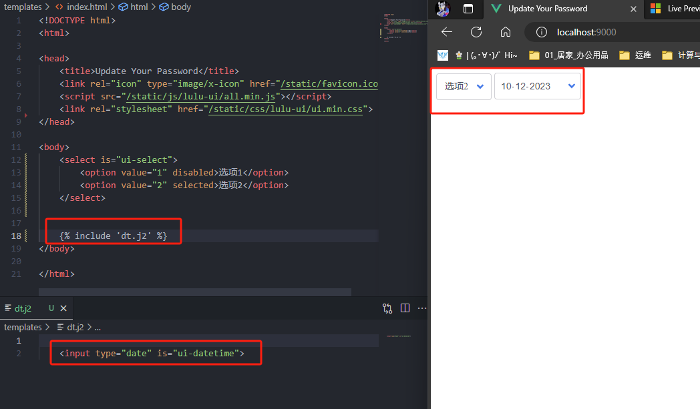
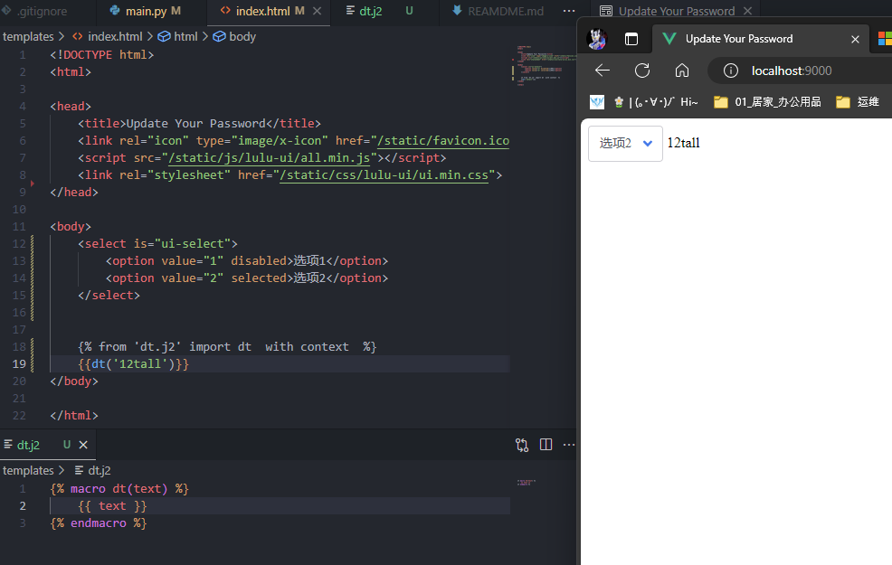
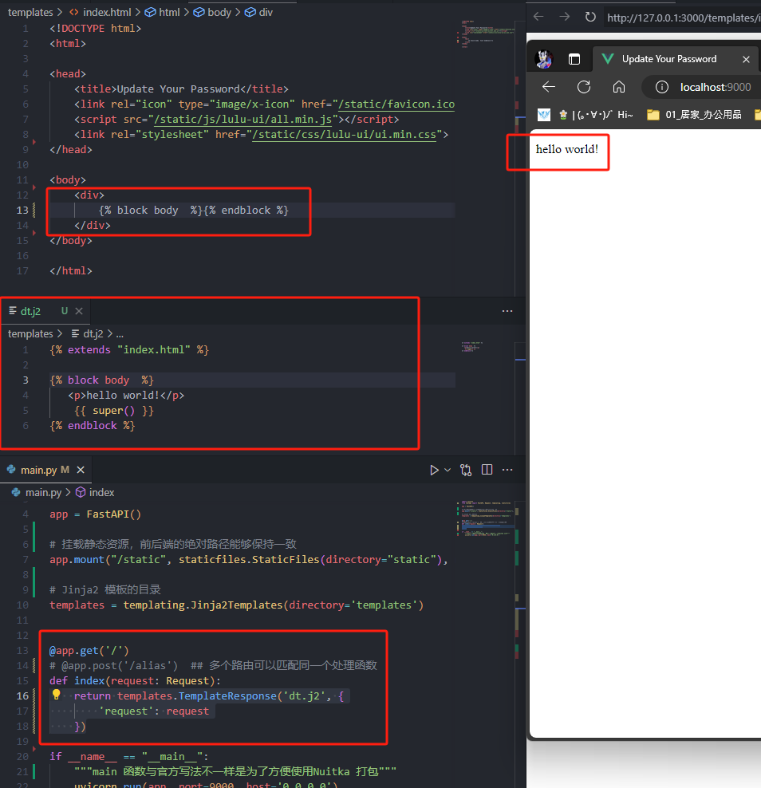

---  
title: FastAPI 工程化  
date: 2023-10-12
timeLine: true
sidebar: false  
icon: python
category:  
    - Python      
tag:   
    - fastapi   
    - router  
    - asgi 
    - jinja2  
    - lulu-ui
---    

> 从asp.NET 到前后分离，到vue+koa2，兜兜转转又到了模板渲染。以前开发看逼格，现在开发看速度。SSR 有啥不好的，又不是不能用只要把内容展示出来就好了呗。  

## FastAPI  
`Koa2` 有各种灵活的插件，`FastAPI` 继承了路由和参数解析的功能，并且还附带了文档的功能，这样省了接口测试的功夫。并且如果配合`Jinja2` 和`lulu-ui` 完全能做出不错的页面出来。下面是一个最基本的后端代码：  
```python{22}
import uvicorn
from fastapi import FastAPI, Request, templating, staticfiles

app = FastAPI()

# 挂载静态资源，前后端的绝对路径能够保持一致
app.mount("/static", staticfiles.StaticFiles(directory="static"), name="static")

# Jinja2 模板的目录
templates = templating.Jinja2Templates(directory='templates')


@app.get('/')
# @app.post('/alias')  ## 多个路由可以匹配同一个处理函数
def index(request: Request):
    return templates.TemplateResponse('index.html', {
        'request': request,
        'warning_text': 'hello world'
    })

if __name__ == "__main__":
    """main 函数与官方写法不一样是为了方便使用Nuitka 打包"""
    uvicorn.run(app, port=9000, host='0.0.0.0')
```  

项目的文件结构如下：  
     

这样组织`static` 文件夹，可以让前后端引用js 的路径一致，便于开发时预览页面效果。   

## 前端  

前端采用`lulu-ui`，因为他采用的是`is` 方法重新定义组件，相比于`vue` 或者其他框架来说，它的用法更接近于原生的`html+js+css`。所见即所得：  

  

不太好的地方是后端通过表单获取数据时写法有点复杂，但是可以通过拦截`submit` 或者其他的手段来曲线救国。   

## Jinja2   
虽然专业的前端设计很漂亮，但是打包工具未免也太复杂了些。而后端渲染的方式简单粗暴，深得我心。尤其是`jinja2` 既可以实现继承（`extend`）又可以实现组件化（`import/include`）。看起来也还挺方便的，只是还不知道使用起来感觉怎么样。  

1. 通过`include` 导入模板文件     
  
2. 通过`import` 导入模板文件的部分内容  
  
3. 通过`extends` 继承模板文件  
  

这篇笔记记录的都是一些可行性的问题，具体项目中的代码肯定还需要很多细节性的问题需要解决。


## 参考资料  
1. [Live Preview](https://marketplace.visualstudio.com/items?itemName=ms-vscode.live-server) 实时预览html 的vscode 插件  
2. [How To Format Form Data as JSON](https://www.section.io/engineering-education/how-to-format-form-data-as-json/) 通过监听表单的`submit` 事件来自定义处理函数    
3. [lulu-ui](https://l-ui.com/)    
4. [How to use macros in a included file](https://stackoverflow.com/a/45024799)  
5. [SQLModel](https://sqlmodel.tiangolo.com/) FastAPI 作者开发的ORM 库，应该是见过的最简洁的Python ORM 库了    

-----  

其实有一个问题： `ORM` 要不要承担创建表和数据迁移的工作呢？如果不要的话，代码的逻辑应该会非常简单；如果要的话，一不小心就会出现循环导入的问题。
