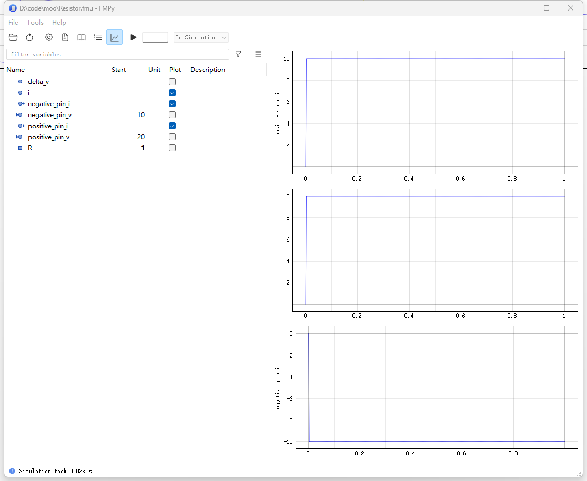

---  
title: Python FMU 相关  
date: 2023-10-11
timeLine: true
sidebar: false  
icon: python
category:  
    - Python      
tag:   
    - python   
    - fmi  
    - fmu  
    - simulation  
    - modelica  
---   

> 同事在需要在Modelica 中使用状态机建模，并且导出FMU 用于在环测试。苦于Modelica 的语法要求方程个数必须等于变量个数，实现起来比较繁琐。于是谷歌一下Python 的解决方案。结果还发现了新大陆：  

## Python 生成FMU  
[NTNU-IHB/PythonFMU](https://github.com/NTNU-IHB/PythonFMU) 可以将Python 代码嵌入到FMU 中，且支持Windows、Linux 和MacOS，支持到FMU 2.0 标准。原理就是：  
- 通过C/C++ 实现了FMU 文件头  
- 在具体功能函数中调用Python 文件   

在调用FMU 时需要依赖Python 环境，也就是Python 套壳。下面来看一下其项目的定义：  
```python  
# https://github.com/NTNU-IHB/PythonFMU/blob/master/examples/demoslave.py  
from pythonfmu import Fmi2Causality, Fmi2Variability, Fmi2Slave, Real

#
class Resistor(Fmi2Slave):

    author = "John Doe"
    description = "A simple description"

    def __init__(self, **kwargs):
        super().__init__(**kwargs)
        # 定义变量和初始值
        self.positive_pin_v = 20.
        self.positive_pin_i = 0.001
        self.negative_pin_v = 10.
        self.negative_pin_i = 0.001
        self.delta_v = 10.
        self.i = 0.001
        self.R = 10000.
        # 注册可变参数，电阻R
        self.register_variable(Real("R", causality=Fmi2Causality.parameter, variability=Fmi2Variability.tunable))
        # 注册输入输出变量
        self.register_variable(Real("positive_pin_v", causality=Fmi2Causality.input))
        self.register_variable(Real("positive_pin_i", causality=Fmi2Causality.output))
        self.register_variable(Real("negative_pin_v", causality=Fmi2Causality.input))
        self.register_variable(Real("negative_pin_i", causality=Fmi2Causality.output))
        # 注册本地变量，本地变量
        self.register_variable(Real("delta_v", causality=Fmi2Causality.local))
        self.register_variable(Real("i", causality=Fmi2Causality.local))

    def do_step(self, current_time, step_size):
        """实际任务，会被循环调用"""
        self.delta_v = self.positive_pin_v - self.negative_pin_v
        self.i = i = self.delta_v / self.R
        self.positive_pin_i = i
        self.negative_pin_i = -i
        return True
```  

通过以下命令就可以打包生成`Resistor.fmu`：  
```shell
pythonfmu build -f demoslave.py
```

## Python 调用FMU  

安装[CATIA-Systems/FMPy](https://github.com/CATIA-Systems/FMPy) 并执行`python -m fmpy.gui`。选择上一步生成的`Resistor.fmu` 模型，需改参数后可以运行仿真，结果如下图：  
  

### 连续调用与步长  
有时我们需要动态调试，这是就需要手工通过代码来覅用FMPy 了，下面为官方示例：  
```python{23,29-33,37,43,54}
""" This example demonstrates how continue a simulation e.g. to
 retrieve outputs or set tunable parameters at certain intervals while
 keeping the FMU instance alive. """

import os
import tempfile
import shutil
import numpy as np
from fmpy import extract, read_model_description, instantiate_fmu, simulate_fmu, plot_result
from fmpy.simulation import apply_start_values
from fmpy.util import download_file


def continue_simulation(fmu_filename):

    # extract the FMU to a temporary directory
    unzipdir = extract(fmu_filename)

    # read the model description
    model_description = read_model_description(unzipdir)
    # 1. 创建FMU 实例
    # instantiate the FMU beforehand, so we can keep it alive
    fmu_instance = instantiate_fmu(unzipdir=unzipdir, model_description=model_description)
    # 2. 开始第一次仿真
    # simulate to 1 s
    result1 = simulate_fmu(
        filename=unzipdir,
        model_description=model_description,
        fmu_instance=fmu_instance,
        start_values={'e': 0.95}, # 如果不设置stop_time 的话，默认是start_time+1
        stop_time=1,          # 下面参数表示，不设置停止时间，并且保持FMU 在线
        set_stop_time=False,  # don't communicate the stop time, so we can continue
        terminate=False  # keep the FMU instance alive
    )
    # 3. 修改部分参数
    # change a tunable parameter
    apply_start_values(fmu=fmu_instance, model_description=model_description, start_values={'e': 0.55})
    # 4. 继续第二次仿真
    # continue to 2 s
    result2 = simulate_fmu(
        filename=unzipdir,
        model_description=model_description,
        fmu_instance=fmu_instance,
        initialize=False,  # the FMU instance is already instantiated
        start_time=1,  # start where we left off
        stop_time=2,
        terminate=False
    )
    # 绘制结果图像
    # concatenate and plot the results
    plot_result(np.concatenate((result1, result2)), events=True)

    # clean up
    fmu_instance.terminate()
    fmu_instance.freeInstance()
    shutil.rmtree(unzipdir)


if __name__ == '__main__':

    archive_filename = download_file(
        url='https://github.com/modelica/Reference-FMUs/releases/download/v0.0.23/Reference-FMUs-0.0.23.zip',
        checksum='d6ad6fc08e53053fe413540016552387257971261f26f08a855f9a6404ef2991'
    )

    with tempfile.TemporaryDirectory() as tempdir:

        extract(archive_filename, unzipdir=tempdir)

        # works also for '1.0/cs' and '2.0'
        continue_simulation(os.path.join(tempdir, '3.0', 'BouncingBall.fmu'))
```

## 扩展  
其实有了这些基础之后可以玩点更疯狂的举动，比如在第一节定义FMU 时，我们可以在`do_step` 内部初始化一个虚拟的微控制器，像AVR 或者ARM。感觉还是要学一下状态机了。


## 参考资料  
1. [NTNU-IHB/PythonFMU](https://github.com/NTNU-IHB/PythonFMU) 其中的示例比文档更好懂  
2. [CATIA-Systems/FMPy](https://github.com/CATIA-Systems/FMPy) 同样看示例和函数的注释更好懂一些