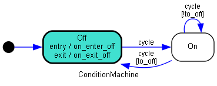
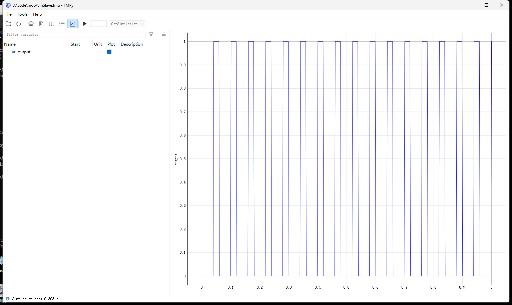

---  
title: Python 状态机    
date: 2023-10-19
timeLine: true
sidebar: false  
icon: python
category:  
    - Python      
tag:   
    - Python   
    - StateMachine  
---   

> 还是在做fmu 时引出的问题，需要用到[Python State Machine](https://python-statemachine.readthedocs.io/en/latest/index.html)  


## 概览  
`python-statemachine` 的使用，需要定义一个状态机子类，集成`StateMachine`。在子类中定义全部的状态、转移条件以及事件处理函数。代码结构如下：  
```python
from statemachine import StateMachine, State

class TrafficLightMachine(StateMachine):
    """
    交通灯状态机  
    """

    # 定义状态
    green = State(initial=True)  # 初始状态
    yellow = State()
    red = State()

    # 事件名`cycle`：状态流动的方向
    cycle = (green.to(yellow) |
             yellow.to(red) |
             red.to(green))

    def before_cycle(self, event: str, source: State, target: State, message: str = ''):
        message = ". " + message if message else ""
        print(f"事件 {event}：从 {source.id} 到 {target.id}{message}")
        return "OK"  # 返回结果可以从对象的send("cycle") 方法返回

    # 进入状态触发事件
    def on_enter_red(self):
        print("禁止通行")

    # 退出状态事件
    def on_exit_red(self):
        print("允许通行")

sm = TrafficLightMachine()
# 需要安装pydot
sm._graph().write_png("sm.png")
sm.send("cycle")
sm.send("cycle")
sm.send("cycle")

# 执行结果  
# 事件 cycle：从 green 到 yellow
# 事件 cycle：从 yellow 到 red
# 禁止通行
# 事件 cycle：从 red 到 green
# 允许通行
```

## 转移条件  
下面代码可以实现如下的效果：  


在执行5 次`cycle` 事件之后，才会从`on` 转移到`off`。这一功能可以很方便地来实现微控制器的模拟。只是不知道效率如何。同样的道理，也可以用来做更加复杂的判断：  

```python
from statemachine import StateMachine, State

class ConditionMachine(StateMachine):
    """
    条件转移状态机 
    """

    # 定义状态
    off = State(initial=True)  # 初始状态
    on = State()

    # 事件名`cycle`：状态流动的方向
    cycle = (on.to(on, unless="to_off") |  # on->on 除非满足to_off()=True
             on.to(off, cond="to_off") |   # on->off 当满足to_off()=True
             off.to(on))

    def __init__(self):
        self.count = 1

    def to_off(self):
        res = self.count % 5
        return res == 0

    def before_cycle(self):  # 理论上可以接收参数的，sm.cycle(params)
        # print(f'{self.count}')
        self.count = self.count + 1

    # 进入状态触发事件，初始化状态时也会触发
    def on_enter_off(self):
        print("Off")

    # 退出状态事件
    def on_exit_off(self):
        print("On")


sm = ConditionMachine()
# 需要安装pydot
sm._graph().write_png("sm.png")
sm.send("cycle")
sm.send("cycle")
sm.send("cycle")
sm.send("cycle")
sm.send("cycle")

# 输出
# Off
# On
# Off
```

## 观测器  
通过单独定义[观测器](https://python-statemachine.readthedocs.io/en/latest/observers.html)，可以在不修改状态机源代码的情况下来添加更多的行为。  


## 导出FMU  
这篇笔记最初的目的就是为了[导出fmu](../fmu/README.md)，以下代码可以在Windows 平台上顺利编译并通过测试：  
```python{16-18,46-53}
# DON'T Add Any Chinese Charactor
from typing import Any
from pythonfmu import Fmi2Slave, Real, Fmi2Causality
from statemachine import StateMachine, State

class ConditionMachine(StateMachine):
    """State Machine to generate rectangle wave"""
    off = State(initial=True)  
    on = State()

    cycle = (on.to(on, unless="to_off") |  
             on.to(off, cond="to_off") |   
             off.to(off, unless="to_on") |
             off.to(on, cond='to_on'))

    def __init__(self, model: Any = None, state_field: str = "state", start_value: Any = None, rtc: bool = True, allow_event_without_transition: bool = False):
        super().__init__(model, state_field, start_value,
                         rtc, allow_event_without_transition)
        self.count = 1

    def to_off(self):
        self.count = self.count % 10  # delay 10 steps
        return self.count == 0

    def to_on(self):
        self.count = self.count % 20  # delay 20 steps
        return self.count == 0

    def before_cycle(self):  
        self.count = self.count + 1


class SmSlave(Fmi2Slave):
    author = "12Tall"
    description = "A FMU with Satate-Machine Slave"

    def __init__(self, **kwargs):
        super().__init__(**kwargs)
        self.sm = ConditionMachine()

        # No input
        self.output = .0
        # Register output as OUTPUT VARIABLE
        self.register_variable(Real("output", causality=Fmi2Causality.output))

    def do_step(self, current_time: float, step_size: float) -> bool:
        self.sm.cycle()  # execute state machine
        # update output
        if self.sm.current_state == self.sm.on:
            self.output = 1
        else:
            self.output = 0
        return True
```

仿真结果如下图所示：  


## 参考资料  
1. [Python State Machine](https://python-statemachine.readthedocs.io/en/latest/index.html)  
2. [How to pass --no-use-pep517 to a particular dependency](https://github.com/python-poetry/poetry/issues/3433#issuecomment-840509576)`poetry run python -m pip install *** --no-use-pep517` 哎  
3. [Cannot import QtWebKitWidgets in PyQt5](https://stackoverflow.com/a/55840383)