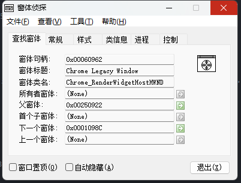

---
title: pywinauto 自动化 
date: 2023-07-31
timeLine: true
sidebar: false  
icon: config
category:  
    - 笔记  
    - 运维      
tag:   
    - python  
    - 自动化  
    - auto  
---    



`pywinauto` 通过其`Application` 模块打开或者载入进程以追踪其GUI 界面，并可以发送鼠标或键盘事件。  
```python
from pywinauto import Application  

app = Application(backend="uia").start("mspaint.exe")
dlg = app.top_window()
dlg.print_control_identifiers()
# Control Identifiers:

# Dialog - '无标题 - 画图'    (L711, T269, R2247, B1133)
# ['无标题 - 画图Dialog', '无标题 - 画图', 'Dialog']
# child_window(title="无标题 - 画图", control_type="Window")
#    |
#    | Pane - ''    (L719, T461, R2239, B1093)
#    | ['Pane', 'Pane0', 'Pane1']
#    ...
#    |    |
#    |    | Button - '关闭'    (L2193, T270, R2240, B300)
#    |    | ['关闭', 'Button54', '关闭Button']
#    |    | child_window(title="关闭", control_type="Button")

dlg[u'关闭'].click()
# <uia_controls.ButtonWrapper - '关闭', Button, 4634795030945390888>
```  

## Window 方法   
实测下面方法在`Win11` 中文系统下的`Notepad` 程序测试无效：  
- `app.windows()` 获取所有窗口   
- `app.window(title="title", title_re=".*", class_name="clazz", handle=win)` 获取某个窗口，条件可选  
- `app['key']` 根据魔术字符串获取窗口  

### 获取控件  
- `app.dlg.ctrl`  
- `app['dlg']['ctrl']` 或者`app[u'dlg'][u'ctrl']` 针对非英文环境    


### Win10 笔记本  
`Win10+` 的操作系统中，笔记本和计算器程序似乎是作为`Desktop` 窗口的子窗口出现的，所以直接从进程获取窗口会出现异常。这个时候可以通过`Desktop` 对象获取：  
```python  
from pywinauto import Desktop, Application

app = Application(backend="uia").start("calc.exe")
dlg = Desktop(backend="uia")[u'计算器']  
dlg.type_keys('2*3=')
# <uiawrapper.UIAWrapper - '计算器', Dialog, 2219639103146925685>  
# 程序显示结果2*3=6
dlg.print_control_identifiers()
# Control Identifiers:

# Dialog - '计算器'    (L1002, T35, R1518, B710)
# ['计算器', '计算器Dialog', 'Dialog', '计算器0', '计算器1', '计算器Dialog0', '计算器Dialog1', 'Dialog0', 'Dialog1']
# child_window(title="计算器", control_type="Window")
#    |
#    | Dialog - '计算器'    (L1322, T36, R1510, B68)
#    | ['计算器2', '计算器Dialog2', 'Dialog2']
#    ...
#    |    |
#    |    | Button - '最小化 计算器'    (L1372, T36, R1418, B68)
#    |    | ['Button', '最小化 计算器', '最小化 计算器Button', 'Button0', 'Button1']
#    |    | child_window(title="最小化 计算器", auto_id="Minimize", control_type="Button")
#    |    |
#    ...
#    | Pane - ''    (L1010, T68, R1510, B702)
#    | ['Pane', '计算器Pane']
 
dlg[u'最小化 计算器'].click()
# <uia_controls.ButtonWrapper - '最小化 计算器', Button, 4656439219294527907>
```  

**`print_control_identifiers` 是一个非常重要的函数**，利用它可以显示可用的窗口或控件的信息。  

## 软件自动化安装   
这里只写一个思路，一开始设计项目的时候总想着考虑得非常全面，但是随着认知的清晰，发现投入的费效比才是最重要的。设计一个可以灵活配置的安装脚本，思路上可能达到自己设计脚本语言的水平；然而我需要的只是一个安装软件的脚本，就算我有十几个软件需要安装，也只是需要十几个脚本罢了。  

> 配合`Nuitka` 和`PySide6` 做一个图形界面还是蛮必须的。  

## 有用的工具  
之前在[看雪论坛](https://bbs.kanxue.com/thread-79847.htm)上看过一个比较好用的窗口侦测软件。另外，了解一下[Windows 窗口机制](../../node/simple-wallpaper-engine/README.md)，对于更好的认识软件自动化应该是蛮有用的。